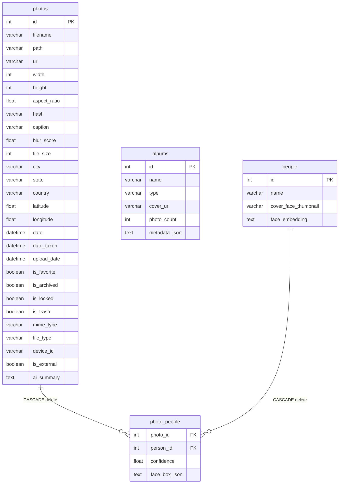

# Design System Specification: Prism Photos

This document details the visual identity, token configurations, component design specifications, and systemic design rationale for **Prism Photos**. It serves as an authoritative, machine-readable contract (via YAML front matter) and a human-readable guide (via Markdown body) for both developer engineering and AI code generation engines (such as Google Stitch).

---

## 🎨 Overview & Visual Identity

Prism Photos is a privacy-first, offline desktop photo library that utilizes a sleek, cinematic, high-contrast dark aesthetic:
- **Atmospheric Depth:** Employs ultra-subtle primary-colored mesh gradients (`.mesh-atmos`) on an absolute pitch-black background (`#050505`) and dynamic grain overlays (`.grain-overlay`) to create high sensory depth without visual noise.
- **Micro-Animations:** Employs smooth animations (`slide-from-left`, `slide-from-right`, `agent-pop`, `ken-burns`) to keep visual transitions responsive and premium.
- **Dynamic Theming:** Supports multiple curated primary accent themes (White, Purple, Green, Orange, Rose) that adapt visual elements instantly to custom moods.

---

## 🏛 System Architecture Overview

The application utilizes a decentralized, secure local-first architecture separated into clear layers to protect user information:

```mermaid
graph TD
    subgraph Presentation Layer (UI)
        TauriShell[Tauri v2 Desktop Shell]
        ViteReact[Vite / React SPA]
        ZustandStores[Zustand State Stores]
    end

    subgraph Service Orchestration (Backend)
        FastAPI[FastAPI API Service]
        SyncService[Sync Service Mixins]
        ProcQueue[Sequential Processing Queue]
    end

    subgraph Worker Pool
        WorkerPool[ProcessPoolExecutor]
        ThreadExecutor[ThreadPoolExecutor / asyncio.to_thread]
    end

    subgraph Storage & Inference (Local-Only)
        SQLite[(SQLite DB - WAL Mode)]
        FaceSDK[InspireFace C++ SDK]
        Ollama[Ollama Vision API]
    end

    TauriShell -->|Embeds| ViteReact
    ViteReact -->|SSE / REST Calls| FastAPI
    FastAPI -->|Offloads Crawling/Hashing| ThreadExecutor
    FastAPI -->|Offloads Thumbnails/Laplacian| WorkerPool
    FastAPI -->|Active Pragmas| SQLite
    ProcQueue -->|Sequential Face Scans| FaceSDK
    ProcQueue -->|Vision Descriptions| Ollama
```

---

## 🖥 Frontend Architecture & State Controls

The frontend client is heavily tuned to handle extremely fast page rendering and block component-wide cascading updates:

1. **State Isolation (Zustand & React Hooks):**
   - Core visual toggles and active sessions are managed by lightweight **Zustand stores** (`editSessionStore.ts`, `uiStore.ts`) to avoid React-wide re-render cycles.
   - Catalog paginations and real-time scanning statuses are managed by `useAppState` hooks.
2. **Cascading Render Protection (`React.memo`):**
   - **Virtual Grid Rows (`PhotoGridRow`):** Visible grid rows implement precise memoization custom comparisons. A row will only re-render if the selection state of its child photos actually toggles, preventing massive canvas re-paint cycles during selection mode.
   - **Framer Motion Layout Optimization:** Framer Motion `layout` sweep recalculations are removed from grid item cards (`PhotoItem.tsx`) to guarantee smooth 60/120 FPS virtual scrolling.
3. **SSE Connection Leak Protection:**
   - Client subscriptions (`EventService.ts`) manage a single active `reconnectTimeout` handle. Cleanups cleanly disconnect streams on component unmount to prevent browser connection accumulation.

---

## ⚙ Backend Service Architecture

The FastAPI backend runs synchronously-isolated execution contexts to guarantee zero event loop starvation:

- **Async Loop Integrity:** Traversal operations, PBKDF2 hashing, and dynamic file reads are offloaded to worker threads using `asyncio.to_thread` to ensure uvicorn is never blocked.
- **Connection-Scoped Database Pragmas:** SQLAlchemy engine connection listeners bind optimizations (`synchronous=NORMAL`, `cache_size=-64000`, `temp_store=MEMORY`) to **every new session** created by the async session maker, ensuring consistent database transaction speeds.

---

## 🔄 Sync & Ingestion Pipeline

The background sync manager (`SyncService`) schedules and counts files asynchronously:

```
[New Photo Detected on Disk]
       │
       ▼
[Offloaded to ProcessPoolExecutor]
       │  ├── 1. Generate md5 Content Hash
       │  ├── 2. Resize and write compressed WebP thumbnail
       │  ├── 3. Extract EXIF / GeoCoordinates metadata
       │  └── 4. Calculate Laplacian Variance (Sharpness Score)
       ▼
[Database Write Semaphore Acquired]
       │  ├── 1. Query Content-Hash duplicate index
       │  ├── 2. Insert Photo database record (caches blur_score, file_size)
       │  └── 3. Debounce Offline Reverse Geocoding (Places Albumer)
       ▼
[Broadcast SSE "new_photo" event to Client UI]
```

---

## 🔐 Security & Cryptographic Boundaries

Prism Photos implements strict security boundaries for local APIs:

### 1. KEK/DEK Envelope Encryption (Locked Folder)
To isolate private photographs safely on local storage:

```
[User Password] ──► [PBKDF2 KDF (100,000 rounds)] ──► [Key Encryption Key (KEK)]
                                                              │
[Data Encryption Key (DEK)] ◄── [Decrypts] ◄── [Encrypted DEK in settings.json]
             │
             ▼
[Encrypts / Decrypts locked files on local disk]
```

- **DEK:** A random 32-byte key generated on setup that encrypts/decrypts photos via AES-256 (Fernet).
- **KEK:** Derived from the user's password via PBKDF2 (100,000 rounds). The KEK encrypts the DEK, saving only the `encrypted_dek` in `settings.json`.
- **The Decoupled Benefit:** Changing passwords only requires re-wrapping the DEK; **no file-system decryption/re-encryption loops are executed**.
- **Threading Offload:** Offloaded to `asyncio.to_thread` to maintain responsive execution.

### 2. Path Traversal & CORS Safeguards
- **CORS Allowed Origins:** Restricts API headers strictly to Tauri scopes (`tauri://localhost`, `http://tauri.localhost`, `http://localhost:3005`). Wildcard CORS is prohibited.
- **Allowed Path Boundaries:** Path traversal endpoints strictly restrict paths to application uploads, thumbnails, home `Pictures`, and external Unix mounts (`/media`, `/Volumes`, `/mnt`). Out-of-boundary queries trigger a `403 Forbidden` response.

---

## 🧠 AI Inference & Facial Clustering

AI operations run locally without network latency:

1. **Facial landmarks and Centroid Cache (InspireFace):**
   - Implements native C++ facial landmarks mapping via the InspireFace SDK.
   - **Clustering Centroid Cache:** To avoid loading the entire database, the system maintains a running average face embedding centroid in memory for each unique clustered person.
   - Matches are calculated using cosine similarity comparisons. High-confidence results trigger an early exit score check (`FACE_EARLY_EXIT_SCORE = 0.75`), bypassing remaining candidate iterations.
2. **Dynamic Centroid Adaptation:**
   - Centroids are updated dynamically and re-normalized to the unit sphere:
     $$\vec{E}_{avg} = \frac{n \cdot \vec{E}_{avg} + \vec{E}_{new}}{n + 1}$$
     $$\vec{E}_{normalized} = \frac{\vec{E}_{avg}}{\|\vec{E}_{avg}\| + 10^{-10}}$$
3. **Local Visual Descriptions:** Ingestion queues offload visual descriptions to local Ollama Vision models via secure local endpoint interfaces.

---

## 💾 Database & Storage Schema

The schema uses clean relational association mappings with explicit cascade deletion rules:



### Key DB Optimization Indices:
- **`idx_photos_hash`:** Unique index on `hash` for instant duplicate lookup.
- **`idx_photo_people_composite`:** Composite index on `photo_people(person_id, photo_id)` to optimize face queries.

---

## ⚡ High-Scale Performance Strategy (100K+ Photos)

- **Pre-Calculated Ingestion Metrics:** Sharpness calculations (`blur_score`) and file sizes are stored on creation. Subsystems never load file systems or read images dynamically at query time.
- **Serialized DB Writes:** Database writes are protected by an `asyncio.Semaphore(1)` lock inside the sync service. This serializes database writes to prevent SQLite lock contentions while allowing CPU-bound thumbnail processing to run in parallel.
- **Client Virtualization:** The frontend virtualizer only mounts DOM elements currently in the active viewport (plus 10 overscan buffers), maintaining memory usage below 200MB even with 100K+ photos.
