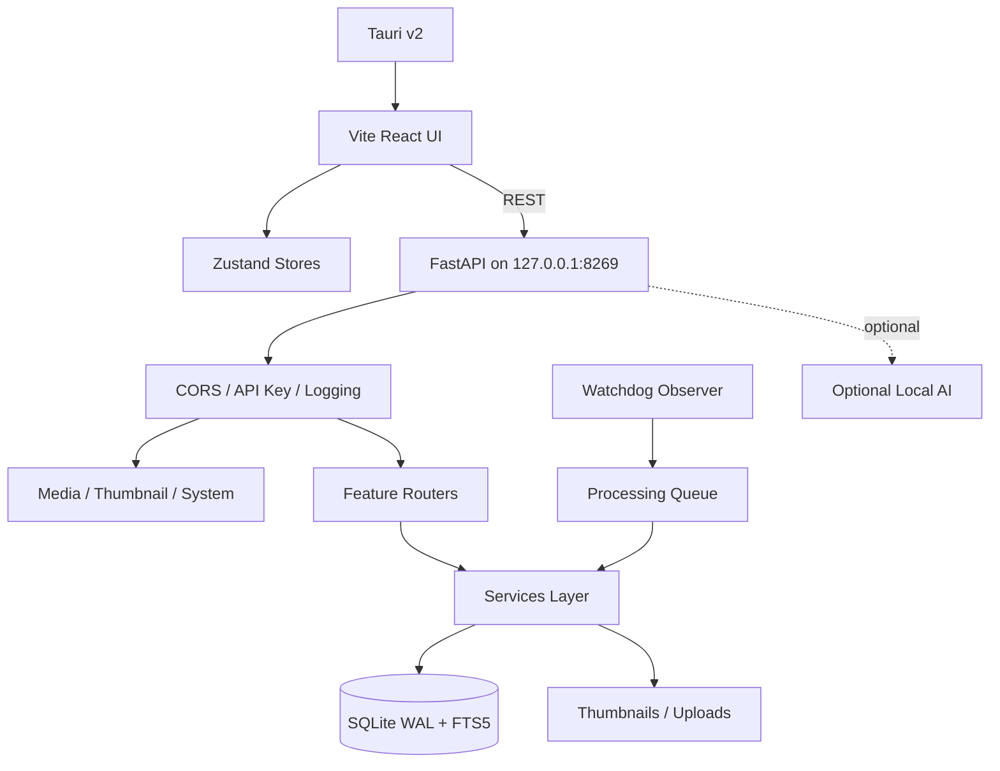

<p align="center">
  
</p>

<p align="center">
  <strong>Privacy-first local photo and video library, search, organization, and editing desktop app.</strong>
</p>

<p align="center">
  
  
  
  
  
</p>

---

## Table of Contents

- [What Prism Is](#what-prism-is)
- [Command-Line Interface](#command-line-interface)
- [Core Features](#core-features)
- [Technology Stack](#technology-stack)
- [Architecture](#architecture)
- [Project Layout](#project-layout)
- [Getting Started](#getting-started)
  - [Prerequisites](#prerequisites)
  - [One-Click Startup](#one-click-startup)
  - [Manual Development Setup](#manual-development-setup)
  - [Useful Scripts](#useful-scripts)
- [User Guide](#user-guide)
- [Optional Local AI Features](#optional-local-ai-features)
- [Security Boundaries](#security-boundaries)
- [Testing](#testing)
- [Troubleshooting](#troubleshooting)
- [Contribution](#contribution)
- [Acknowledgements](#acknowledgements)
- [Contact](#contact)
- [License](#license)

---

## Command-Line Interface

```bash
prism --help
```

Prism includes a command-line interface for importing, searching, and managing the photo library without the desktop shell. Supported commands include import, search, stats, XMP sidecar management, people and album listings, background indexing, and running the FastAPI server.

For the full command reference, options, and examples, see **[PRISM_CLI.md](docs/PRISM_CLI.md)**.

---

## What Prism Is

**Prism** is a local-first desktop photo and video library for photographers and privacy-conscious users. It indexes images and videos from watched folders, extracts metadata, generates thumbnails, supports fast search and browsing, groups photos by people/places/memories, and keeps private photos in an encrypted Locked Folder.

The core product is designed so that normal library data, search indexes, thumbnails, metadata, and Locked Folder operations stay on the host machine.

---

## Core Features

- **Local library indexing:** Import individual files or folders and watch configured directories for new image and video changes.
- **Supported media formats:** PNG, JPG, JPEG, WebP, HEIC, HEIF, DNG, TIFF, TIF, BMP, GIF, MP4, MOV, M4V, AVI, MKV, WebM, 3GP.
- **Fast browsing:** Virtualized React grid, lightbox preview, bulk selection, favorites, archive, trash, and sorting.
- **Video playback:** Rich custom player with keyboard shortcuts, speed control (0.25x–2x), picture-in-picture, progress bar, and hover preview in grid.
- **Video thumbnails:** Animated WebP preview thumbnails generated via ffmpeg scene detection and frame extraction.
- **Metadata extraction:** EXIF date, GPS coordinates, city/state/country, dimensions, MIME type, file size, content hash, and blur score. For videos: duration, FPS, codec, and audio codec.
- **Offline reverse geocoding:** Places albums and map markers are powered by local metadata and `reverse-geocoder`.
- **Albums:** Places, monthly memories, people albums, and On This Day highlights.
- **People view:** Face clustering for photos and videos (hybrid scene-change + uniform frame sampling with cross-frame deduplication), person rename flow, pending face feedback, and per-person photo grids.
- **Map view:** Leaflet-based geospatial browsing with marker clustering, selectable map styles, and thumbnail-optimized markers.
- **Utilities:** Watched folder configuration, face discovery trigger, purge folder, clear cache, vacuum database, reset indexed library, diagnostics, logs, backup export, and backup restore.
- **Locked Folder:** In-memory authenticated session, Argon2id password verification, random DEK wrapped by a KEK, atomic encrypted file writes, and startup recovery for interrupted encryption/decryption operations.
- **Local AI assistant:** Opt-in natural-language photo search with planner, search tools, verification, and result rendering.
- **Local editing tools:** Crop, rotate, flip, straighten, adjustments, curves, effects, portrait/background tools, selective edits, inpainting, masks, and object detection UI.
- **Explore view:** AI-powered theme collections, event timeline, On This Day memories, and seasonal photo groupings.
- **OCR text extraction:** Opt-in PaddleOCR-VL integration for extracting visible text from images, stored and searchable via FTS5.

---

## Technology Stack

<p align="left">
  
  
  
  
  
  
  
</p>

### Frontend

- React, TypeScript, Vite, Tailwind CSS
- Tauri v2 shell and dialog plugin
- Zustand state stores
- React Router
- Framer Motion
- TanStack Virtual
- Leaflet, React Leaflet, and Leaflet MarkerCluster
- Lucide icons
- Cropper.js and React Cropper
- Vitest, Testing Library, jsdom

### Backend

- FastAPI and Uvicorn
- SQLAlchemy async sessions with SQLite `aiosqlite`
- SQLite WAL mode, `synchronous=NORMAL`, 64 MB cache, memory temp store
- SQLAlchemy model definitions and dynamic migration for photo search columns
- OpenCV blur scoring, Pillow/Pillow-Heif metadata extraction, WebP thumbnail generation
- ffmpeg/ffprobe for video metadata extraction, frame sampling, and animated WebP thumbnail generation
- Watchdog-based directory observer
- Argon2 password verification and Fernet envelope encryption
- Optional local inference paths for face detection, image summaries, embeddings, inpainting, background removal, and OCR text extraction

---

### Runtime flow



---

## Getting Started

### Prerequisites

- [pnpm](https://pnpm.io/) v9+
- [Python](https://www.python.org/) 3.11+
- [uv](https://github.com/astral-sh/uv)
- [ffmpeg](https://ffmpeg.org/) and ffprobe (for video thumbnails and metadata extraction)
- Tauri system dependencies for your OS
- Optional: NVIDIA CUDA libraries and `llama-server` for GPU-backed AI features

### One-Click Startup

Install root dependencies and start the backend plus Tauri dev shell:

```bash
pnpm install
cd frontend && pnpm install
pnpm run desktop
```

`pnpm run desktop` starts the FastAPI backend on port `8269`, streams backend logs, and opens the Tauri desktop shell using the Vite frontend on port `3005`.

### Manual Development Setup

#### Terminal 1: Python API backend

```bash
cd backend
uv venv
source .venv/bin/activate
uv sync
uv run uvicorn app.main:app --host 0.0.0.0 --port 8269 --reload --log-level info
```

On Windows PowerShell, activate the virtual environment with:

```powershell
.\.venv\Scripts\Activate.ps1
```

#### Terminal 2: Frontend client

```bash
cd frontend
pnpm install
pnpm run dev
```

The Vite dev server is pinned to port `3005` for the Tauri config.

### Useful Scripts

| Command | Description |
| --- | --- |
| `pnpm run dev` | Run backend and frontend concurrently |
| `pnpm run frontend` | Start Vite frontend dev server |
| `pnpm run frontend:build` | Build frontend assets |
| `pnpm run frontend:typecheck` | Run frontend TypeScript checks |
| `pnpm run backend` | Start FastAPI backend with reload |
| `pnpm run backend:test` | Run backend pytest suite |
| `pnpm run backend:sync` | Install backend dependencies with frozen lockfile |
| `pnpm run test` | Run frontend typecheck and backend tests |
| `pnpm run desktop` | Start backend and Tauri desktop shell |
| `pnpm run tauri` | Run Tauri CLI from the frontend package |

---

## User Guide

### Import photos and videos

Use the header import control or the folder browser to select files or folders. Single-file imports call `/api/v1/photos/upload`; directory imports scan supported image and video formats and ingest each new file.

During ingestion, Prism:

1. Validates the path against allowed read/write roots.
2. Generates a WebP thumbnail (animated WebP for videos via ffmpeg frame extraction).
3. Extracts metadata, EXIF date, GPS coordinates, dimensions, MIME type, file size, blur score, and content hash. For videos: duration, FPS, video codec, and audio codec.
4. Checks path and content-hash duplicates.
5. Writes the photo record to SQLite.
6. Emits a `new_photo` SSE event to the UI.
7. Enqueues optional background analysis jobs (face detection for both photos and videos, AI summaries for images only).

### Browse and organize

The sidebar provides:

- **Gallery:** Main virtualized library grid.
- **Explore:** AI-powered discovery view with themed collections, event timeline, On This Day memories, and seasonal groupings.
- **Map:** Geotagged photos on a Leaflet map.
- **Prism AI:** Optional local AI assistant.
- **Favorites, Albums, People, Archive, Trash:** Curated library views.
- **Utilities:** Sync, face discovery, purge, reset, diagnostics, and theme settings.
- **Locked Folder:** Authenticated encrypted photo view.

The lightbox opens selected photos and exposes bulk actions for selected images.

### Search and filters

The UI supports filtering by favorites, recent items, videos, and search terms. Backend search paths include metadata fields, captions, auto tags, FTS5 text search, people relationships, albums, OCR-like text queries, semantic embeddings, and similar-image lookup when embeddings exist.

### Locked Folder

The Locked Folder is configured and unlocked from the UI. The backend stores only password verification metadata and the encrypted DEK in `settings.json`. The decrypted DEK exists only in memory after authentication. Locking the session clears the in-memory key and blocks encrypted file/thumbnail access until the password is verified again.

### Utilities

The Utilities view exposes:

- Watched folder and excluded folder configuration.
- Face discovery trigger.
- Folder purge from the indexed library.
- Cache clearing.
- Database vacuum.
- Indexed library reset. Original photo files are not deleted by this operation.
- Diagnostics and backend log tail.
- Backup export and restore endpoints.

---

## Optional Local AI Features

AI features are disabled by default through backend feature flags. Enable only the components you need and provide the required local model files or services.

| Feature | Config flag | Current implementation / Description |
| --- | --- | --- |
| Agent search | `ENABLE_AI_AGENT` | `llama-server` agent model, planner, search tools, and verification loop |
| Face detection and clustering | `ENABLE_AI_FACE` | InspireFace SDK, face embeddings, people clustering, pending face feedback. For videos: hybrid frame sampling (scene-change + uniform) with cross-frame face deduplication |
| Vision summaries and embeddings | `ENABLE_AI_CLIP` | Florence-2 summaries, SigLIP2 embeddings, semantic search |
| Inpainting (Object Removal) | `ENABLE_AI_INPAINTING` | Stable Diffusion 1.5 inpainting with CPU fallback |
| Background removal | `ENABLE_AI_REMBG` | rembg optional dependency group |
| OCR text extraction | `ENABLE_AI_OCR` | PaddleOCR-VL via `llama-server` on port 9092, background pipeline Stage 4 |
| Image background processes | `ENABLE_IMAGE_BG_PROCESS` | Master switch for all image-related background analysis jobs |
| Gemma image captioning | `ENABLE_AI_CAPTION` | Florence-2/Gemma captions generation during image analysis |
| Video background processes | `ENABLE_VIDEO_BG_PROCESS` | Master switch for all video-related background analysis jobs |
| Video face tracking | `ENABLE_VIDEO_FACE` | Face detection and cross-frame tracking inside video assets |
| Subtitle generation | `ENABLE_AI_SUBTITLES` | Whisper-based automatic subtitle generation for video assets |
| Video editor AI features | `ENABLE_VIDEO_EDITOR_AI` | Multi-track timeline and local composition export tools |

### Dynamic Configuration & Hardware Control

Prism features a unified **Engine Settings** control panel directly inside the System Utilities page:
- **Hardware Acceleration Select**: Dynamically configure the target GPU execution backend (NVIDIA CUDA, AMD ROCm, Intel Arc/SYCL, Vulkan, or CPU Only). Models will adaptively route inference paths.
- **Background Worker Gating**: Toggle individual background worker pipelines (SigLIP embeddings, Face scanning/clustering, Gemma captions, OCR text extraction, Video face tracking, and Subtitle generation).
- **Worker Process Controls**: Stop and start the background queue workers in real-time. Starting/restarting will automatically scan for and resume from any unfinished import assets in the catalog.
- **Log Console**: Monitor real-time execution logs (`backend.log`) inside a scrollable CLI-like console window directly within the UI, featuring auto-refresh and manual refresh controls.

All configurations are saved dynamically to `settings.json` in the user data directory, overriding default `.env` properties and persisting reliably across backend restarts.

Relevant backend defaults:

| Setting | Default |
| --- | --- |
| Agent server | `127.0.0.1:9090` |
| Vision server | `127.0.0.1:9091` |
| OCR server | `127.0.0.1:9092` |
| Backend API | `127.0.0.1:8269` |
| Tauri dev URL | `http://localhost:3005` |

The agent can use tools for metadata search, people search, caption/FTS search, semantic search, album search, OCR-like text search, and similar-image search.

---

## Security Boundaries

### Local encryption

The Locked Folder uses envelope encryption:

```text
Password -> Argon2id verification hash
Password + salt -> KEK
Random 32-byte DEK -> encrypted with KEK
DEK -> encrypts Locked Folder files with Fernet
```

Encrypted files are written with a `Prism_ENC:` header using atomic replace. A temporary backup is kept during encryption/decryption and restored if the operation fails. Startup also recovers interrupted Locked Folder operations.

### Path isolation

File access is centralized in `backend/app/utils/security.py`. Read and write operations reject traversal parts, resolve symlinks, and require the final path to be inside allowed roots.

Allowed read/write roots include:

- Prism upload directory
- Prism thumbnail directory
- Prism data directory
- `~/Pictures`

Out-of-boundary requests return `403 Access Denied`.

### API authentication

Set `API_KEY` in `backend/.env` to enable token-based authentication. All API endpoints require an `X-API-Key` header when enabled. When the key is empty (default), the API is open for local development.

### CORS

The API allows only local Tauri/Vite origins:

- `tauri://localhost`
- `http://tauri.localhost`
- `http://localhost:3005`

### Tauri Content Security Policy

The Tauri webview enforces a strict CSP that restricts script, style, and connection sources to the local backend and self origins.

### Rate limiting

Photo upload endpoints enforce per-client rate limiting (100 uploads per minute) to prevent abuse.

### Data storage

Platform data directory resolution:

| OS | Default data directory |
| --- | --- |
| Linux | `~/.local/share/prism` |
| macOS | `~/Library/Application Support/prism` |
| Windows | `%APPDATA%/prism` |

Stored files include:

- `Prism.db`
- `settings.json`
- `uploads/`
- `thumbnails/`

---

## Testing

Run the combined test entrypoint:

```bash
pnpm run test
```

Run checks separately:

```bash
pnpm run frontend:typecheck
pnpm run backend:test
```

### Backend test suite

Backend tests use `pytest`, `pytest-asyncio`, and `httpx` against the FastAPI ASGI app. The suite covers:

- **Media serving:** `/local` range requests, HEIC/RAW conversion, locked-folder decryption, `/transcode` probe and cache behavior, photo thumbnail generation
- **Photos API:** listing, stats, upload, directory import, lock/unlock, favorite, trash, metadata, OCR
- **Video and NLE APIs:** export, subtitles, project/clip CRUD, proxy endpoint
- **Other APIs:** people, explore, stories, privacy, LAN sync, utilities, settings
- **Services:** sync ingestion, processing queue, LAN sync lifecycle, AI orchestrator
- **Utils:** rate limiting, raw image fallback, path traversal security
- **Infrastructure:** DB migration, face clustering, vision pipeline, image summaries, agent planner/orchestrator, locked folder encryption, security boundaries

Total: **105 tests** across **19 test files**.

### Feature-flag pytest markers

Tests for optional AI features are tagged with markers so they can be run selectively:

```bash
uv run pytest tests/backend/tests -q
uv run pytest tests/backend/tests -m "requires_ai_agent or requires_face" -q
```

| Marker | Feature flag |
| --- | --- |
| `requires_ai_agent` | `ENABLE_AI_AGENT` |
| `requires_inpaint` | `ENABLE_AI_INPAINTING` |
| `requires_face` | `ENABLE_AI_FACE` |
| `requires_lan_sync` | `ENABLE_LAN_SYNC` |
| `requires_raw` | `ENABLE_RAW_PROCESSING` |
| `requires_ocr` | `ENABLE_AI_OCR` |
| `requires_ai_story` | `ENABLE_AI_STORY` |

Tests requiring optional extras that are not installed will be **skipped** automatically (7 skipped by default).

---

## Troubleshooting

### Backend is already running

`pnpm run desktop` detects an active listener on port `8269` and reconnects to the existing backend log stream instead of starting a duplicate backend process.

### CUDA or native library issues

`run-desktop.sh` sets common CUDA `LD_LIBRARY_PATH` entries, handles the local `gcc-15` compiler override when available, and fixes the executable-stack issue for the bundled InspireFace shared library when `execstack` is installed.

### AI features are disabled

Most AI components are behind feature flags and are not required for basic import, browsing, search, albums, maps, or Locked Folder usage.

### Video thumbnails not generating

Video thumbnail generation requires `ffmpeg` and `ffprobe` to be installed and available on your PATH. If these are not installed, videos will still be imported but without animated preview thumbnails. Install ffmpeg via your system package manager (e.g., `apt install ffmpeg`, `brew install ffmpeg`).

### Locked Folder access

The Locked Folder session is memory-only. Locking the session or restarting the app requires password verification again. Failed verification attempts trigger lockout after three failures.

### Library reset

Resetting the indexed library removes photo records and generated thumbnails from Prism's data directory. It does not delete original photo files.

---

## Contribution

Contributions are welcome. Good contribution areas include:

- UI polish for browsing, editing, maps, and Locked Folder flows
- Backend API stability and migration coverage
- Face clustering performance and correctness
- Optional AI feature gating and model loading behavior
- Tests for import, search, security boundaries, and editing workflows
- Backend: add routes in `routes/`, business logic in `services/`, keep `main.py` as the app factory

Before submitting larger changes, run the relevant typecheck and test commands for the affected area. Use the feature-flag pytest markers to run a targeted subset of backend tests.

---

## Acknowledgements

Prism builds on many open-source projects, including:

- Tauri, React, TypeScript, Vite, Tailwind CSS, Zustand, Framer Motion, TanStack Virtual
- FastAPI, Uvicorn, SQLAlchemy, aiosqlite, SQLite
- Pillow, Pillow-Heif, OpenCV, NumPy, SciPy
- ffmpeg and ffprobe
- reverse-geocoder
- Leaflet, React Leaflet, and Leaflet MarkerCluster
- Cropper.js
- llama.cpp / llama-server
- Florence-2, SigLIP, Ollama Vision
- PaddleOCR-VL
- Stable Diffusion inpainting, diffusers, rembg
- InspireFace
- Vitest and Testing Library

---

## Contact

Use project issues for bugs, feature requests, and questions. For security concerns, contact the maintainers directly.

---

## License

This project is licensed under the MIT License. See [LICENSE](LICENSE) for details.
