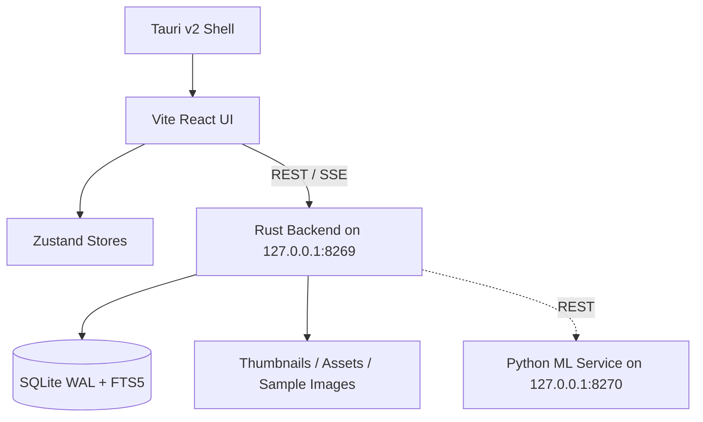

<p align="center">
  
</p>

<p align="center">
  <strong>Privacy-first local photo & video library, AI search, organization, and editing suite powered by Rust & React.</strong>
</p>

<p align="center">
  
  
  
  
  
  
</p>

---

## Table of Contents

- [What Prism Is](#what-prism-is)
- [Core Features](#core-features)
- [Technology Stack](#technology-stack)
- [Architecture](#architecture)
- [Getting Started](#getting-started)
  - [Prerequisites](#prerequisites)
  - [One-Click Startup](#one-click-startup)
  - [Manual Setup](#manual-setup)
  - [Optional Local AI Features](#optional-local-ai-features)
- [License](#license)

---

## What Prism Is

**Prism** is a local-first desktop photo and video library application for photographers and privacy-conscious users. Powered by a high-performance **Rust (Axum)** backend, Prism indexes images and videos from watched folders, extracts EXIF metadata, generates high-speed WebP thumbnails, supports instantaneous FTS5 search and browsing, groups media by people/places/memories, provides a non-linear video timeline editor, and secures private media inside an Argon2id encrypted Locked Folder.

All photo metadata, search indexes, thumbnails, and Locked Folder operations remain 100% local on your machine.

---

## Core Features

- **Local library indexing:** Import individual files or entire directory trees with directory watching and auto-sync.
- **Universal UUID Support:** Photos, Albums, Video Projects, People, Agent Sessions, and Agent Messages use unique UUID identifiers in API endpoints and deep-link URLs.
- **Media formats:** PNG, JPG, JPEG, WebP, HEIC, HEIF, DNG, TIFF, BMP, GIF, MP4, MOV, M4V, AVI, MKV, WebM, 3GP.
- **High-Performance Rust Core:** Low memory footprint, fast SQLite WAL & FTS5 queries, multi-threaded image processing, and SSE live event streaming.
- **Non-Linear Video Editor (NLE):** Timeline project dashboard, multi-track composition, sample preset thumbnails, aspect ratio configuration (16:9, 9:16, 1:1), and clip analysis.
- **Fast browsing:** Virtualized React grid, full-screen lightbox preview, sample presets, favorite/archive/trash flags, and accessibility (a11y) optimized controls.
- **Video playback & previews:** Custom player with keyboard controls, speed adjustment, picture-in-picture, and hover preview thumbnails.
- **Metadata & EXIF:** EXIF dates, GPS coordinates, camera make/model, ISO, focal length, image dimensions, content hash, and blur scoring. For videos: duration, FPS, video codec, and audio codec.
- **People & Face Clustering:** Person grid, custom naming flow, pending face feedback, and sample preset preview thumbnails.
- **Map View:** Leaflet-based geospatial browsing with cluster markers and custom tile themes.
- **Locked Folder:** Argon2id password verification, envelope encryption with random DEK wrapped by KEK, atomic encrypted writes, and startup recovery.
- **Local AI Assistant:** Conversational agent interface with persistent sessions, message history, plan execution, and photo search tools.
- **Image Editing Suite:** Crop, rotate, flip, color matching, presets with sample image previews, curves, selective region adjustments, and annotation overlays.

---

## Technology Stack

<p align="left">
  
  
  
  
  
  
</p>

### Frontend
- **Framework:** React 18, TypeScript, Vite, Tailwind CSS
- **Desktop Shell:** Tauri v2
- **State Management:** Zustand
- **Navigation:** React Router v7
- **UI & Animations:** Framer Motion, Lucide Icons, TanStack Virtual
- **Geospatial & Editing:** Leaflet, Cropper.js

### Backend
- **Core Engine:** Rust (`backend_rust`), Axum, Tokio async runtime
- **Database:** SQLite with SQLx, WAL mode, FTS5 full-text search index
- **ML Microservice:** Standalone Python ML microservice (`Prism_python_backend`) for face detection & embedding inference

---

## Architecture


```mermaid
graph TD
    Tauri[Tauri v2 Shell] --> React[Vite React UI]
    React --> Zustand[Zustand Stores]
    React -->|REST / SSE| Axum[Rust Backend on 127.0.0.1:8269]
    Axum --> SQLx[(SQLite WAL + FTS5)]
    Axum --> Storage[Thumbnails / Assets / Sample Images]
    Axum -. REST .-> PyML[Python ML Service on 127.0.0.1:8270]
```

---

## Getting Started

### Prerequisites

- **Node.js** v18+ & **pnpm** v9+
- **Rust** & `cargo` (1.75+)
- **Python** 3.11+ & `uv` (optional, for standalone Python ML microservice)
- **ffmpeg** and **ffprobe** (for video frame extraction and animated WebP thumbnails)

### One-Click Startup

To start the Rust backend and launch the application:

```bash
# Start Web environment (Vite + Rust Backend)
./run-web.sh

# Start Desktop environment (Tauri + Rust Backend)
./run-desktop.sh
```

## License

This project is licensed under the MIT License. See [LICENSE](LICENSE) for details.
