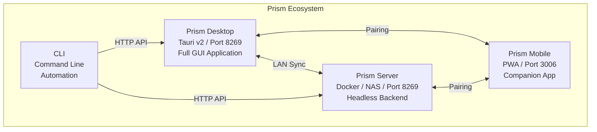

<div align="center">


# Prism

[](LICENSE)
[](https://www.rust-lang.org/)
[](https://react.dev/)
[](https://tauri.app/)
[](https://www.sqlite.org/)

Privacy-first local photo and video library with AI-powered organization and professional editing.

[Quick Start](#quick-start) | [Product Highlights](#product-highlights) | [Prism Ecosystem](#prism-ecosystem) | [Documentation](#documentation) | [Configuration](#configuration)
</div>

Prism indexes media from watched folders, extracts EXIF metadata, generates WebP thumbnails, supports full-text search, groups media by people/places/memories, provides a non-linear video editor, and secures private media inside an Argon2id-encrypted Locked Folder. All data stays **100% local** on your machine.

## Quick Start

### Prerequisites

- [Rust](https://rustup.rs/) (latest stable)
- [Node.js](https://nodejs.org/) v18+ and [pnpm](https://pnpm.io/)
- SQLite (usually pre-installed)
- ffmpeg/ffprobe (for video metadata and thumbnails)

### Install and run

```bash
git clone https://github.com/yourusername/prism.git
cd prism/frontend && pnpm install && cd ..

# Start backend + frontend
./run-web.sh
```

The backend starts on port `8269`, the Vite dev server on port `3005`. Open http://localhost:3005.

> [!TIP]
> For desktop mode with Tauri, run `./run-desktop.sh` instead. See [docs/SETUP.md](docs/SETUP.md) for system dependencies.

> [!NOTE]
> You can also run the backend as a Docker container with `docker compose up -d`.

## Product Highlights

### Photo Management

- **Smart Import** — Watch folders with automatic detection of new media
- **EXIF Extraction** — Full metadata parsing including GPS, camera info, and timestamps
- **Virtualized Grid** — High-performance photo grid with timeline dial navigation
- **Full-Text Search** — FTS5-powered search across filenames, captions, locations, and OCR text
- **People Detection** — AI-powered face detection and recognition with in-process embeddings
- **Album Management** — Custom albums, smart albums (screenshots, documents, places), and memories

### Image Editor (19 Tools)

Professional non-destructive image editing:

| Category | Tools |
|----------|-------|
| Light | Exposure, brightness, contrast, highlights, shadows, whites, blacks |
| Color | HSL per-band, color wheels, temperature, tint, vibrance, saturation |
| Tone | Per-channel RGB curves with bezier spline interpolation |
| Presets | Curated cinematic, vintage, and creative look presets |
| Selective | Local adjustment layers using custom drawn masks (lasso, AI segmentation) |
| Portrait | Skin smoothing, face brightness, AI-powered face-aware enhancements |
| Healing | AI-powered object removal and inpainting (LaMa ONNX) |
| Effects | Annotations, frames, grain, light leaks, vignettes, tilt-shift, LUT support |
| Transform | Crop, rotate, flip with aspect ratio constraints |
| Export | Multi-format export (JPEG, PNG, WebP) with quality controls |

### Video Editor (NLE)

Full non-linear editing system:

- Multi-track timeline with video, audio, and text tracks
- Clip editing: split, trim, copy, paste, delete
- Keyframe animation with bezier curves
- Per-clip color grading and transitions
- Multi-cam editing and audio mixing
- Speed ramping with variable speed control
- Proxy generation for smooth editing
- Export to MP4 with customizable resolution, codec, and bitrate

### Privacy and Security

- **Locked Folder** — Argon2id-encrypted private photo storage
- **Local-first** — All data stays on your machine, no cloud dependencies
- **API Key Auth** — Optional API key protection for the backend

### Map View

- Interactive Leaflet-based map with photo markers and clustering
- Travel routes visualization and density heatmaps
- Temporal slider to filter photos by time

### AI Features (Optional)

- Agent chat for natural language photo search
- Semantic search via SigLIP2 embeddings
- OCR text extraction with PaddleOCR-VL
- Object detection and auto-tagging
- Background removal and segmentation

### Utilities

- Storage cleanup (duplicates, blur detection, documents)
- Batch rename with pattern-based templates
- Backup and restore
- Diagnostics and system health monitoring

## Prism Ecosystem

Prism is a complete ecosystem for managing your photo library across devices:


```mermaid
graph TB
    subgraph Prism_Ecosystem["Prism Ecosystem"]
        Desktop["Prism Desktop<br/>Tauri v2 / Port 8269<br/>Full GUI Application"]
        Server["Prism Server<br/>Docker / NAS / Port 8269<br/>Headless Backend"]
        Mobile["Prism Mobile<br/>PWA / Port 3006<br/>Companion App"]
        CLI["CLI<br/>Command Line<br/>Automation"]
    end

    Desktop <--> |"LAN Sync"| Server
    Desktop <--> |"Pairing"| Mobile
    Server <--> |"Pairing"| Mobile
    CLI --> |"HTTP API"| Desktop
    CLI --> |"HTTP API"| Server
```

| Project | Description | Location |
|---------|-------------|----------|
| Prism Desktop | Full-featured desktop app with Tauri v2 shell | This project |
| Prism Server | Docker-containerized backend for headless deployment | [`prism-server/`](../prism-server/) |
| Prism Mobile | Mobile companion PWA for browsing and uploads | [`prism-mobile/`](../prism-mobile/) |
| CLI | Command-line interface for automation | [`cli/`](../cli/) |

### Connecting Your Devices

1. **Desktop to Server** — Both run the same backend; choose based on your setup
2. **Mobile to Desktop/Server** — Connect over LAN using the pairing system
3. **CLI to Any** — Use the CLI with any running backend instance

> [!IMPORTANT]
> All connections happen over your local network. No cloud services required. See [Prism Server](../prism-server/README.md) and [Prism Mobile](../prism-mobile/README.md) for setup instructions.

## Documentation

| Document | Description |
|----------|-------------|
| [Architecture](docs/ARCHITECTURE.md) | System architecture, design decisions, and data flow |
| [Image Editor](docs/IMAGE_EDITOR.md) | Complete guide to all 19 image editing tools |
| [Video Editor](docs/VIDEO_EDITOR.md) | NLE video editor features and workflow |
| [CLI Reference](docs/CLI.md) | Command-line interface usage and commands |
| [AI Features](docs/AI_FEATURES.md) | AI capabilities, models, and configuration |
| [Setup Guide](docs/SETUP.md) | Installation, configuration, and troubleshooting |
| [Security](docs/SECURITY.md) | Privacy features, encryption, and security model |
| [API Reference](docs/API.md) | REST API endpoints and usage |
| [Database](docs/DATABASE.md) | SQLite schema and data model |

## Tech Stack

| Layer | Technology |
|-------|------------|
| Frontend | React 18, TypeScript 5.8, Vite 6, Tailwind CSS, Zustand |
| Desktop Shell | Tauri v2 |
| Backend | Rust, Axum, Tokio, SQLx |
| Database | SQLite (WAL mode + FTS5) |
| ML/AI | ONNX Runtime, SigLIP2, face-id (SCRFD+ArcFace), LaMa |
| Video | ffmpeg/ffprobe, WebCodecs API |
| Map | Leaflet + React Leaflet |

## Configuration

Prism is configured via environment variables:

| Variable | Default | Description |
|----------|---------|-------------|
| `HOST` | `0.0.0.0` | Backend bind host |
| `PORT` | `8269` | Backend bind port |
| `DATABASE_URL` | `sqlite://prism.db` | SQLite database URL |
| `UPLOAD_DIR` | `uploads` | Media upload directory |
| `THUMBNAILS_DIR` | `thumbnails` | Thumbnail storage directory |
| `API_KEY` | *(empty)* | Optional API key for authentication |
| `GPU_MODE` | `cpu` | GPU mode for ML inference (`cpu`/`cuda`/`metal`) |
| `RUST_LOG` | `info` | Log level (`debug`/`info`/`warn`/`error`) |

> [!NOTE]
> GPU acceleration is available for ML inference. Set `GPU_MODE=cuda` for NVIDIA or `GPU_MODE=metal` for Apple Silicon.

## Development

```bash
# Run tests
cd frontend && pnpm test

# Run linter
cd frontend && pnpm lint

# Type check
cd frontend && pnpm tsc

# Build for production
cd frontend && pnpm build
```

## Acknowledgments

- [Tauri](https://tauri.app/) — Build smaller, faster, more secure desktop applications
- [Axum](https://github.com/tokio-rs/axum) — Ergonomic and modular web framework
- [SigLIP2](https://huggingface.co/google/siglip2-base-patch16-224) — Semantic image-text embeddings
- [face-id](https://crates.io/crates/face_id) — In-process face detection and recognition
- [LaMa](https://advimman.github.io/lama/) — Resolution-robust inpainting
