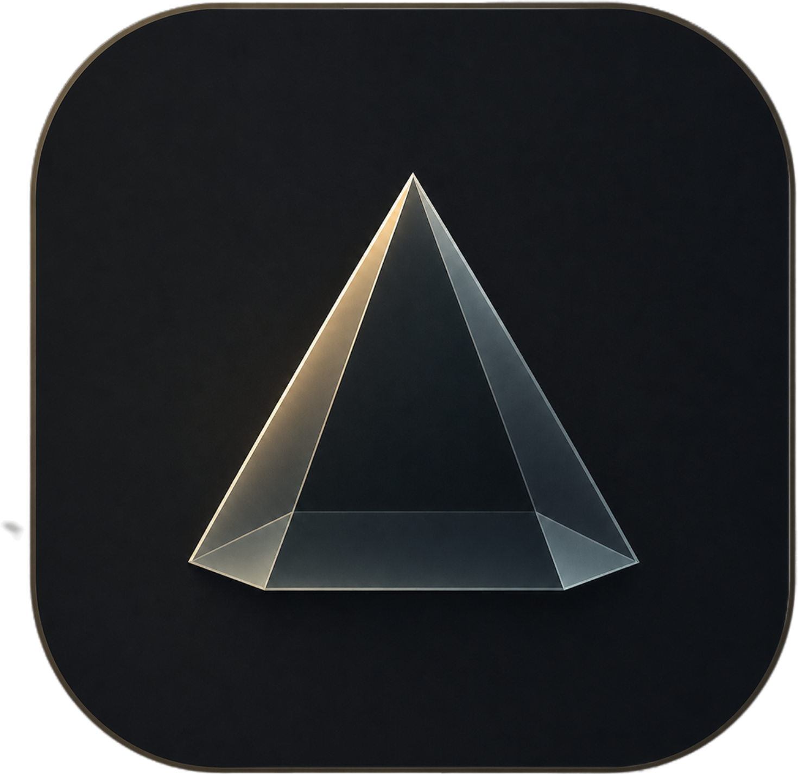
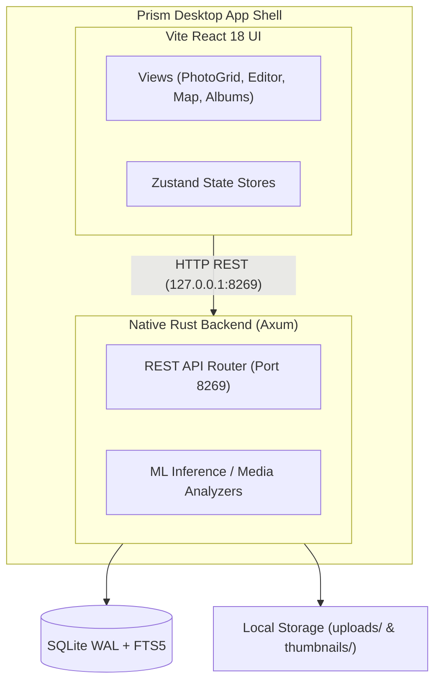

<div align="center">


# Prism

[](https://www.rust-lang.org/)
[](https://react.dev/)
[](https://tauri.app/)
[](https://www.sqlite.org/)

Privacy-first adaptive photo and video library application powered by Tauri v2, React, and a high-performance Rust backend.

[Quick Start](#quick-start) | [Features](#desktop-features) | [Image Editor](#image-editor-19-tools) | [Video Editor](#video-editor-nle) | [Documentation](#documentation)

</div>

---

> [!NOTE]
> **Prism** is a unified, adaptive photo & video library application. It runs natively as a desktop app (Tauri v2), as a web app, or via Docker container deployment (`prism-server`).

---

## Quick Start

### Prerequisites

- [Rust](https://rustup.rs/) (latest stable)
- [Node.js](https://nodejs.org/) v18+ and [pnpm](https://pnpm.io/)
- SQLite & `ffmpeg`/`ffprobe`

### Install and Run Desktop App

```bash
# Install frontend dependencies
cd frontend && pnpm install && cd ..

# Option A: Run in Web Dev Mode (Browser UI + Rust Backend)
./run-web.sh

# Option B: Run in Native Desktop Shell Mode (Tauri v2)
./run-desktop.sh
```

The Rust backend runs on port `8269`, and the Vite dev server on port `3005`. Open http://localhost:3005 in Web Mode or use the Tauri desktop window.

---

## Desktop Features

### Photo & Gallery Management

- **Smart Import & Folder Watching** — Automatically detects and indexes new photos from local media directories.
- **EXIF Extraction** — Parses full camera, GPS, exposure, and time metadata.
- **Virtualized Photo Grid** — High-performance grid powered by TanStack Virtual for fluid scrolling through 100k+ media assets.
- **Full-Text Search** — SQLite FTS5 index for fast discovery by location, caption, camera model, or OCR text.
- **In-Process Face Recognition** — Local SCRFD + ArcFace face detection with person grouping.
- **Albums & Memories** — Smart albums (documents, screenshots, places) and automated highlights.

### Image Editor (19 Tools)

Non-destructive professional photo editor built directly into the desktop UI:

| Category | Available Tools |
|----------|-----------------|
| **Light** | Exposure, brightness, contrast, highlights, shadows, whites, blacks |
| **Color** | HSL per-band, color wheels, temperature, tint, vibrance, saturation |
| **Tone** | Per-channel RGB curves with bezier spline interpolation |
| **Presets** | Curated cinematic, vintage, and creative look presets |
| **Selective** | Adjustment layers with custom drawn masks (lasso, AI segmentation) |
| **Portrait** | Skin smoothing, face brightness, AI-powered face enhancements |
| **Healing** | AI-powered object removal and inpainting (LaMa ONNX) |
| **Effects** | Annotations, frames, grain, light leaks, vignettes, tilt-shift, LUT support |
| **Transform** | Crop, rotate, flip with aspect ratio locks |
| **Export** | JPEG, PNG, WebP export with custom quality settings |

### Video Editor (NLE)

Full non-linear multi-track video editing engine:

- Multi-track timeline supporting video, audio, and text overlays
- Split, trim, copy, paste, and delete clip operations
- Keyframe animation with bezier velocity curves
- Per-clip color grading and transitions
- Multi-cam editing and audio track mixing
- Speed ramping with variable speed control
- Background video proxy generation for smooth preview rendering
- Multi-format MP4 export with configurable codecs and bitrates

### Interactive Map View

- Leaflet-based map visualization with marker clustering by GPS EXIF coordinates.
- Route drawing, density heatmaps, and temporal time-slider filtering.

### Locked Folder Vault

- Argon2id-encrypted storage area for private media.
- Auto-locking session handling and hidden media state.

---

## Desktop Architecture


```mermaid
graph TB
    subgraph Desktop_App["Prism Desktop App Shell"]
        subgraph Frontend_UI["Vite React 18 UI"]
            Views["Views (PhotoGrid, Editor, Map, Albums)"]
            Stores["Zustand State Stores"]
        end

        subgraph Backend_Process["Native Rust Backend (Axum)"]
            API["REST API Router (Port 8269)"]
            Services["ML Inference / Media Analyzers"]
        end
    end

    DB[("SQLite WAL + FTS5")]
    FS["Local Storage (uploads/ & thumbnails/)"]

    Frontend_UI --> |"HTTP REST (127.0.0.1:8269)"| Backend_Process
    Backend_Process --> DB
    Backend_Process --> FS
```

---

## Documentation Links

| Document | Description |
|----------|-------------|
| [Architecture](docs/ARCHITECTURE.md) | Technical architecture, component layout, and data flow |
| [CLI Reference](docs/CLI.md) | Command-line interface and plugin management |
| [Image Editor Guide](docs/IMAGE_EDITOR.md) | In-depth breakdown of all 19 image editing tools |
| [Video Editor Guide](docs/VIDEO_EDITOR.md) | NLE timeline features and video pipeline |
| [AI Features](docs/AI_FEATURES.md) | Local ONNX models and AI capability documentation |
| [Setup Guide](docs/SETUP.md) | System dependency installation and troubleshooting |
| [Security Model](docs/SECURITY.md) | Locked folder, encryption, and privacy details |
| [API Reference](docs/API.md) | REST API endpoint documentation |
| [Plugin Development](docs/PLUGINS.md) | Guide to building, packaging, and publishing Prism plugins |
| [Database Schema](docs/DATABASE.md) | SQLite tables and indexes reference |

---

## Configuration

Prism Desktop is configured via environment variables or runtime settings:

| Variable | Default | Description |
|----------|---------|-------------|
| `HOST` | `127.0.0.1` | Local backend bind address |
| `PORT` | `8269` | Local backend port |
| `DATABASE_URL` | `sqlite://prism.db` | SQLite database URL |
| `UPLOAD_DIR` | `uploads` | Local directory for imported media |
| `THUMBNAILS_DIR` | `thumbnails` | Directory for generated WebP thumbnails |
| `WEB_STATIC_DIR` | `./frontend/dist` | Directory for standalone static web serving |
| `API_KEY` | *(empty)* | Optional API key authentication header |
| `GPU_MODE` | `cpu` | Inference mode (`cpu`, `cuda`, `metal`) |
| `RUST_LOG` | `info` | Logging verbosity level |

## Desktop Development Commands

```bash
# Frontend type check
cd frontend && pnpm tsc

# Frontend linter
cd frontend && pnpm lint

# Frontend tests
cd frontend && pnpm test

# Build frontend production bundle
cd frontend && pnpm build

# Rust backend tests
cd backend_rust && cargo test
```

