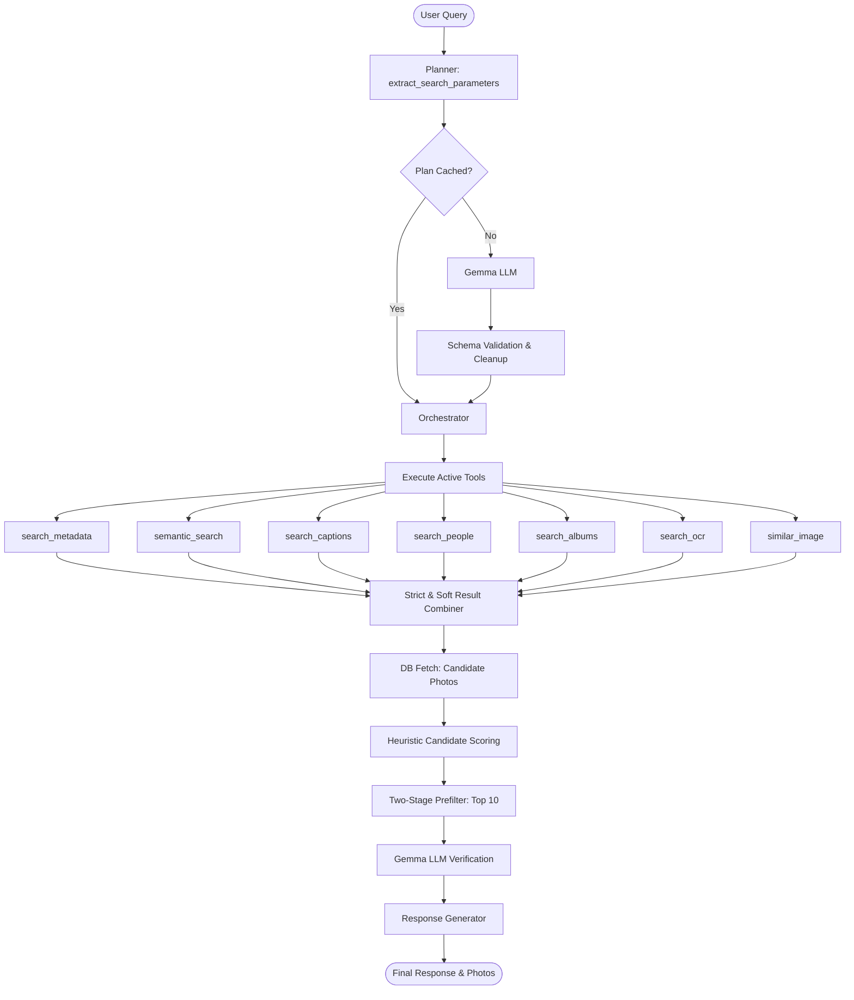

# Prism Photo AI Agent Architecture & Documentation

This document describes the design, components, and workflows of the offline neural agentic search module in **Prism Photos**.

---

## 1. Overview

The Prism Photo AI Agent is a local-first, offline neural search system. It translates natural language user queries (e.g., *"Show my favorite family photos in Goa during sunset"*) into structured database queries, executes multi-tool hybrid searches (metadata filters, semantic embedding search, OCR, person indexing), and verifies results using a local LLM before returning formatted summaries to the user.



---

## 2. Component Directory

All files reside under [backend/app/agent/](file:///home/chotaxdon/Work/Projects/Prism/backend/app/agent):

| File | Class | Responsibility |
| :--- | :--- | :--- |
| [`service.py`](file:///home/chotaxdon/Work/Projects/Prism/backend/app/agent/service.py) | `PrismAgent` | Main interface layer exposing search endpoints, preloading, and entry points. |
| [`planner.py`](file:///home/chotaxdon/Work/Projects/Prism/backend/app/agent/planner.py) | `Planner` | Handles query planning, plan reformulation, LLM-based photo verification, and response generation. |
| [`orchestrator.py`](file:///home/chotaxdon/Work/Projects/Prism/backend/app/agent/orchestrator.py) | `AgentOrchestrator` | Coordinates the loop, manages tool execution, combines results, scores candidates, and streams progress. |
| [`search_tools.py`](file:///home/chotaxdon/Work/Projects/Prism/backend/app/agent/search_tools.py) | `SearchTools` | Hybrid indexes scanning (FTS5 captions, clustered faces, metadata filters, SigLIP semantic similarity). |
| [`embeddings.py`](file:///home/chotaxdon/Work/Projects/Prism/backend/app/agent/embeddings.py) | `EmbeddingClient` | Generates text query vector embeddings using SigLIP models. |
| [`llm.py`](file:///home/chotaxdon/Work/Projects/Prism/backend/app/agent/llm.py) | `LlamaManager` | Interface to local `llama-server` endpoints with automatic VRAM management. |

---

## 3. Core Search Pipelines

### 3.1 Expanded Semantic Planner Schema
The `Planner` extracts search instructions from query history and user input. It formats outputs using a semantic structure:
```json
{
  "intent": "photo_search",
  "is_locked": false,
  "entities": {
    "people": ["Rahul"],
    "locations": ["Goa"],
    "events": ["trip"],
    "objects": ["beach"],
    "time_range": "2025"
  },
  "constraints": {
    "must_match": ["people", "locations"],
    "soft_match": ["objects"]
  },
  "ranking": {
    "prefer_favorites": true,
    "prefer_recent": false
  }
}
```
If the LLM fails to output valid JSON, a robust parser sanitizes the response, extracts brace boundaries (`{...}`), and cleans/coerces parameter data types to guarantee stability.

### 3.2 Dynamic Tool Routing
The orchestrator dynamically maps planner entities to backend search tools:
- `entities["people"]` $\to$ `search_people` (matches face clusters)
- `entities["locations"]` $\to$ `search_metadata` (scans city, state, country)
- `entities["time_range"]` $\to$ `search_metadata` (extracts numeric years)
- `entities["events"]` / `entities["objects"]` $\to$ hybrid text tools (`semantic_search`, `search_captions`, `search_ocr`, `search_albums`)

### 3.3 Strict vs. Soft Result Combiner
To avoid discarding valid candidates when a search model is slightly misaligned, tools are categorized dynamically based on constraints:
- **Strict Constraints**: Tool runs for entities listed in `constraints.must_match`. Results are combined using **intersection** ($\cap$).
- **Soft Constraints**: Tool runs for entities listed in `constraints.soft_match`. Results are combined using **union** ($\cup$).

The final candidate set is calculated as:
$$\text{Combined IDs} = \text{Strict IDs} \cap \text{Soft IDs}$$
*Fallback*: If the final intersection is empty, the orchestrator falls back to the hard strict constraints set.

---

## 4. Two-Stage Candidate Verification

To mitigate slow LLM evaluations when checking a large number of search results, candidate validation is executed in two stages:

1. **Heuristic Pre-Filtering & Scoring**: Candidates are ranked in memory using query token intersections with metadata.
   - Exact year match: `+3.0`
   - Exact favorite state match: `+2.0`
   - Location term match: `+2.0`
   - Caption term match: `+1.5`
   - AI summary / tag match: `+1.0`
   - Filename term match: `+0.5`
2. **LLM Verification**: Only the **top 10** highest-scoring candidates are sent to Gemma for final verification, drastically lowering API latency and token consumption.

---

## 5. In-Memory Caching System

The agent optimizes compute overhead through local caching:
- **SigLIP Embeddings Cache**: Stores generated query vectors inside `EmbeddingClient` to speed up semantic queries.
- **Planner Output Cache**: Caches structured JSON plans in `Planner` based on the message and history fingerprint.
- **Tool Results Cache**: Stores matched photo sets in `SearchTools` keyed by query filters.

*Note*: Cache structures automatically clear when exceeding size thresholds to prevent memory bloating.

---

## 6. Privacy & Security Constraints

The `is_locked` folder flag is consistently propagated to all SQL layers:
- Clustered face lookups (`search_people`) join on the `photos` table to filter locked items.
- Full-text search (`search_captions`) uses FTS5 joins with `photos` to exclude unauthorized assets.
- Similar image and OCR scans reject locked records by default unless the lock state is explicitly unlocked.

---

## 7. Future Roadmaps & Optimizations

These architectural enhancements are designed to further optimize performance, user experience, and intelligence for Prism Photos.

### 7.1 Cross-Encoder Re-Ranker (Replacing Gemma Verification)
Gemma verification is currently the primary bottleneck for searching. Replacing or augmenting it with a Cross-Encoder Re-Ranker model (e.g., `bge-reranker`, `jina-reranker`) offers substantial benefits:
- **Pipeline Shift**:
  ```mermaid
  graph LR
      Top100[Top 100 Candidates] --> Reranker[Cross-Encoder Re-Ranker] --> Top10[Top 10 Candidates] --> LLMResponse[Gemma Response Generation]
  ```
- **Benefits**:
  - **Speed**: Pure transformer inference for sequence pair classification is much faster than auto-regressive generation.
  - **Consistency**: Deterministic, finely calibrated similarity scores (0.0 to 1.0) rather than LLM text parser fallbacks.
  - **Lower VRAM**: Reranker models are typically much smaller (100M-300M parameters) than full conversational LLMs (2B+ parameters).

### 7.2 Search Explanations
To increase user trust and transparency, the system should compute and return structured search explanations for each matching photo:
```json
{
  "photo_id": "...",
  "score": 0.91,
  "matched": [
    "Rahul detected",
    "Beach caption",
    "Goa location"
  ]
}
```
The UI can render these details directly to explain to the user exactly why each photo was selected (e.g., `✓ Rahul`, `✓ Goa`, `✓ Beach`), addressing a common usability pain point in existing photo applications.

### 7.3 Specialized Agent Roles (Multi-Agent Architecture)
Instead of relying on a single monolithic agent, the system can delegate tasks to three specialized agent roles:
1. **Search Agent (Fast)**:
   - *Responsibilities*: Query parsing, finding photos, locating people/faces, finding albums.
   - *Requirement*: High execution speed, direct database indexing connections.
2. **Curator Agent (Slow, Creative)**:
   - *Responsibilities*: Designing themed albums, generating highlights/recap summaries, creating travel stories.
   - *Requirement*: Rich context integration, longer-running reasoning.
3. **Organizer Agent (Background)**:
   - *Responsibilities*: De-cluttering (detecting blurry/duplicate photos), renaming clusters/people, suggesting albums, merging duplicates.
   - *Requirement*: Scheduled cron/background execution, minimal impact on active user performance.

### 7.4 Conversational Memory Search (Refinement Engine)
To support multi-turn refinement queries (e.g., *"Show photos from my Goa trip"* $\to$ *"Only the ones with Rahul"* $\to$ *"Now show sunset shots"*), the system will use a conversational refinement pipeline:
- **Refinement Pipeline**:
  ```mermaid
  graph TD
      Query1([Goa trip]) --> Plan1[Plan 1] --> Results1[Result Set 1]
      Query2([Only the ones with Rahul]) --> Refine1[Refinement Filter] --> Results2[Subset of Result Set 1]
      Query3([Now show sunset shots]) --> Refine2[Refinement Filter] --> Results3[Final Refined Subset]
  ```
- **Execution Flow**: Instead of running a full hybrid query across the entire database at each turn, the agent keeps the current result set IDs in memory as context, applies the newly generated planner constraints directly to filter/sort the active subset, and yields instant updates.
