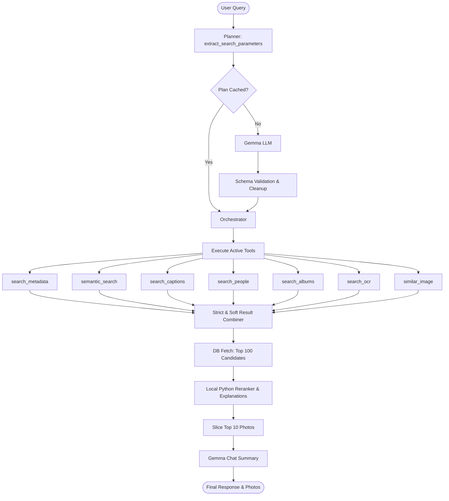

# Prism Photo AI Agent Architecture & Documentation

This document describes the design, components, and workflows of the offline neural agentic search module in **Prism Photos**.

---

## 1. Overview

The Prism Photo AI Agent is a local-first, offline neural search system. It translates natural language user queries (e.g., *"Show my favorite family photos in Goa during sunset"*) into structured database queries, executes multi-tool hybrid searches (metadata filters, semantic embedding search, OCR, person indexing), and ranks candidate matches using a fast local python-based metadata and semantic similarity reranker, providing matched reasons checkmarks and scores, and using Gemma only for generating the final chat response summary.



---

## 2. Component Directory

All files reside under [backend/app/agent/](file:///home/chotaxdon/Work/Projects/Prism/backend/app/agent):

| File | Class | Responsibility |
| :--- | :--- | :--- |
| [`service.py`](file:///home/chotaxdon/Work/Projects/Prism/backend/app/agent/service.py) | `PrismAgent` | Main interface layer exposing search endpoints, preloading, and entry points. |
| [`planner.py`](file:///home/chotaxdon/Work/Projects/Prism/backend/app/agent/planner.py) | `Planner` | Handles query planning, plan reformulation, and response generation. |
| [`orchestrator.py`](file:///home/chotaxdon/Work/Projects/Prism/backend/app/agent/orchestrator.py) | `AgentOrchestrator` | Coordinates tool execution, combines results, runs the python-based reranker, and manages memory refinement. |
| [`search_tools.py`](file:///home/chotaxdon/Work/Projects/Prism/backend/app/agent/search_tools.py) | `SearchTools` | Hybrid indexes scanning (FTS5 captions, clustered faces, metadata filters, SigLIP semantic similarity). |
| [`embeddings.py`](file:///home/chotaxdon/Work/Projects/Prism/backend/app/agent/embeddings.py) | `EmbeddingClient` | Generates text query vector embeddings using SigLIP models. |
| [`llm.py`](file:///home/chotaxdon/Work/Projects/Prism/backend/app/agent/llm.py) | `LlamaManager` | Interface to local `llama-server` endpoints with automatic VRAM management. |
| [`specialized_agents.py`](file:///home/chotaxdon/Work/Projects/Prism/backend/app/agent/specialized_agents.py) | `SearchAgent`, `CuratorAgent`, `OrganizerAgent` | Modular specialized roles layout for library search, curation, and cleanup tasks. |

---

## 3. Core Search Pipelines

### 3.1 Unified Planner Schema
The `Planner` extracts search instructions from query history and user input. It decouples intent extraction from database tool names by returning a semantic plan containing entities, constraints, ranking configurations, and conversational memory flags:
```json
{
  "intent": "photo_search",
  "is_locked": false,
  "refine_previous": true,
  "entities": {
    "people": ["Rahul"],
    "locations": [],
    "events": [],
    "objects": [],
    "time_range": null
  },
  "constraints": {
    "must_match": ["people"],
    "soft_match": []
  },
  "ranking": {
    "prefer_favorites": false,
    "prefer_recent": true
  }
}
```
The key fields are:
- `is_locked`: Determines whether search boundary is locked-folder or public.
- `refine_previous`: Boolean flag marking whether this request represents an iterative refinement or filter on top of preceding search outcomes (e.g. "only with Rahul").
- `entities`: Granular query parameters extracted.
- `constraints`: Decides which entity subsets require hard intersections (`must_match`) or soft unions (`soft_match`).

If the LLM fails to output valid JSON, a robust parser sanitizes the response, extracts brace boundaries (`{...}`), and cleans/coerces parameter data types to guarantee stability.

### 3.2 Dynamic Strict vs. Soft Result Combiner
To avoid discarding valid candidates when a search model is slightly misaligned, tools are dynamically categorized into constraints based on the planner's output:
- **Strict Results**: Results from metadata checks (using `locations` or `time_range`) and name checks (`people`) are marked as strict if their entity type is listed in `must_match`. These are combined using **intersection** ($\cap$).
- **Soft Results**: Results from text-based searches (`semantic_search`, `search_captions`, `search_ocr`, `search_albums`) and similar image scans (`similar_image`), as well as metadata/people checks that are not marked as strict, are treated as soft constraint queries. These are combined using **union** ($\cup$).

The final candidate IDs are calculated as:
$$\text{Combined IDs} = \text{Strict IDs} \cap \text{Soft IDs}$$
*Fallback*: If the final intersection is empty, the orchestrator falls back to the strict constraints set (or soft constraints set if no strict constraints are present) to ensure user search criteria are still partially satisfied.


---

## 4. Local Python Reranker & Search Explanations

To completely bypass slow LLM verification bottlenecks, Prism uses a fast Python-based reranker to rank the top 100 candidates down to the top 10. This achieves sub-millisecond latencies, eliminates redundant VRAM/token usage, and improves query stability.

### 4.1 Scoring Components
For every candidate photo, a combined score is calculated:
- **Date Year Match**: `+3.0` (if query specifies a year matching `date_taken` year)
- **Favorites Match**: `+2.0` (if query contains favorites keywords and photo is favorite)
- **Location Name Match**: `+2.0` per matching location term in metadata
- **Face Detections**: `+2.0` per matching name in `entities.people`
- **Caption Matches**: `+1.5` per overlapping token in caption text
- **AI Tag / Description Matches**: `+1.0` per overlapping token in tags/summary
- **Semantic Vector Match**: `+ (cosine_similarity * 10)` if similarity with query embedding is $\ge 0.15$

### 4.2 Search Explanations
For every returned photo, a structured list of match reasons is stored and propagated to the UI:
```json
{
  "score": 0.91,
  "matched": [
    "Rahul",
    "Goa",
    "Sunset"
  ]
}
```
The React frontend renders these matched reasons as premium checkmarks on card hover overlays to increase user search trust.

---

## 5. In-Memory Caching System

The agent optimizes compute overhead through local caching:
- **SigLIP Embeddings Cache**: Stores generated query vectors inside `EmbeddingClient` to speed up semantic queries.
- **Planner Output Cache**: Caches structured JSON plans in `Planner` based on the message and history fingerprint.
- **Tool Results Cache**: Stores matched photo sets in `SearchTools` keyed by query filters.

*Note*: Cache structures automatically clear when exceeding size thresholds to prevent memory bloating.

---

## 6. Privacy & Security Constraints

The `is_locked` folder flag is consistently propagated to all SQL layers:
- Clustered face lookups (`search_people`) join on the `photos` table to filter locked items.
- Full-text search (`search_captions`) uses FTS5 joins with `photos` to exclude unauthorized assets.
- Similar image and OCR scans reject locked records by default unless the lock state is explicitly unlocked.

---

## 7. Conversational Memory Search

Prism supports continuous search refinement (e.g. *"Show photos of Goa"* followed by *"Only the ones with Rahul"*).
- **Session Identification**: A session key is generated based on the MD5 hash of the first user message in history to keep a stable session context for the thread.
- **Cache Refinement**: The orchestrator caches the final photo IDs returned for each query turn. If the planner sets `refine_previous: true`, the current candidate set is intersected with the cached IDs from the preceding turn, creating a refined filter context without resetting state.

---

## 8. Specialized Agent Roles

To prevent the search agent from bloating, the agentic architecture lays stubs for modular specialized agents:
- **Search Agent (Fast)**: Scours indexes for photos, face identifications, and album records.
- **Curator Agent (Slow)**: Manages slow creative content curation, such as travel highlight compilations or custom travel story generation.
- **Organizer Agent (Background)**: Sweeps libraries in background threads for duplicates merge, clutter detection (blurry pictures/screenshots), and metadata suggestion.
