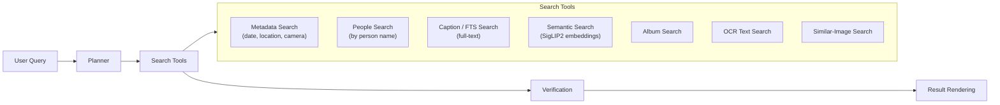
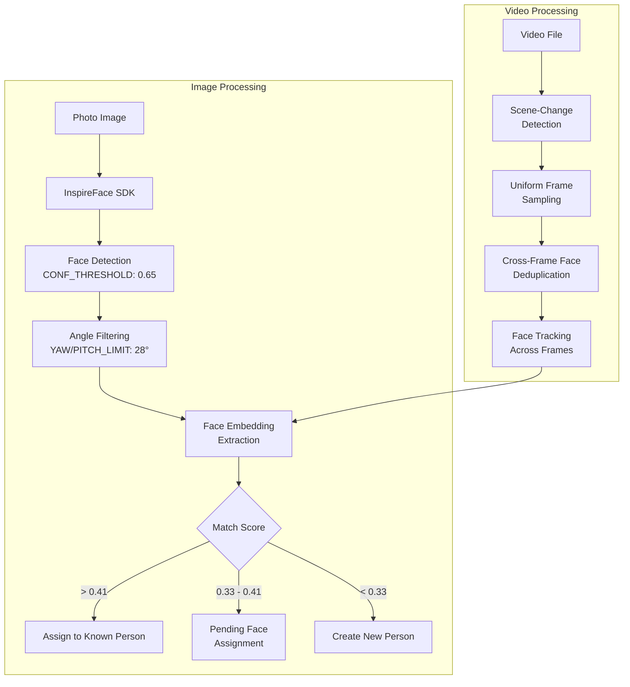
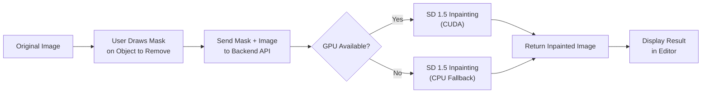
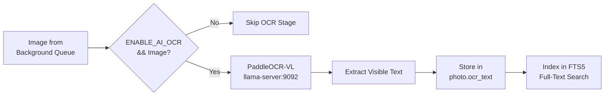
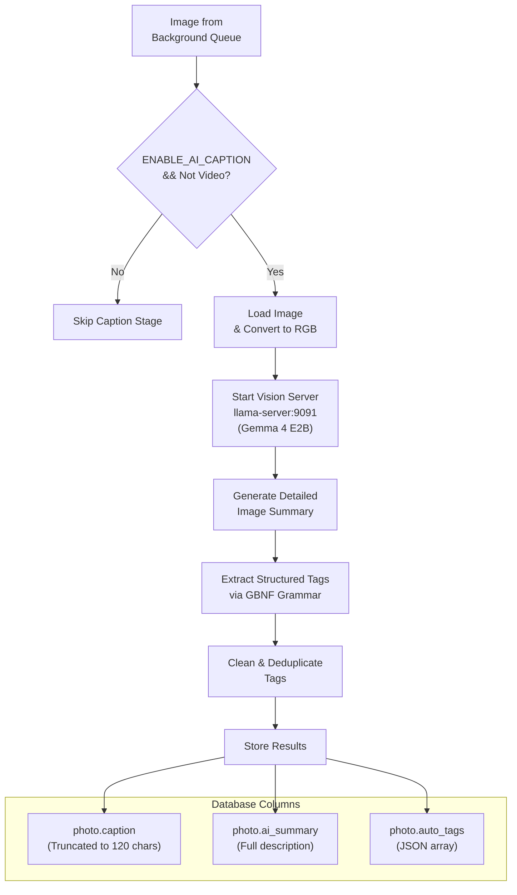

# Prism AI Features

Prism includes several optional local AI features that run entirely on your machine. All AI features are disabled by default and must be explicitly enabled via feature flags in `backend/.env`.

---

## Table of Contents

- [Feature Flag Overview](#feature-flag-overview)
- [Hardware Acceleration](#hardware-acceleration)
- [Dynamic Configuration & Engine Settings](#dynamic-configuration--engine-settings)
- [Agent Search (AI Assistant)](#agent-search-ai-assistant)
- [Face Detection & Clustering](#face-detection--clustering)
- [Vision Summaries & Embeddings](#vision-summaries--embeddings)
- [Inpainting (Object Removal)](#inpainting-object-removal)
- [Background Removal](#background-removal)
- [OCR Text Extraction](#ocr-text-extraction)
- [Caption Generation](#caption-generation)
- [Video Features](#video-features)
- [Model Files & Server Ports](#model-files--server-ports)
- [Troubleshooting](#troubleshooting)

---

## Feature Flag Overview

All AI features are controlled by environment variables in `backend/.env`. Set them to `True` to enable.

| Flag | Default | Description | Hardware Required |
|------|---------|-------------|-------------------|
| `ENABLE_AI_AGENT` | `False` | Local AI assistant with natural-language photo search | GPU recommended |
| `ENABLE_AI_FACE` | `False` | Face detection and clustering (InspireFace) | GPU optional |
| `ENABLE_AI_CLIP` | `False` | SigLIP2 embeddings for semantic search | GPU recommended |
| `ENABLE_AI_INPAINTING` | `False` | Stable Diffusion inpainting for object removal | GPU required |
| `ENABLE_AI_REMBG` | `False` | Background removal | GPU optional |
| `ENABLE_AI_OCR` | `False` | PaddleOCR-VL text extraction | GPU optional |
| `ENABLE_AI_SUBTITLES` | `False` | Whisper-based subtitle generation | GPU optional |
| `ENABLE_AI_CAPTION` | `True` | Gemma 4 image captioning | GPU recommended |
| `ENABLE_AI_STORY` | `True` | AI-powered story generation | CPU only |
| `ENABLE_AI_CONTENT_CLASSIFY` | `True` | Content classification (photo/screenshot/document) | CPU only |

### Background Processing Master Switches

| Flag | Default | Description |
|------|---------|-------------|
| `ENABLE_IMAGE_BG_PROCESS` | `True` | Master switch for all image background analysis |
| `ENABLE_VIDEO_BG_PROCESS` | `True` | Master switch for all video background analysis |
| `ENABLE_VIDEO_FACE` | `True` | Face detection and tracking inside videos |
| `ENABLE_VIDEO_EDITOR_AI` | `True` | Video editor AI features |

---

## Hardware Acceleration

Prism supports dynamic GPU backend configuration via the `GPU_MODE` setting.

### GPU Modes

| Mode | Value | Backend |
|------|-------|---------|
| NVIDIA CUDA | `cuda` | CUDA Toolkit required |
| AMD ROCm | `rocm` | ROCm stack required |
| Intel Arc/SYCL | `sycl` | Intel oneAPI required |
| Vulkan | `vulkan` | Vulkan SDK required |
| CPU Only | `cpu` | No GPU acceleration |

### Video Encoding Modes

| Mode | Value | Description |
|------|-------|-------------|
| Auto | `auto` | Automatic selection |
| NVENC | `nvenc` | NVIDIA hardware encoding |
| VAAPI | `vaapi` | Intel/AMD hardware encoding |
| CPU | `cpu` | Software encoding |

### Mutual Exclusion

When loading GPU resources, the system automatically unloads competing models to free VRAM:

Loading SigLIP2 → Unloads: llama-server (agent/vision/OCR), Face SDK, Vision LLM
Loading Face SDK → Unloads: SigLIP2, llama-server, Vision LLM
Loading llama-server → Unloads: SigLIP2, Face SDK

This ensures only one GPU-intensive model is resident in VRAM at a time.

---

## Dynamic Configuration & Engine Settings

Prism features a unified **Engine Settings** control panel accessible from the System Utilities page in the UI.

### Hardware Acceleration Select

Dynamically configure the target GPU execution backend without restarting:

- NVIDIA CUDA
- AMD ROCm
- Intel Arc/SYCL
- Vulkan
- CPU Only

Models adaptively route inference paths based on the selected backend.

### Background Worker Gating

Toggle individual background worker pipelines in real-time:

- SigLIP embeddings
- Face scanning/clustering
- Gemma captions
- OCR text extraction
- Video face tracking
- Subtitle generation

### Worker Process Controls

- **Stop**: Gracefully stops the background queue worker after current batch
- **Start/Restart**: Resumes processing; automatically scans for and resumes unfinished import assets

### Log Console

Monitor real-time execution logs (`backend.log`) inside a scrollable CLI-like console window directly within the UI, with auto-refresh and manual refresh controls.

### Configuration Persistence

All dynamic settings are saved to `settings.json` in the platform data directory, overriding default `.env` properties and persisting across backend restarts.

---

## Agent Search (AI Assistant)

The AI agent provides natural-language photo search capabilities.

### Architecture



1. **Planner**: Analyzes the user's query and decomposes it into search steps
2. **Search Tools**: Executes specialized search operations:
   - Metadata search (date, location, camera, file type)
   - People search (by person name)
   - Caption/FTS search (full-text across filenames, captions, summaries)
   - Semantic search (SigLIP2 embedding similarity)
   - Album search (by album name)
   - OCR text search (extracted text from images)
   - Similar-image search (visual similarity)
3. **Verification**: Validates search results against the query
4. **Result Rendering**: Formats and presents results to the user

### Model Requirements

- **Agent model**: `gemma-4-E4B-it-qat-UD-Q4_K_XL.gguf` in `models/llm/`
- **Draft model**: `gemma-4-E4B-it-Q4_0-MTP.gguf` (optional, for speculative decoding)
- **MMProj**: `mmproj-BF16-E4B.gguf` (vision encoder)
- **Server**: `llama-server` running on port `9090`

### Startup

The agent server is started on-demand by `AIOrchestrator.start_server(mode='agent')` and is managed through the agent API endpoints.

---

## Face Detection & Clustering

### Architecture



### Image Face Detection

Uses the InspireFace SDK to detect faces in photos:

1. Face detection with configurable confidence threshold (`FACE_CONF_THRESHOLD`, default: 0.65)
2. Yaw/pitch angle filtering (`FACE_YAW_PITCH_LIMIT`, default: 28°)
3. Face embedding extraction
4. Clustering against known people using embedding similarity
   - Match threshold: `FACE_MATCH_THRESHOLD` (default: 0.41)
   - Uncertain match threshold: `FACE_UNCERTAIN_MATCH_THRESHOLD` (default: 0.33)
   - Early exit score: `FACE_EARLY_EXIT_SCORE` (default: 0.75)
5. Borderline matches stored as `PendingFaceAssignment` for user verification
6. Face region metadata stored as JSON bounding boxes

### Video Face Detection

Hybrid approach combining scene-change detection with uniform frame sampling:

1. **Scene-change detection**: Identifies transition points in the video
2. **Uniform frame sampling**: Samples frames at regular intervals between scene changes
3. **Cross-frame face deduplication**: Ensures each person is counted once
4. Configuration:
   - `VIDEO_FACE_SCENE_THRESHOLD`: Scene change sensitivity (default: 0.3)
   - `VIDEO_FACE_MAX_FRAMES`: Maximum frames to analyze (default: 50)
   - `VIDEO_FACE_MIN_GAP_SECONDS`: Minimum gap between frame samples (default: 5.0)
   - `VIDEO_FACE_DEDUP_THRESHOLD`: Face deduplication threshold (default: 0.7)

### Video Face Tracking

Tracks detected faces across video frames:

- `VIDEO_FACE_TRACKER_IOU_THRESHOLD`: IoU threshold for tracking (default: 0.3)
- `VIDEO_FACE_TRACKER_CENTROID_DIST`: Maximum centroid distance (default: 150.0)
- `VIDEO_FACE_TRACKER_EMB_SIM_THRESHOLD`: Embedding similarity threshold (default: 0.4)
- `VIDEO_FACE_TRACKER_MAX_MISSED`: Max frames a track can be lost (default: 5)

### People Management

- **Person rename**: Rename detected people in the UI
- **Pending faces**: Review and confirm borderline face assignments
- **Cover photo**: Each person has a cover face thumbnail

### Services

Key service files: `backend/app/services/face_detection.py`, `face_clustering.py`, `face_recognition.py`, `face_sdk.py`, `face_tracker.py`, `face_utils.py`

---

## Vision Summaries & Embeddings

### SigLIP2 Embeddings (Semantic Search)

Uses Google's SigLIP2 model to generate visual embeddings for semantic similarity search.

- **Model**: `google/siglip2-base-patch16-224`
- **Cache location**: `backend/models/.cache/huggingface/`
- **Output**: 768-dimensional L2-normalized embedding vector
- **Storage**: JSON-serialized in the `embedding` column of the `photos` table
- **Usage**: Semantic search, similar-image lookup

### Florence-2 / Gemma Captions (Image Summaries)

Generates natural-language descriptions of images.

- **Model**: Gemma 4 E2B via `llama-server` on port 9091
- **Output**: Caption (truncated to 120 chars) and structured tags
- **Storage**: `ai_summary` (full description), `caption` (short), `auto_tags` (JSON array)

### FTS5 Full-Text Search

Searchable text is indexed in SQLite FTS5 across:
- Filename
- Caption
- Location (city, state, country)
- AI summary
- Auto tags
- OCR text

---

## Inpainting (Object Removal)

Uses Stable Diffusion 1.5 for AI-powered object removal and image inpainting.

### Architecture



### How It Works

1. User draws a mask over the object to remove (via `InpaintCanvas`)
2. The mask and original image are sent to the backend
3. Stable Diffusion 1.5 inpaints the masked region
4. The result is returned and displayed in the editor

### Configuration

- **Feature flag**: `ENABLE_AI_INPAINTING`
- **Hardware**: GPU required (CUDA recommended)
- **Fallback**: CPU inference supported but significantly slower
- **Service**: `backend/app/services/inference/sd_inpaint.py`
- **API endpoint**: Inpaint API router in `backend/app/api/photos/inpaint.py`

---

## Background Removal

Uses `rembg` library for automatic background removal from photos.

### Configuration

- **Feature flag**: `ENABLE_AI_REMBG`
- **Dependency**: Optional `rembg` package (install via `uv sync --extra rembg`)
- **Service**: `backend/app/services/portrait_service.py`

---

## OCR Text Extraction

Uses PaddleOCR-VL for extracting visible text from images.

### Architecture



### How It Works

1. Images are analyzed during the background processing pipeline (Stage 4)
2. Text is extracted using the PaddleOCR-VL model running in llama-server
3. Extracted text is stored in the `ocr_text` column
4. Text is indexed in FTS5 for full-text search

### Configuration

- **Feature flag**: `ENABLE_AI_OCR`
- **Server port**: 9092
- **Model**: `PaddleOCR-VL-1.6-GGUF.gguf` in `models/PaddleOCR/`
- **MMProj**: `PaddleOCR-VL-1.6-GGUF-mmproj.gguf`
- **Service**: `backend/app/services/ocr/ocr_extract.py`, `ocr_manager.py`

---

## Caption Generation

Uses Gemma 4 models for automatic image captioning and tag generation.

### Models

Two Gemma 4 variants are supported:

| Model | Size | Use Case | Server Port |
|-------|------|----------|-------------|
| Gemma 4 E4B | 4B parameters | Agent search (reasoning-focused) | 9090 |
| Gemma 4 E2B | 2B parameters | Vision/captioning (faster) | 9091 |

### Caption Generation Pipeline



1. Image is loaded and converted to RGB
2. Vision server (port 9091) generates a detailed summary
3. Structured tags are extracted using a GBNF grammar (`tags.gbnf`)
4. Tags are cleaned, deduplicated, and enriched with caption keywords
5. Results are stored in the database

### GBNF Grammar

Tag generation follows a structured JSON schema defined in `backend/app/services/image_summary/tags_schema.json` and enforced via a GBNF grammar file `tags.gbnf`.

---

## Video Features

### Video Face Tracking

When `ENABLE_VIDEO_FACE` is enabled, the system:

1. Analyzes video frames using hybrid scene-change + uniform sampling
2. Detects faces across frames with cross-frame deduplication
3. Clusters faces and assigns to known people
4. Tracks faces across frame sequences

### Subtitle Generation

When `ENABLE_AI_SUBTITLES` is enabled:

- Uses Whisper-based automatic speech recognition
- Generates subtitle tracks for video assets
- Subtitles are stored and accessible via the NLE APIs

### Video Editor AI

When `ENABLE_VIDEO_EDITOR_AI` is enabled:

- Multi-track non-linear editing timeline
- AI-powered effects and transitions
- Local composition export tools

---

## Model Files & Server Ports

### Required Model Locations

```
backend/
└── models/
    ├── llm/
    │   ├── gemma-4-E4B-it-qat-UD-Q4_K_XL.gguf  (agent model)
    │   ├── gemma-4-E4B-it-Q4_0-MTP.gguf          (draft model)
    │   ├── mmproj-BF16-E4B.gguf                   (agent mmproj)
    │   ├── gemma-4-E2B-it-qat-UD-Q4_K_XL.gguf    (vision model)
    │   ├── gemma-4-E2B-it-Q4_0-MTP.gguf           (vision draft)
    │   └── mmproj-BF16-E2B.gguf                   (vision mmproj)
    ├── PaddleOCR/
    │   ├── PaddleOCR-VL-1.6-GGUF.gguf             (OCR model)
    │   └── PaddleOCR-VL-1.6-GGUF-mmproj.gguf     (OCR mmproj)
    └── .cache/
        └── huggingface/
            └── models--google--siglip2-base-patch16-224/
```

### Server Port Map

| Service | Port | Purpose |
|---------|------|---------|
| Agent server | 9090 | LLM agent search |
| Vision server | 9091 | Image captioning and tagging |
| OCR server | 9092 | PaddleOCR-VL text extraction |
| Backend API | 8269 | FastAPI application |
| Frontend (dev) | 3005 | Vite dev server |

### llama-server Configuration

The `AIOrchestrator` class manages llama-server lifecycle:

- **Start**: Launches the server with appropriate model, port, and GPU flags
- **Stop**: Terminates the server and clears CUDA cache
- **Health check**: Polls `/health` endpoint every second (up to 60 retries)
- **Flags**: `--flash-attn on`, `-ctk q8_0`, `-ctv q8_0`, `-ngl 999`

---

## Troubleshooting

### AI features are disabled

Most AI components are behind feature flags. Basic features (import, browse, search, albums, maps, Locked Folder) work without any AI enabled.

### CUDA Out of Memory

If you see `OutOfDeviceMemory` errors:
1. Reduce the number of concurrent AI features enabled
2. Set a specific Vulkan device: `GGML_VK_VISIBLE_DEVICES=0`
3. Switch to CPU mode: `GPU_MODE=cpu`

### llama-server fails to start

1. Check that the model files exist in the expected paths
2. Ensure `llama-server` is installed and on your PATH
3. Check GPU compatibility
4. Look at the stderr log file (written to a temp file during startup)

### Face detection not working

1. Verify `ENABLE_AI_FACE=True`
2. Check that InspireFace SDK shared libraries are accessible
3. On Linux, `execstack` may be needed to fix executable-stack issues
4. Adjust `FACE_CONF_THRESHOLD` if detection is too aggressive or too conservative

### OCR not extracting text

1. Verify `ENABLE_AI_OCR=True`
2. Check that PaddleOCR model files exist
3. OCR is only run on images (not videos)
4. Text must be visible in the image; handwriting may not be recognized

### Background processing appears stuck

1. Check the Engine Settings panel to see worker status
2. Verify the background queue is not paused by the throttler
3. Check `backend.log` for error messages
4. Restart the worker process from the Engine Settings panel
