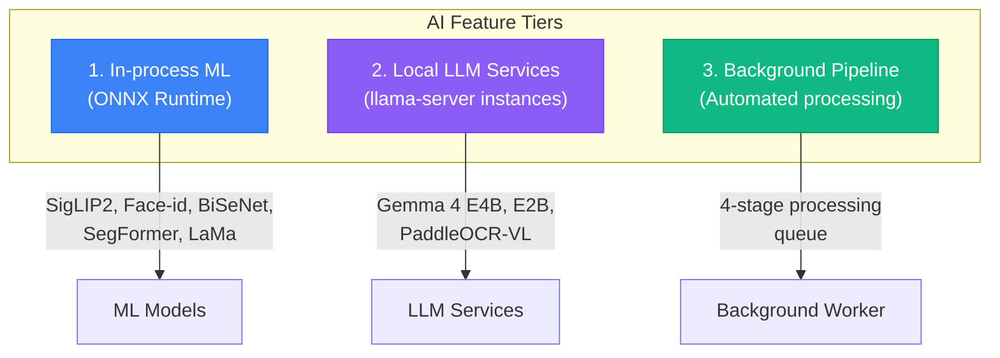
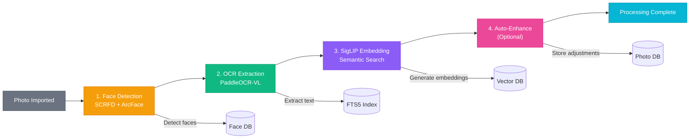

# AI Features

Prism includes optional AI-powered features for intelligent photo organization, search, and editing. All AI features run locally — no data is sent to external services.

## Overview

AI features are organized into three tiers:


```mermaid
graph TD
    subgraph Tiers["AI Feature Tiers"]
        InProcess["1. In-process ML<br/>(ONNX Runtime)"]
        LLM["2. Local LLM Services<br/>(llama-server instances)"]
        Pipeline["3. Background Pipeline<br/>(Automated processing)"]
    end

    InProcess --> |"SigLIP2, Face-id, BiSeNet,
SegFormer, LaMa"| Models["ML Models"]
    LLM --> |"Gemma 4 E4B, E2B,
PaddleOCR-VL"| Services["LLM Services"]
    Pipeline --> |"4-stage processing
queue"| Worker["Background Worker"]

    style InProcess fill:#3b82f6,stroke:#2563eb,color:#fff
    style LLM fill:#8b5cf6,stroke:#7c3aed,color:#fff
    style Pipeline fill:#10b981,stroke:#059669,color:#fff
```

## In-process ML Models

### SigLIP2 (Semantic Embeddings)
- **Model**: `google/siglip2-base-patch16-224`
- **Purpose**: Generate semantic embeddings for similarity search
- **Dimensions**: 768-dim L2-normalized vectors
- **Usage**: Text-to-image search, similar photo discovery
- **Port**: None (runs in-process)

**Capabilities:**
- Find photos by natural language description
- Discover visually similar images
- Group photos by visual content
- Power the "Explore" view recommendations

### face-id (Face Detection & Recognition)
- **Models**: SCRFD (detection) + ArcFace w600k (embeddings)
- **Purpose**: Detect faces and generate recognition embeddings
- **Embeddings**: 512-d L2-normalized vectors
- **Usage**: People tagging, face clustering

**Capabilities:**
- Automatic face detection in photos
- Generate face embeddings for recognition
- Cluster similar faces together
- Power the "People" view

### BiSeNet (Face Parsing)
- **Model**: CelebAMask-HQ (19 classes)
- **Purpose**: Precise face region segmentation
- **Usage**: Portrait editing, face-aware adjustments

**Capabilities:**
- Skin/hair/eye separation
- Portrait mask generation
- Face-aware color grading

### SegFormer (Semantic Segmentation)
- **Model**: ADE20K-150 classes
- **Purpose**: Pixel-level scene understanding
- **Usage**: Background removal, object selection

**Capabilities:**
- Automatic background detection
- Subject segmentation
- Object selection for editing

### LaMa (Inpainting)
- **Model**: LaMa ONNX
- **Purpose**: Content-aware object removal
- **Usage**: Healing tool, object erasure

**Capabilities:**
- Remove unwanted objects
- Fill in removed areas naturally
- Preserve image context

### ONNX Matting & Background Removal (Plugin Pack)
- **Engines & Weights**:
  - `isnet-general-use` (ISNet Universal Matting, 1024×1024, ~170 MB)
  - `birefnet-general` (Bilateral Reference Network, 1024×1024, ~200 MB)
  - `rmbg-1.4` (BRIA RMBG Studio Matting, 1024×1024, ~170 MB)
- **Purpose**: High-precision alpha matting for complex subjects (fine hair, transparency, foliage).
- **Usage**: Cutout tool, solid/gradient backdrops, custom scenic background replacement.
- **Delivery**: Opt-in modular plugin installed via `prism install background-removal` or UI Plugin Catalog into `plugins/background-removal/`.
- **Runtime**: Dynamic ONNX session pool with LRU RAM caching ($\le 2$ concurrent sessions in memory).


## Local LLM Services

### Agent Search (Port 9090)
- **Model**: Gemma 4 E4B (gguf)
- **Purpose**: Natural language photo search
- **Usage**: AI assistant chat, semantic queries

**Capabilities:**
- Understand natural language queries
- Search photos by description
- Answer questions about photo content
- Generate search explanations

### Vision/Captioning (Port 9091)
- **Model**: Gemma 4 E2B
- **Purpose**: Image understanding and captioning
- **Usage**: Auto-captioning, content analysis

**Capabilities:**
- Generate image descriptions
- Extract text from images (OCR)
- Analyze image content
- Provide visual question answering

### OCR (Port 9092)
- **Model**: PaddleOCR-VL
- **Purpose**: Text extraction from images
- **Usage**: Document scanning, screenshot text

**Capabilities:**
- Extract printed text
- Recognize handwritten text
- Process multi-language text
- Power document smart albums

## Background Processing Pipeline

### 4-Stage Pipeline

The background worker processes newly imported photos through 4 stages:


```mermaid
flowchart LR
    Import["Photo Imported"] --> Face["1. Face Detection<br/>SCRFD + ArcFace"]
    Face --> OCR["2. OCR Extraction<br/>PaddleOCR-VL"]
    OCR --> SigLIP["3. SigLIP Embedding<br/>Semantic Search"]
    SigLIP --> AutoEnhance["4. Auto-Enhance<br/>(Optional)"]
    AutoEnhance --> Complete["Processing Complete"]

    Face --> |"Detect faces"| FaceDB[("Face DB")]
    OCR --> |"Extract text"| FTS[("FTS5 Index")]
    SigLIP --> |"Generate embeddings"| VectorDB[("Vector DB")]
    AutoEnhance --> |"Store adjustments"| PhotoDB[("Photo DB")]

    style Import fill:#6b7280,stroke:#4b5563,color:#fff
    style Face fill:#f59e0b,stroke:#d97706,color:#fff
    style OCR fill:#10b981,stroke:#059669,color:#fff
    style SigLIP fill:#8b5cf6,stroke:#7c3aed,color:#fff
    style AutoEnhance fill:#ec4899,stroke:#db2777,color:#fff
    style Complete fill:#06b6d4,stroke:#0891b2,color:#fff
```

**Stage 1: Face Detection**
- Detect faces using SCRFD
- Generate face embeddings with ArcFace
- Store face data in database

**Stage 2: OCR**
- Extract text from images
- Store text for full-text search
- Enable document detection

**Stage 3: SigLIP Embedding**
- Generate semantic embedding
- Enable similarity search
- Power explore recommendations

**Stage 4: Auto-Enhance** (Optional)
- Analyze image histogram
- Apply automatic adjustments
- Store enhancement parameters

### Priority System

Each analyzer has a priority level:
- **OCR**: Priority 0 (highest)
- **Face**: Priority 200
- **SigLIP**: Priority 300
- **Auto-Enhance**: Priority 400 (lowest)

The system processes higher-priority analyzers first.

## Feature Flags

AI features can be enabled/disabled via settings:

```bash
# Enable/disable specific features
prism config ai_agent_enabled true
prism config ai_ocr_enabled true
prism config ai_face_enabled true
prism config ai_siglip_enabled true
```

## Model Setup

### Required Models (In-process)

Download models to `backend_rust/models/`:

```
models/
├── llm/
│   ├── siglip2_image.onnx
│   ├── siglip2_text.onnx
│   └── tokenizer.json
├── face/
│   ├── det_10g.onnx          # SCRFD detection
│   └── w600k_mbf.onnx        # ArcFace embeddings
├── segmentation/
│   ├── segformer.onnx         # Semantic segmentation
│   └── face_parsing.onnx      # Face parsing
└── inpainting/
    └── lama.onnx              # LaMa inpainting
```

### Optional LLM Services

For advanced AI features, run llama-server instances:

```bash
# Agent search (port 9090)
llama-server -m models/llm/gemma-4-e4b.gguf --port 9090

# Vision/captioning (port 9091)
llama-server -m models/llm/gemma-4-e2b.gguf --port 9091

# OCR (port 9092)
llama-server -m models/ocr/paddleocr.onnx --port 9092
```

## GPU Acceleration

### CUDA (NVIDIA)
```bash
export GPU_MODE=cuda
```

### Metal (Apple Silicon)
```bash
export GPU_MODE=metal
```

### CPU (Default)
```bash
export GPU_MODE=cpu
```

## Performance Considerations

### Memory Usage
- SigLIP2: ~500MB RAM
- Face-id: ~200MB RAM
- Segmentation: ~300MB RAM
- LaMa: ~100MB RAM

### Processing Speed
- **CPU**: ~2-5 seconds per photo (full pipeline)
- **GPU**: ~0.5-1 second per photo (full pipeline)

### Batch Processing
The background queue processes photos in parallel:
- Default: 4 concurrent workers
- Configurable via settings
- Automatic retry on failure

## Troubleshooting

### Models Not Found
```
Error: SigLIP models or tokenizer not found
```

**Solution:** Download models to `backend_rust/models/llm/`

### GPU Not Available
```
Warning: CUDA not available, falling back to CPU
```

**Solution:** Install CUDA toolkit or use CPU mode

### Memory Issues
```
Error: Out of memory during inference
```

**Solution:** 
- Reduce concurrent workers
- Use smaller models
- Increase system memory

### LLM Services Not Running
```
Warning: Agent search unavailable
```

**Solution:** Start llama-server instances on configured ports
