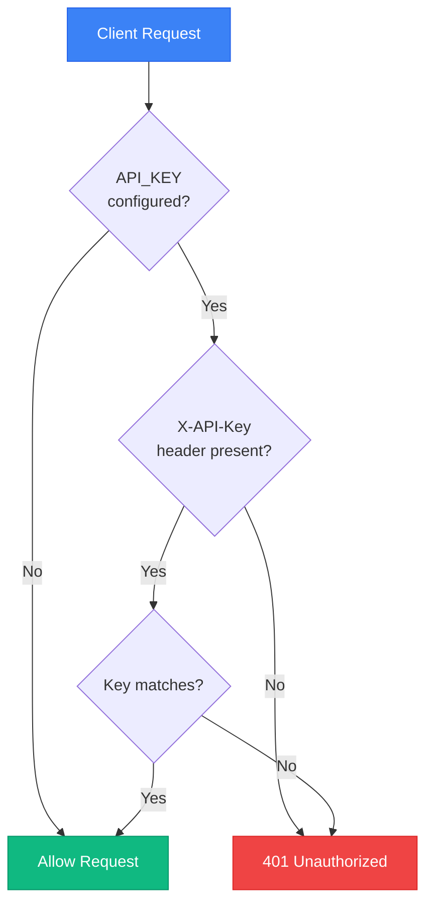

# API Reference

Prism exposes a REST API for the frontend and external clients. The API runs on port `8269` by default.

## Base URL

```
http://127.0.0.1:8269/api/v1
```

## Authentication



### API Key (Optional)

If `API_KEY` is configured, include it in the header:

```
X-API-Key: your-secret-key
```

## System Endpoints

### Health Check
```http
GET /health
```

**Response:**
```json
{
  "status": "ok",
  "service": "prism-backend-rust",
  "version": "0.1.0",
  "database": "sqlite:prism.db"
}
```

### Photo Statistics
```http
GET /api/v1/photos/stats
```

**Response:**
```json
{
  "total_photos": 1234,
  "total_videos": 56,
  "favorites_count": 89,
  "trash_count": 12,
  "locked_count": 5,
  "storage_used_bytes": 48318382080
}
```

## Photo Endpoints

### List Photos
```http
GET /api/v1/photos?limit=25&offset=0
```

**Query Parameters:**
| Parameter | Default | Description |
|-----------|---------|-------------|
| `limit` | 25 | Number of photos to return |
| `offset` | 0 | Pagination offset |

**Response:**
```json
[
  {
    "id": 1,
    "uuid": "a1b2c3d4-e5f6-7890-abcd-ef123456",
    "filename": "IMG_001.jpg",
    "url": "/api/v1/photos/1/thumbnail",
    "path": "/uploads/IMG_001.jpg",
    "width": 4032,
    "height": 3024,
    "date_taken": "2024-01-15T18:30:00Z",
    "is_favorite": false,
    "is_locked": false,
    "is_trash": false,
    "file_type": "image",
    "city": "Paris",
    "state": "Île-de-France",
    "country": "France"
  }
]
```

### Get Single Photo
```http
GET /api/v1/photos/:id
```

### Get Photo Metadata
```http
GET /api/v1/photos/:id/metadata
```

### Serve Photo File
```http
GET /api/v1/photos/:id/file
```

### Serve Thumbnail
```http
GET /api/v1/photos/:id/thumbnail
```

### Upload Photo
```http
POST /api/v1/photos/upload
Content-Type: multipart/form-data
```

**Body:**
- `file` — Photo file to upload

### Upload Blob
```http
POST /api/v1/photos/upload-blob
Content-Type: application/octet-stream
```

### Expand Directory
```http
POST /api/v1/photos/expand-directory
Content-Type: application/json
```

**Body:**
```json
{
  "path": "/home/user/Photos",
  "recursive": true
}
```

### Toggle Favorite
```http
POST /api/v1/photos/:id/favorite
```

### Toggle Trash
```http
POST /api/v1/photos/:id/trash
```

### Restore Photo
```http
POST /api/v1/photos/:id/restore
```

### Update Location
```http
PUT /api/v1/photos/:id/location
Content-Type: application/json
```

**Body:**
```json
{
  "latitude": 48.8566,
  "longitude": 2.3522,
  "city": "Paris",
  "country": "France"
}
```

### Update Adjustments
```http
PUT /api/v1/photos/:id/adjustments
Content-Type: application/json
```

**Body:**
```json
{
  "brightness": 10,
  "contrast": 5,
  "saturation": 20
}
```

### Tag Photo Face
```http
POST /api/v1/photos/:id/tag-face
Content-Type: application/json
```

**Body:**
```json
{
  "person_id": 1,
  "face_id": 123
}
```

### Bulk Update Adjustments
```http
POST /api/v1/photos/bulk-adjustments
Content-Type: application/json
```

**Body:**
```json
{
  "photo_ids": [1, 2, 3],
  "adjustments": {
    "brightness": 10
  }
}
```

## AI Photo Endpoints

### Trigger OCR
```http
POST /api/v1/photos/:id/ocr
```

### Process Inpainting
```http
POST /api/v1/photos/inpaint/process
Content-Type: application/json
```

**Body:**
```json
{
  "photo_id": 1,
  "mask": "base64-encoded-mask"
}
```

### Get AI Summary
```http
GET /api/v1/photos/:id/summary
```

### Generate AI Summary
```http
POST /api/v1/photos/:id/summary/generate
```

### XMP Operations
```http
POST /api/v1/photos/:id/xmp
Content-Type: application/json
```

### Toggle Lock
```http
POST /api/v1/photos/:id/lock
```

### Unlock Photo
```http
POST /api/v1/photos/:id/unlock
```

### Export Photo Preset
```http
POST /api/v1/photos/:id/export-preset
```

### Get Semantic Masks
```http
GET /api/v1/photos/semantic-masks/:photo_id
```

### Get Background Mask
```http
GET /api/v1/photos/background-mask/:photo_id
```

### Get Portrait Masks
```http
GET /api/v1/photos/portrait-masks/:photo_id
```

### Auto-Enhance
```http
POST /api/v1/photos/auto-enhance/:photo_id
```

### XMP Export
```http
POST /api/v1/photos/xmp/export
Content-Type: application/json
```

### XMP Import
```http
POST /api/v1/photos/xmp/import
Content-Type: application/json
```

### Export Photos
```http
POST /api/v1/photos/export
Content-Type: application/json
```

**Body:**
```json
{
  "album_id": 1,
  "output_dir": "/home/user/Export"
}
```

## Album Endpoints

### List Albums
```http
GET /api/v1/albums
```

### Create Album
```http
POST /api/v1/albums
Content-Type: application/json
```

**Body:**
```json
{
  "name": "Vacation 2024",
  "type": "custom"
}
```

### Delete Album
```http
DELETE /api/v1/albums/:id
```

### Get Album Photos
```http
GET /api/v1/albums/:id/photos
```

### Rename Album
```http
POST /api/v1/albums/:id/rename
Content-Type: application/json
```

**Body:**
```json
{
  "name": "New Album Name"
}
```

### Add Photos to Album
```http
POST /api/v1/albums/:id/add-photos
Content-Type: application/json
```

**Body:**
```json
{
  "photo_ids": [1, 2, 3]
}
```

### Remove Photos from Album
```http
POST /api/v1/albums/:id/remove-photos
Content-Type: application/json
```

### Set Album Cover
```http
POST /api/v1/albums/:id/set-cover
Content-Type: application/json
```

**Body:**
```json
{
  "photo_id": 1
}
```

### List Smart Albums
```http
GET /api/v1/albums/smart
```

### Get Smart Album Photos
```http
GET /api/v1/albums/smart/:smart_type/photos
```

## People Endpoints

### List People
```http
GET /api/v1/people
```

### Get Person Photos
```http
GET /api/v1/people/:id/photos
```

### Rename Person
```http
PUT /api/v1/people/:id/name
Content-Type: application/json
```

**Body:**
```json
{
  "name": "Alice"
}
```

### Get Pending Faces
```http
GET /api/v1/people/:id/pending-faces
```

### Submit Face Feedback
```http
POST /api/v1/people/pending-faces/:pending_id/feedback
Content-Type: application/json
```

### Scan Photo Faces
```http
POST /api/v1/people/scan/:photo_id
```

## Explore Endpoints

### Explore Photos
```http
GET /api/v1/explore
```

### Explore Insights
```http
GET /api/v1/explore/insights
```

### Explore Themes
```http
GET /api/v1/explore/themes
```

### On This Day
```http
GET /api/v1/explore/on-this-day
```

### Rediscover Prompts
```http
GET /api/v1/explore/rediscover-prompts
```

### Timeline
```http
GET /api/v1/explore/timeline
```

### Seasons
```http
GET /api/v1/explore/seasons
```

### Activity
```http
GET /api/v1/explore/activity
```

### Highlights
```http
GET /api/v1/explore/highlights
```

### Generate Highlight Project
```http
POST /api/v1/explore/highlights/generate
Content-Type: application/json
```

## NLE (Video Editor) Endpoints

### List Projects
```http
GET /api/v1/nle/projects
```

### Create Project
```http
POST /api/v1/nle/projects
Content-Type: application/json
```

### Get Project
```http
GET /api/v1/nle/projects/:id
```

### Update Project
```http
PUT /api/v1/nle/projects/:id
Content-Type: application/json
```

### Delete Project
```http
DELETE /api/v1/nle/projects/:id
```

### Analyze Video Clip
```http
POST /api/v1/nle/clips/analyze
Content-Type: application/json
```

**Body:**
```json
{
  "photo_id": 1,
  "source_path": "/path/to/video.mp4"
}
```

### Generate Proxy
```http
POST /api/v1/nle/clips/proxy
Content-Type: application/json
```

### Thumbnail Strip
```http
POST /api/v1/nle/clips/thumbnail-strip
Content-Type: application/json
```

### Get Waveform
```http
POST /api/v1/nle/clips/waveform
Content-Type: application/json
```

### Render Preview
```http
POST /api/v1/nle/preview/render
Content-Type: application/json
```

### Preview Frame
```http
POST /api/v1/nle/preview/frame
Content-Type: application/json
```

### Export Project
```http
POST /api/v1/nle/export
Content-Type: application/json
```

### Export XML
```http
POST /api/v1/nle/export/xml
Content-Type: application/json
```

### Get Export Status
```http
GET /api/v1/nle/export/:job_id
```

### Download Export
```http
GET /api/v1/nle/export/:job_id/download
```

## Privacy Endpoints

### Get Privacy Status
```http
GET /api/v1/privacy/status
```

### Get Privacy Feature Detail
```http
GET /api/v1/privacy/feature/:feature_id
```

## Settings Endpoints

### Get Settings
```http
GET /api/v1/settings
```

### Get General Settings
```http
GET /api/v1/settings/general
```

### Save General Settings
```http
POST /api/v1/settings/general
Content-Type: application/json
```

### Get Map Style
```http
GET /api/v1/settings/map-style
```

### Save Map Style
```http
POST /api/v1/settings/map-style
Content-Type: application/json
```

### SSE Events
```http
GET /api/v1/settings/events
```

### Get Folders Settings
```http
GET /api/v1/settings/folders
```

### Save Folders Settings
```http
POST /api/v1/settings/folders
Content-Type: application/json
```

### Reset Library
```http
POST /api/v1/settings/reset-library
```

### Clear Cache
```http
POST /api/v1/settings/clear-cache
```

### Vacuum Database
```http
POST /api/v1/settings/vacuum
```

### Purge Folder
```http
POST /api/v1/settings/purge-folder
Content-Type: application/json
```

### Locked Folder Endpoints
```http
GET /api/v1/settings/locked-folder/status
POST /api/v1/settings/locked-folder/setup
POST /api/v1/settings/locked-folder/verify
POST /api/v1/settings/locked-folder/lock-session
```

### Sync Settings
```http
GET /api/v1/settings/sync
POST /api/v1/settings/sync
Content-Type: application/json
```

### Telemetry Settings
```http
GET /api/v1/settings/telemetry
POST /api/v1/settings/telemetry
Content-Type: application/json
```

## Utilities Endpoints

### Get Duplicates
```http
GET /api/v1/utilities/duplicates
```

### Get Blurry Photos
```http
GET /api/v1/utilities/blurry
```

### Get Document Photos
```http
GET /api/v1/utilities/documents
```

### Get Diagnostics
```http
GET /api/v1/utilities/diagnostics
```

### Get Logs
```http
GET /api/v1/utilities/logs
```

### List Directory Contents
```http
POST /api/v1/utilities/list-dir
Content-Type: application/json
```

### External Locations
```http
GET /api/v1/utilities/external-locations
POST /api/v1/utilities/external-locations
PATCH /api/v1/utilities/external-locations/:loc_id
DELETE /api/v1/utilities/external-locations/:loc_id
```

### Visual Duplicates
```http
GET /api/v1/utilities/visual-duplicates
```

### Backup Export
```http
POST /api/v1/utilities/backup/export
Content-Type: application/json
```

### Backup Restore
```http
POST /api/v1/utilities/backup/restore
Content-Type: application/json
```

### Batch Rename
```http
POST /api/v1/utilities/batch-rename
Content-Type: application/json
```

### Fused Search
```http
GET /api/v1/utilities/search/fused?q=sunset&limit=25
```

### Purge Trash
```http
POST /api/v1/utilities/purge-trash
Content-Type: application/json
```

### Background Jobs
```http
GET /api/v1/utilities/background-jobs/status
POST /api/v1/utilities/background-jobs/start
POST /api/v1/utilities/background-jobs/stop
POST /api/v1/utilities/background-jobs/pause
POST /api/v1/utilities/background-jobs/resume
```

### System State
```http
GET /api/v1/utilities/system-state
```

## Telemetry Endpoints

### Get Telemetry Summary
```http
GET /api/v1/telemetry/summary
```

### Get Telemetry Events
```http
GET /api/v1/telemetry/events
```

### Clear Telemetry Events
```http
DELETE /api/v1/telemetry/events
```

### Telemetry SSE Stream
```http
GET /api/v1/telemetry/stream
```

### Log Frontend Event
```http
POST /api/v1/telemetry/log
Content-Type: application/json
```

### Log Frontend Event Batch
```http
POST /api/v1/telemetry/log-batch
Content-Type: application/json
```

## LAN Sync Endpoints

### Discover Peers
```http
GET /api/v1/lan/discover
```

### Pair With Peer
```http
POST /api/v1/lan/peers/:peer_id/pair
```

### Handle Pair Request
```http
POST /api/v1/lan/pair/request
```

### Initiate Sync
```http
POST /api/v1/lan/peers/:peer_id/sync
```

### Sync Status
```http
GET /api/v1/lan/sync/status
```

### Import From Peer
```http
POST /api/v1/lan/peers/:peer_id/import
```

### Get Manifest
```http
GET /api/v1/lan/manifest
```

## Stories Endpoints

### Generate Story
```http
POST /api/v1/stories/generate
Content-Type: application/json
```

### Get Event Story
```http
GET /api/v1/stories/event/:event_id
```

## Video Export Endpoints

### Start Export
```http
POST /api/v1/video/export
Content-Type: application/json
```

### Get Export Status
```http
GET /api/v1/video/export/:job_id
```

### Download Export
```http
GET /api/v1/video/export/:job_id/download
```

### Generate Subtitles
```http
POST /api/v1/video/subtitles/generate
Content-Type: application/json
```

## Agent (AI Chat) Endpoints

### List Sessions
```http
GET /api/v1/agent/sessions
```

### Create Session
```http
POST /api/v1/agent/sessions
```

### Get Session
```http
GET /api/v1/agent/sessions/:id
```

### Rename Session
```http
PATCH /api/v1/agent/sessions/:id
Content-Type: application/json
```

### Delete Session
```http
DELETE /api/v1/agent/sessions/:id
```

### Upload Image
```http
POST /api/v1/agent/upload_image
Content-Type: multipart/form-data
```

### Preload Model
```http
POST /api/v1/agent/preload
```

### Chat
```http
POST /api/v1/agent/chat
Content-Type: application/json
```

**Body:**
```json
{
  "session_id": "uuid",
  "message": "Find photos from Paris",
  "attached_image": null
}
```

## Shares Endpoints

### Create Share
```http
POST /api/v1/shares
Content-Type: application/json
```

**Body:**
```json
{
  "resource_type": "photo",
  "resource_id": 1,
  "expires_in_hours": 24
}
```

### Get Shared Resource
```http
GET /api/v1/shares/:token
```

### Revoke Share
```http
DELETE /api/v1/shares/:token
```

### Download Shared File
```http
GET /api/v1/shares/:token/download
```

## Plugin Endpoints

Manage modular extensions and plugins stored in the `plugins/` directory. For instructions on creating custom plugins, see [Plugin Development Guide](PLUGINS.md).

### List Installed Plugins
```http
GET /api/v1/plugins
```

**Response:**
```json
{
  "plugins": [
    {
      "id": "background-removal",
      "manifest": {
        "id": "background-removal",
        "name": "AI Background Removal Studio",
        "version": "1.2.0",
        "author": "Prism Core & Open Source AI",
        "description": "Deep learning matting pack supporting ISNet, BiRefNet, and RMBG-1.4.",
        "category": "AI & Machine Learning",
        "capabilities": ["matting", "segmentation", "image-editor"],
        "entrypoint": "index.js"
      },
      "config": {
        "enabled": true,
        "installed_at": "2026-08-23T10:00:00Z",
        "updated_at": "2026-08-23T10:00:00Z",
        "settings": {}
      },
      "path": "plugins/background-removal",
      "is_active": true,
      "has_models": true
    }
  ],
  "plugins_dir": "plugins",
  "total": 1
}
```

### Browse Plugin Catalog
```http
GET /api/v1/plugins/catalog
```

**Response:**
```json
{
  "catalog": [
    {
      "id": "background-removal",
      "name": "AI Background Removal Studio",
      "version": "1.2.0",
      "author": "Prism Core & Open Source AI",
      "description": "Deep learning matting pack supporting ISNet Universal, BiRefNet High-Resolution, and RMBG-1.4.",
      "category": "AI & Machine Learning",
      "icon": "Scissors",
      "is_installed": true,
      "is_active": true,
      "size_display": "~170 MB",
      "tags": ["matting", "segmentation", "onnx", "cutout"],
      "manifest": { ... }
    }
  ],
  "total": 4
}
```

### Install Plugin
Installs a plugin into `plugins/<id>/` from a catalog ID, manifest JSON file (`background-removal.json`), local directory, or GitHub URL.

```http
POST /api/v1/plugins/install
Content-Type: application/json

{
  "source": "background-removal.json"
}
```

*Supported `source` formats:*
- **Catalog ID or JSON**: `"background-removal"`, `"background-removal.json"`
- **Local JSON manifest file**: `"/path/to/my-plugin/plugin.json"`
- **Local Directory**: `"/path/to/my-plugin/"`
- **Direct Manifest URL**: `"https://raw.githubusercontent.com/owner/repo/main/plugin.json"`

**Response:**
```json
{
  "status": "success",
  "message": "Plugin 'background-removal' successfully installed into plugins/background-removal",
  "plugin": {
    "id": "background-removal",
    "manifest": { ... },
    "config": { ... },
    "path": "plugins/background-removal",
    "is_active": true,
    "has_models": true
  }
}
```

*Legacy route:* `POST /api/v1/plugins/install/:id` is also supported.


### Uninstall Plugin
Deletes `plugins/<id>/` folder and contents from disk.

```http
POST /api/v1/plugins/uninstall/:id
```

### Toggle Plugin Active State
```http
POST /api/v1/plugins/toggle/:id
Content-Type: application/json

{
  "enabled": false
}
```

### Update Plugin Settings
```http
POST /api/v1/plugins/config/:id
Content-Type: application/json

{
  "settings": {
    "default_model": "birefnet"
  }
}
```

## Error Responses

### 400 Bad Request
```json
{
  "error": "Invalid request parameters"
}
```

### 401 Unauthorized
```json
{
  "error": "Invalid or missing API key"
}
```

### 404 Not Found
```json
{
  "error": "Resource not found"
}
```

### 429 Too Many Requests
```json
{
  "error": "Rate limit exceeded"
}
```

### 500 Internal Server Error
```json
{
  "error": "Internal server error"
}
```

## Rate Limits

| Endpoint | Limit | Window |
|----------|-------|--------|
| `/api/v1/video/*` | 20 requests | 1 minute |
| `/api/v1/photos/inpaint/process` | 20 requests | 1 minute |
| Other endpoints | No limit | — |

## Content Types

| Content Type | Usage |
|--------------|-------|
| `application/json` | JSON request/response |
| `multipart/form-data` | File uploads |
| `application/octet-stream` | Binary data |
| `text/event-stream` | SSE streams |
| `image/*` | Image responses |
| `video/*` | Video responses |
