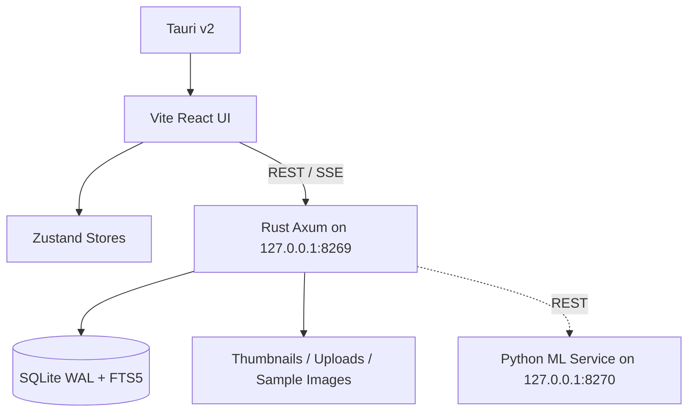

# Prism Architecture

Architectural overview of the Prism photo and video library desktop application, powered by a Rust (Axum) backend.

---

## Table of Contents

- [High-Level Architecture](#high-level-architecture)
- [Runtime Flow](#runtime-flow)
- [Frontend Architecture](#frontend-architecture)
- [Backend Architecture](#backend-architecture)
- [Database Schema](#database-schema)
- [Background Processing Pipeline](#background-processing-pipeline)
- [Sync Service](#sync-service)
- [Locked Folder Encryption Flow](#locked-folder-encryption-flow)
- [API Route Structure](#api-route-structure)

---

## High-Level Architecture

Prism follows a three-tier desktop application architecture:

```
┌─────────────────────────────────────────────────┐
│                  Tauri v2 Shell                   │
│  ┌───────────────────────────────────────────┐   │
│  │         Vite React UI (port 3005)          │   │
│  │  ┌─────────┐  ┌──────────┐  ┌─────────┐   │   │
│  │  │ Zustand  │  │  React   │  │  TanStack│   │   │
│  │  │  Stores  │  │  Router  │  │  Virtual │   │   │
│  │  └────┬────┘  └──────────┘  └─────────┘   │   │
│  │       │                                     │   │
│  │       └────────── REST ──────────────────┐  │   │
│  └──────────────────────────────────────────┘  │   │
└──────────────────────┬─────────────────────────┘   │
                       │ HTTP (127.0.0.1:8269)        │
┌──────────────────────┴──────────────────────────────┘
│                  Rust (Axum) Backend                  │
│  ┌─────────┐  ┌──────────┐  ┌──────────────────┐    │
│  │ CORS /  │  │  Routes  │  │    Services       │    │
│  │  Auth   │  │  / API   │  │  (Business Logic) │    │
│  └────┬────┘  └────┬─────┘  └────────┬─────────┘    │
│       │            │                  │              │
│       └────────────┴──────────────────┘              │
│                              │                        │
│                    ┌─────────┴──────────┐             │
│                    │    SQLite (WAL)    │             │
│                    │   + FTS5 Index     │             │
│                    └────────────────────┘             │
│                              │                        │
│                    ┌─────────┴──────────┐             │
│                    │  File System       │             │
│                    │  (uploads/         │             │
│                    │   thumbnails/)     │             │
│                    └────────────────────┘             │
└───────────────────────────────────────────────────────┘
```

### Key Design Decisions

1. **Local-first**: All data stays on the user's machine. No cloud dependencies.
2. **Desktop-native**: Tauri v2 provides a lightweight, secure native shell.
3. **High-performance backend**: Rust (Axum) runs as the core backend, with an optional Python ML microservice for AI inference.
4. **SQLite WAL mode**: Write-Ahead Logging for concurrent read/write performance.
5. **REST API**: Frontend communicates with backend via HTTP REST (no IPC bridge).
6. **Opt-in AI**: All AI features are behind feature flags, disabled by default.

---

## Runtime Flow


```mermaid
graph TD
    Tauri[Tauri v2] --> React[Vite React UI]
    React --> Zustand[Zustand Stores]
    React -->|REST / SSE| Axum[Rust Axum on 127.0.0.1:8269]
    Axum --> SQLx[(SQLite WAL + FTS5)]
    Axum --> Storage[Thumbnails / Uploads / Sample Images]
    Axum -. REST .-> PyML[Python ML Service on 127.0.0.1:8270]
```

### Startup Sequence

1. `pnpm run desktop` launches the Tauri shell
2. Tauri spawns the Rust backend (`cargo run`) as a subprocess
3. Rust backend startup (`main.rs`):
   - Initializes the database (WAL mode, create tables, apply schema migrations)
   - Auto-purges trashed photos older than 30 days
   - Starts the LAN sync service
   - Initializes the sync (watchdog) service
   - Starts the background processing queue
   - Recovers interrupted Locked Folder files
4. Vite dev server (or built frontend) loads the React UI
5. React UI connects to the Rust backend via REST API at `http://127.0.0.1:8269`

---

## Frontend Architecture

### Technology Stack

- **React 18.3** with TypeScript
- **Vite 6** build tool and dev server
- **Tailwind CSS** for styling
- **Zustand** state management stores
- **React Router** for navigation
- **Framer Motion** for animations
- **TanStack Virtual** for virtualized grid rendering
- **Leaflet + React Leaflet** for map view
- **Lucide** icons

### State Management (Zustand Stores)

| Store | Purpose | File |
|-------|---------|------|
| `uiStore` | UI state (sidebar, modals, theme) | `frontend/store/uiStore.ts` |
| `editStore` | Image editor state | `frontend/store/editStore.ts` |
| `nleStore` | Video editor (NLE) state | `frontend/store/nleStore.ts` |
| `settingsStore` | App settings | `frontend/store/settingsStore.ts` |
| `syncStore` | Sync status | `frontend/store/syncStore.ts` |
| `videoPlayerStore` | Video player state | `frontend/store/videoPlayerStore.ts` |

### Component Structure

```
frontend/components/
├── AgentView/        # AI agent chat interface
├── albums/           # Album views (places, memories, people)
├── Editor/           # Image and Video editors
│   ├── ImageEditor/  # 19-tool image editor (see IMAGE_EDITOR.md)
│   └── VideoEditor/  # NLE video editor (see VIDEO_EDITOR.md)
├── explore/          # AI-powered discovery view
├── FileFolderBrowser/ # File system browser
├── import/           # Import UI
├── layout/           # App shell layout
├── LockedViewAuth/   # Locked Folder auth
├── MapView/          # Leaflet map
├── PeopleView/       # People management
├── PhotoGrid/        # Virtualized photo grid
├── PhotoView/        # Lightbox viewer
├── projects/         # Video projects
├── ui/               # Reusable UI components
├── utilities/        # System utilities view
├── viewers/          # Media viewers
└── wrappers/         # HOC wrappers
```

### Custom Hooks

Key hooks found in `frontend/hooks/`:

| Hook | Purpose |
|------|---------|
| `useAppState.ts` | Application state management |
| `useAudioContext.ts` | Audio context for video editing |
| `useAudioMixer.ts` | Audio mixer for multi-track audio |
| `useBulkActions.ts` | Bulk selection and actions |
| `useGalleryLayout.ts` | Gallery grid layout calculation |
| `useImageHighRes.ts` | High-resolution image loading |
| `useLightboxGestures.ts` | Touch/gesture support for lightbox |
| `usePhotos.ts` | Photo data fetching |
| `useSelection.ts` | Selection state management |
| `useSlideshow.ts` | Slideshow functionality |
| `useStats.ts` | Library statistics |
| `useVideoProjects.ts` | Video project management |
| `useZoomShortcuts.ts` | Keyboard shortcuts for zoom |

---

## Backend Architecture

### Technology Stack

- **Rust** with **Axum** web framework and **Tokio** async runtime
- **SQLx** async SQLite driver with compile-time query checking
- **SQLite** WAL mode with FTS5 full-text search
- **uuid** crate for universal UUID generation
- **serde / serde_json** for serialization
- **tower-http** for CORS middleware
- **ffmpeg/ffprobe** (via CLI) for video metadata extraction and thumbnails
- **Optional Python ML Microservice** (external, at `../Prism_python_backend`) for face detection, embeddings, and AI inference

### Application Structure

```
backend_rust/src/
├── main.rs              # Axum app factory, router registration, server startup
├── config.rs            # Configuration (ports, paths, env vars)
├── db.rs                # SQLite connection pool, table creation, migrations, UUID population
├── models/              # Data models and structs
│   └── mod.rs           # Photo, Person, Album, etc. structs
├── routes/              # API route handlers
│   ├── mod.rs           # Router composition and shared helpers
│   ├── photos/          # Photo CRUD, upload, metadata, masks
│   │   ├── mod.rs       # Photo sub-router
│   │   ├── listing.rs   # Photo listing, stats, search
│   │   ├── upload.rs    # File upload and directory import
│   │   ├── metadata.rs  # Photo metadata, tags, faces, favorites
│   │   └── masks.rs     # Portrait and background masks
│   ├── albums.rs        # Album CRUD, smart albums
│   ├── people.rs        # People listing, rename, person photos
│   ├── nle.rs           # Video project CRUD, clip analysis
│   ├── agent.rs         # AI agent sessions and chat
│   ├── explore.rs       # Explore view collections
│   ├── settings.rs      # Settings management, SSE events
│   ├── system.rs        # Health check, sample images
│   ├── utilities.rs     # Diagnostics, backup, storage cleanup
│   └── privacy.rs       # Locked folder endpoints
└── services/            # Business logic
    ├── mod.rs           # Service module exports
    ├── thumbnail.rs     # WebP thumbnail generation
    ├── exif.rs          # EXIF metadata extraction
    └── ml_client.rs     # HTTP client for Python ML microservice
```

### Route Modules

The route layer contains all API endpoint handlers, organized by domain:

| Module | File | Purpose |
|--------|------|---------|
| Photos | `routes/photos/` | Photo CRUD, upload, search, stats, metadata, masks |
| Albums | `routes/albums.rs` | Album listing, creation, smart albums |
| People | `routes/people.rs` | People listing, rename, person photos |
| NLE | `routes/nle.rs` | Video project CRUD, clip analysis |
| Agent | `routes/agent.rs` | AI chat sessions and messaging |
| Explore | `routes/explore.rs` | Explore view with themed collections |
| Settings | `routes/settings.rs` | App settings, SSE event stream |
| Utilities | `routes/utilities.rs` | Diagnostics, backup, cleanup |
| Privacy | `routes/privacy.rs` | Locked folder management |
| System | `routes/system.rs` | Health check, sample image serving |

---

## Database Schema

### Entity Relationship

```
Photo ──1:N──→ PhotoPerson ──N:1──→ Person
  │                                      │
  │                                      │
  ├──N:1──→ Event                        │
  │                                      │
  ├──N:M──→ Album (via PhotoAlbum)       │
  │                                      │
  ├──1:N──→ BackgroundJob                │
  │                                      │
  └──1:N──→ PendingFaceAssignment ──N:1──┘

VideoProject ──1:N──→ VideoClip (via photo_id → Photo)
AgentSession  ──1:N──→ AgentMessage
SyncPeer (standalone)
```

### Core Tables

#### `photos`

| Column | Type | Description |
|--------|------|-------------|
| `id` | Integer (PK) | Primary key |
| `uuid` | Text | Unique UUID identifier |
| `filename` | String(255) | Original filename |
| `path` | String(512) | Full file path |
| `url` | String(512) | Thumbnail URL |
| `width`, `height` | Integer | Image dimensions |
| `aspect_ratio` | Float | Width/height ratio |
| `hash` | String(64) | Content hash (SHA256) |
| `phash` | String(64) | Perceptual hash |
| `caption` | String(512) | User caption |
| `city`, `state`, `country` | String(255) | Reverse-geocoded location |
| `latitude`, `longitude` | Float | GPS coordinates |
| `date` | DateTime | Import date |
| `date_taken` | DateTime | EXIF capture date |
| `is_favorite` | Boolean | Favorites flag |
| `is_locked` | Boolean | Locked Folder flag |
| `is_trash` | Boolean | Trash flag |
| `mime_type` | String(50) | MIME type |
| `file_type` | String(20) | `image` or `video` |
| `duration` | Float (video) | Duration in seconds |
| `fps` | Float (video) | Frames per second |
| `codec`, `audio_codec` | String(50) | Video/audio codec |
| `ai_summary` | Text | AI-generated description |
| `auto_tags` | Text | JSON array of tags |
| `embedding` | Text | JSON float array (SigLIP2) |
| `ocr_text` | Text | Extracted text (OCR) |
| `blur_score` | Float | Blur/sharpness estimate |
| `content_type` | String(20) | `photo`, `screenshot`, `document` |
| `exif_make`, `exif_model` | String(255) | Camera info |
| `rotation` | Integer | Video rotation |
| `device_id` | String(255) | Storage device identifier |
| `is_external` | Boolean | External storage flag |

#### `people`

| Column | Type | Description |
|--------|------|-------------|
| `id` | Integer (PK) | Primary key |
| `uuid` | Text | Unique UUID identifier |
| `name` | String(255) | Person name |
| `cover_face_thumbnail` | String(512) | Cover photo thumbnail |
| `face_embedding` | Text | JSON float array |

#### `photo_people` (Many-to-Many)

| Column | Type | Description |
|--------|------|-------------|
| `photo_id` | Integer (FK) | References photo |
| `person_id` | Integer (FK) | References person |
| `confidence` | Float | Detection confidence |
| `face_box_json` | Text | JSON bounding box |

#### `albums`

| Column | Type | Description |
|--------|------|-------------|
| `id` | Integer (PK) | Primary key |
| `uuid` | Text | Unique UUID identifier |
| `name` | String(255) | Album name |
| `type` | String(20) | `places`, `memories`, `people`, `custom` |
| `is_smart` | Boolean | Auto-generated |
| `cover_url` | String(512) | Cover thumbnail |
| `photo_count` | Integer | Number of photos |

#### `background_jobs`

| Column | Type | Description |
|--------|------|-------------|
| `id` | Integer (PK) | Primary key |
| `photo_id` | Integer (FK) | References photo |
| `job_type` | String(50) | Job type |
| `status` | String(20) | `pending`, `processing`, `completed`, `failed` |
| `attempt_count` | Integer | Retry counter |
| `last_error` | Text | Error message |
| `current_stage` | String(50) | Current
