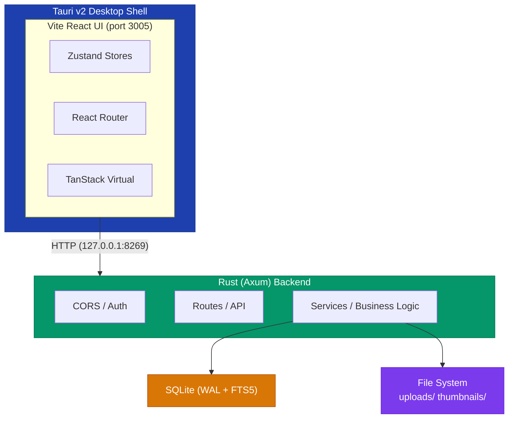
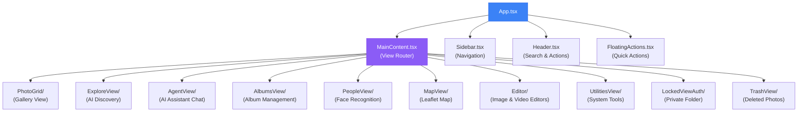
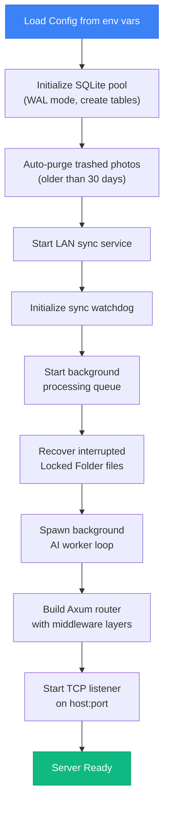
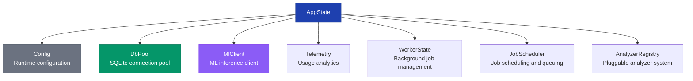
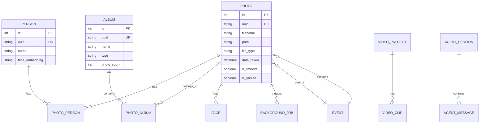

# Architecture

Prism is a privacy-first, local-only desktop photo and video library application. This document describes the system architecture, design decisions, and data flow.

## Overview

```mermaid
graph TB
    subgraph Desktop["Tauri v2 Desktop Shell"]
        subgraph Frontend["Vite React UI (port 3005)"]
            Zustand["Zustand Stores"]
            ReactRouter["React Router"]
            TanStack["TanStack Virtual"]
        end
    end

    subgraph Backend["Rust (Axum) Backend"]
        CORS["CORS / Auth"]
        Routes["Routes / API"]
        Services["Services / Business Logic"]
    end

    Database["SQLite (WAL + FTS5)"]
    FileSystem["File System<br/>uploads/ thumbnails/"]

    Frontend --> |"HTTP (127.0.0.1:8269)"| Backend
    Services --> Database
    Services --> FileSystem

    style Desktop fill:#1e40af,stroke:#1e3a8a,color:#fff
    style Backend fill:#059669,stroke:#047857,color:#fff
    style Database fill:#d97706,stroke:#b45309,color:#fff
    style FileSystem fill:#7c3aed,stroke:#6d28d9,color:#fff
```

## Core Design Principles

### 1. Local-first
All data stays on the user's machine. No cloud dependencies, no external API calls for core features. The application works completely offline.

### 2. Desktop-native
Tauri v2 provides a lightweight, secure native shell. The frontend runs in a WebView, while the backend is a native Rust process.

### 3. High-performance Backend
Rust (Axum) runs as the core backend with in-process ONNX/ML inference. The backend handles all media processing, database operations, and AI tasks.

### 4. SQLite WAL + FTS5
Write-Ahead Logging for concurrent read/write performance, with full-text search for fast photo discovery.

### 5. REST API
Frontend communicates with backend via HTTP REST API. This enables web mode (browser) and desktop mode (Tauri) with the same backend.

### 6. Opt-in AI
All AI features are behind feature flags, disabled by default. AI models run in-process or via local llama-server instances.

## Frontend Architecture

### Component Hierarchy

```mermaid
graph TD
    App["App.tsx"] --> MainContent["MainContent.tsx<br/>(View Router)"]
    App --> Sidebar["Sidebar.tsx<br/>(Navigation)"]
    App --> Header["Header.tsx<br/>(Search & Actions)"]
    App --> FloatingActions["FloatingActions.tsx<br/>(Quick Actions)"]

    MainContent --> PhotoGrid["PhotoGrid/<br/>(Gallery View)"]
    MainContent --> ExploreView["ExploreView/<br/>(AI Discovery)"]
    MainContent --> AgentView["AgentView/<br/>(AI Assistant Chat)"]
    MainContent --> AlbumsView["AlbumsView/<br/>(Album Management)"]
    MainContent --> PeopleView["PeopleView/<br/>(Face Recognition)"]
    MainContent --> MapView["MapView/<br/>(Leaflet Map)"]
    MainContent --> Editor["Editor/<br/>(Image & Video Editors)"]
    MainContent --> UtilitiesView["UtilitiesView/<br/>(System Tools)"]
    MainContent --> LockedViewAuth["LockedViewAuth/<br/>(Private Folder)"]
    MainContent --> TrashView["TrashView/<br/>(Deleted Photos)"]

    style App fill:#3b82f6,stroke:#2563eb,color:#fff
    style MainContent fill:#8b5cf6,stroke:#7c3aed,color:#fff
```

### State Management

| Store | File | Purpose |
|-------|------|---------|
| `uiStore` | `store/uiStore.ts` | UI state (sidebar, modals, theme) |
| `editStore` | `store/editStore.ts` | Image editor state |
| `nleStore` | `store/nleStore.ts` | Video editor (NLE) state |
| `settingsStore` | `store/settingsStore.ts` | App settings |
| `syncStore` | `store/syncStore.ts` | Sync status |
| `galleryLayoutStore` | `store/galleryLayoutStore.ts` | Gallery layout |

### View Modes

| ViewMode | Component | Description |
|----------|-----------|-------------|
| `gallery` | `PhotoGrid` | Default photo grid with virtualized rows |
| `explore` | `ExploreView` | AI-powered discovery |
| `agent` | `AgentView` | AI assistant chat |
| `albums` | `AlbumsView` | Album management |
| `people` | `PeopleView` | People management |
| `projects` | `ProjectsDashboard` | Video projects |
| `map` | `MapView` | Leaflet map view |
| `utilities` | `UtilitiesView` | System utilities |
| `locked` | `LockedViewAuth` | Locked Folder |
| `trash` | `TrashView` | Trash view |
| `favorites` | `PhotoGrid` (filtered) | Favorites |
| `toolbox` | `ImageToolbox` | Image editing tools |

## Backend Architecture

### Application Startup

```mermaid
flowchart TD
    A["Load Config from env vars"] --> B["Initialize SQLite pool
(WAL mode, create tables)"]
    B --> C["Auto-purge trashed photos
(older than 30 days)"]
    C --> D["Start LAN sync service"]
    D --> E["Initialize sync watchdog"]
    E --> F["Start background
processing queue"]
    F --> G["Recover interrupted
Locked Folder files"]
    G --> H["Spawn background
AI worker loop"]
    H --> I["Build Axum router
with middleware layers"]
    I --> J["Start TCP listener
on host:port"]
    J --> K["Server Ready"]

    style A fill:#3b82f6,stroke:#2563eb,color:#fff
    style K fill:#10b981,stroke:#059669,color:#fff
```

### Middleware Stack

1. **CORS Layer** — Allows `tauri://localhost`, `http://localhost:3005`, `http://127.0.0.1:3005`
2. **TraceLayer** — HTTP request tracing
3. **DefaultBodyLimit** — 1GB max body
4. **Rate Limit Layer** — 20 req/min per IP+path for expensive endpoints
5. **Telemetry Layer** — Samples API requests, logs errors always
6. **API Key Auth Layer** — Checks `X-API-Key` header if configured

### Service Architecture

```mermaid
graph TD
    AppState["AppState"] --> Config["Config<br/>Runtime configuration"]
    AppState --> DbPool["DbPool<br/>SQLite connection pool"]
    AppState --> MlClient["MlClient<br/>ML inference client"]
    AppState --> Telemetry["Telemetry<br/>Usage analytics"]
    AppState --> WorkerState["WorkerState<br/>Background job management"]
    AppState --> JobScheduler["JobScheduler<br/>Job scheduling and queuing"]
    AppState --> AnalyzerRegistry["AnalyzerRegistry<br/>Pluggable analyzer system"]

    style AppState fill:#1e40af,stroke:#1e3a8a,color:#fff
    style Config fill:#6b7280,stroke:#4b5563,color:#fff
    style DbPool fill:#059669,stroke:#047857,color:#fff
    style MlClient fill:#8b5cf6,stroke:#7c3aed,color:#fff
```

### Background Worker Pipeline

The background worker processes photos through a 4-stage pipeline:

```mermaid
flowchart LR
    Import["Photo Imported"] --> Face["1. Face Detection<br/>(SCRFD + ArcFace)"]
    Face --> OCR["2. OCR<br/>(PaddleOCR-VL)"]
    OCR --> SigLIP["3. SigLIP Embedding<br/>(Semantic Search)"]
    SigLIP --> AutoEnhance["4. Auto-Enhancement<br/>(Optional)"]
    AutoEnhance --> Complete["Processing Complete"]

    style Import fill:#3b82f6,stroke:#2563eb,color:#fff
    style Face fill:#f59e0b,stroke:#d97706,color:#fff
    style OCR fill:#10b981,stroke:#059669,color:#fff
    style SigLIP fill:#8b5cf6,stroke:#7c3aed,color:#fff
    style AutoEnhance fill:#ec4899,stroke:#db2777,color:#fff
    style Complete fill:#06b6d4,stroke:#0891b2,color:#fff
```

Each stage is pluggable via the `AnalyzerRegistry`.

## Database Schema

### Core Tables

- **photos** — Main photo/video metadata
- **albums** — Album definitions
- **photo_albums** — Many-to-many photo-album relationships
- **people** — Identified people
- **photo_people** — Many-to-many photo-person relationships
- **faces** — Detected face data
- **background_jobs** — Background processing jobs
- **events** — Event groupings (trips, etc.)
- **video_projects** — Video editor project state
- **agent_sessions** — AI agent chat sessions
- **agent_messages** — AI agent chat messages
- **settings** — Key-value settings store

### Entity Relationships

```mermaid
erDiagram
    PHOTO ||--o{ PHOTO_PERSON : has
    PHOTO ||--o{ PHOTO_ALBUM : belongs_to
    PHOTO ||--o{ FACE : has
    PHOTO ||--o{ BACKGROUND_JOB : triggers
    PHOTO }o--|| EVENT : part_of

    PERSON ||--o{ PHOTO_PERSON : has
    ALBUM ||--o{ PHOTO_ALBUM : contains
    EVENT ||--o{ PHOTO : contains

    VIDEO_PROJECT ||--o{ VIDEO_CLIP : has
    AGENT_SESSION ||--o{ AGENT_MESSAGE : contains

    PHOTO {
        int id PK
        string uuid UK
        string filename
        string path
        string file_type
        datetime date_taken
        boolean is_favorite
        boolean is_locked
    }

    ALBUM {
        int id PK
        string uuid UK
        string name
        string type
        int photo_count
    }

    PERSON {
        int id PK
        string uuid UK
        string name
        string face_embedding
    }
```

## ML/AI Pipeline

### In-process Models

- **SigLIP2** — Semantic image embeddings (768-dim)
- **face-id** — Face detection (SCRFD) + embeddings (ArcFace)
- **BiSeNet** — Face parsing/portrait segmentation
- **SegFormer** — Semantic segmentation (ADE20K-150)
- **LaMa** — Inpainting/object removal

### External Services (Optional)

- **llama-server** — LLM for agent search (port 9090)
- **llama-server** — Vision/captioning (port 9091)
- **PaddleOCR-VL** — OCR text extraction (port 9092)

## Security Model

- **Local-first** — No data leaves the machine
- **Locked Folder** — Argon2id encryption for private media
- **API Key Auth** — Optional backend authentication
- **CSP** — Strict Content Security Policy in Tauri
- **No telemetry by default** — Opt-in only

## Performance Optimizations

- **Virtualized Grid** — TanStack Virtual for rendering 100k+ photos
- **WebP Thumbnails** — Fast, small thumbnails with quality preservation
- **SQLite WAL** — Concurrent read/write without locking
- **FTS5** — Full-text search with ranking
- **Background Processing** — Non-blocking AI pipeline
- **Proxy Videos** — Automatic proxy generation for smooth NLE editing
