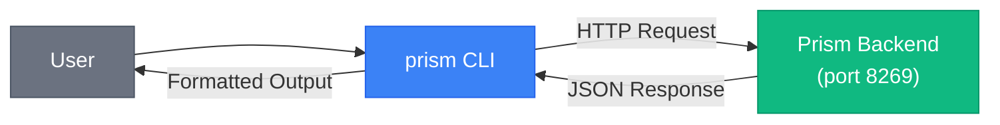

# CLI Reference

Prism provides a command-line interface for interacting with the backend REST API. The CLI is a thin client that communicates with the running backend server.

## Installation

The CLI is built with the project:

```bash
cd cli
cargo build --release
```

The binary will be available at `target/release/prism`.

## Usage



```bash
prism [OPTIONS] <COMMAND>
```

### Global Options

| Option | Description |
|--------|-------------|
| `--api-url <URL>` | Backend base URL (default: `http://127.0.0.1:8269`). Also via `PRISM_API_URL` env var |
| `--json` | Print raw JSON instead of human-readable tables |
| `-v, --verbose` | Show request URL and full error detail |

## Commands

### status
Backend health and library statistics.

```bash
prism status
```

**Output:**
```
Prism backend: OK ✅
  service      : prism-backend-rust
  version      : 0.1.0
  database     : sqlite:prism.db

┌─────────────┬───────────┐
│ Metric      │ Value     │
├─────────────┼───────────┤
│ Photos      │ 1,234     │
│ Videos      │ 56        │
│ Favorites   │ 89        │
│ In trash    │ 12        │
│ Locked      │ 5         │
│ Storage used│ 45.2 GB   │
└─────────────┴───────────┘
```

### stats
Library statistics only.

```bash
prism stats
```

### photos
List recent photos.

```bash
prism photos [OPTIONS]
```

| Option | Default | Description |
|--------|---------|-------------|
| `--limit` | 25 | Number of photos to list |

**Example:**
```bash
prism photos --limit 50
```

**Output:**
```
┌────┬──────────────┬────────────┬──────────────┬───────┬─────┐
│ ID │ Filename     │ Date       │ Location     │ Type  │ Fav │
├────┼──────────────┼────────────┼──────────────┼───────┼─────┤
│ 1  │ IMG_001.jpg  │ 2024-01-15 │ Paris, FR    │ image │ ★   │
│ 2  │ VID_002.mp4  │ 2024-01-14 │ London, UK   │ video │     │
│ 3  │ IMG_003.png  │ 2024-01-13 │ —            │ image │ ★   │
└────┴──────────────┴────────────┴──────────────┴───────┴─────┘

3 photo(s).
```

### photo
Show a single photo's metadata.

```bash
prism photo <ID>
```

**Example:**
```bash
prism photo 42
```

**Output:**
```
┌─────────────┬──────────────────────────────────┐
│ Field       │ Value                            │
├─────────────┼──────────────────────────────────┤
│ ID          │ 42                               │
│ UUID        │ a1b2c3d4-e5f6-7890-abcd-ef123456│
│ Filename    │ IMG_042.jpg                      │
│ Caption     │ Sunset at the beach              │
│ Dimensions  │ 4032×3024                        │
│ File type   │ image                            │
│ Content type│ photo                            │
│ File size   │ 4.5 MB                           │
│ Date taken  │ 2024-01-15T18:30:00Z             │
│ Location    │ Malibu, California, US           │
│ Camera      │ Canon EOS R5                     │
│ Favorite    │ yes                              │
│ Locked      │ no                               │
│ Trashed     │ no                               │
└─────────────┴──────────────────────────────────┘
```

### search
Fused metadata search across photos.

```bash
prism search [OPTIONS] [QUERY]
```

| Option | Default | Description |
|--------|---------|-------------|
| `--limit` | 25 | Maximum results |

**Example:**
```bash
prism search "sunset beach"
prism search --limit 10
```

### people
List known people.

```bash
prism people
```

**Output:**
```
┌────┬────────────────────────────────────┬──────────┐
│ ID │ UUID                               │ Name     │
├────┼────────────────────────────────────┼──────────┤
│ 1  │ a1b2c3d4-e5f6-7890-abcd-ef123456 │ Alice    │
│ 2  │ b2c3d4e5-f6a7-8901-bcde-f1234567 │ Bob      │
└────┴────────────────────────────────────┴──────────┘

2 person(s).
```

### albums
List albums.

```bash
prism albums
```

**Output:**
```
┌────┬─────────────────┬───────────────────┬────────┐
│ ID │ Name            │ Type              │ Photos │
├────┼─────────────────┼───────────────────┼────────┤
│ 1  │ Vacation 2024   │ custom            │ 45     │
│ 2  │ Screenshots     │ smart (screenshots)│ 123    │
│ 3  │ Documents       │ smart (documents) │ 67     │
└────┴─────────────────┴───────────────────┴────────┘

3 album(s).
```

### import
Import a directory tree and scan for photos.

```bash
prism import [OPTIONS] <PATH>
```

| Option | Default | Description |
|--------|---------|-------------|
| `-r, --recursive` | true | Recursively scan subdirectories |

**Example:**
```bash
prism import /home/user/Photos
prism import --no-recursive /home/user/Photos
```

### export
Export photos to an output directory.

```bash
prism export [OPTIONS] -o <OUTPUT_DIR>
```

| Option | Description |
|--------|-------------|
| `--album-id <ID>` | Optional album ID to export |
| `-o, --output-dir` | Output directory path (required) |

**Example:**
```bash
prism export -o /home/user/Export
prism export --album-id 1 -o /home/user/Vacation
```

### config
Read or update backend settings.

```bash
prism config [KEY] [VALUE]
```

**Examples:**
```bash
# View all settings
prism config

# View a specific setting
prism config telemetry_enabled

# Update a setting
prism config telemetry_enabled true
```

### purge-trash
Permanently purge trashed photos.

```bash
prism purge-trash
```

**Warning:** This permanently deletes all photos in the trash.

### diagnostics
Fetch system diagnostics and metrics.

```bash
prism diagnostics
```

**Output:**
```
┌──────────────────────┬───────────────┐
│ Diagnostic Metric    │ Value         │
├──────────────────────┼───────────────┤
│ total_photos         │ 1,234         │
│ total_size_bytes     │ 45.2 GB       │
│ thumbnail_count      │ 1,234         │
│ database_size_bytes  │ 12.5 MB       │
│ uptime_seconds       │ 3,456         │
└──────────────────────┴───────────────┘
```

### plugins
Manage modular Prism plugins and extensions installed in the `plugins/` directory. For a guide on creating custom plugins, see [Plugin Development Guide](PLUGINS.md).

```bash
# List installed plugins
prism plugins list
# (or simply: prism plugins)

# View available plugins in the official catalog
prism plugins catalog

# Install a plugin from the catalog
prism plugins install background-removal
# (shortcut: prism install background-removal)

# View detailed plugin manifest and metadata
prism plugins info background-removal

# Enable or disable an installed plugin
prism plugins toggle background-removal --enabled false
prism plugins toggle background-removal --enabled true

# Uninstall a plugin and remove its files from plugins/
prism plugins uninstall background-removal
# (shortcut: prism uninstall background-removal)
```

**Catalog Output:**
```
┌────────────────────┬──────────────────────────────┬─────────┬──────────────────────┬──────────┬──────────────────────┐
│ ID                 │ Name                         │ Version │ Category             │ Size     │ Status               │
├────────────────────┼──────────────────────────────┼─────────┼──────────────────────┼──────────┼──────────────────────┤
│ background-removal │ AI Background Removal Studio │ v1.2.0  │ AI & Machine Learn...│ ~170 MB  │ Installed (Active) ✅│
│ portrait-enhancer  │ AI Portrait & Face Retouching│ v1.0.0  │ Image Editor         │ ~85 MB   │ Available for Install│
│ cinematic-luts     │ Cinematic Color Grade & 3D...│ v2.1.0  │ Creative & Filters   │ ~12 MB   │ Available for Install│
│ exif-geotagger     │ Smart EXIF & Location Enha...│ v1.1.0  │ Metadata & Geotagg...│ ~45 MB   │ Available for Install│
└────────────────────┴──────────────────────────────┴─────────┴──────────────────────┴──────────┴──────────────────────┘
```

### install
Install a plugin from a manifest JSON file, local directory, or catalog ID into `plugins/<id>/`.

```bash
prism install <SOURCE>
```

**Supported `<SOURCE>` Formats:**

1. **Manifest JSON File** (catalog manifest stem or local file path):
   ```bash
   prism install background-removal.json
   prism install /path/to/my-plugin/plugin.json
   ```
2. **Local Plugin Directory** (containing `plugin.json` and optional `index.js`):
   ```bash
   prism install ./custom-plugins/portrait-studio/
   ```
3. **Direct Manifest URL** (raw HTTP/GitHub JSON link):
   ```bash
   prism install https://raw.githubusercontent.com/owner/repo/main/plugin.json
   ```
4. **Built-in Catalog ID**:
   ```bash
   prism install background-removal
   ```

**Output:**
```
Installing plugin from 'background-removal.json'...
✅ Successfully installed plugin 'background-removal' into plugins/background-removal!
  Name        : AI Background Removal Studio (v1.2.0)
  Category    : AI & Machine Learning
  Author      : Prism Core & Open Source AI
  Description : Deep learning matting pack supporting ISNet Universal, BiRefNet High-Resolution, and RMBG-1.4.
```

### uninstall
Shortcut to uninstall a plugin and delete its directory from `plugins/`.

```bash
prism uninstall <plugin_id>
```

**Example:**
```bash
prism uninstall background-removal
```

**Example:**
```bash
prism uninstall background-removal
```


## JSON Output

All commands support `--json` flag for machine-readable output:

```bash
prism stats --json
```

**Output:**
```json
{
  "total_photos": 1234,
  "total_videos": 56,
  "favorites_count": 89,
  "trash_count": 12,
  "locked_count": 5,
  "storage_used_bytes": 48318382080
}
```

## Environment Variables

| Variable | Description |
|----------|-------------|
| `PRISM_API_URL` | Backend URL (default: `http://127.0.0.1:8269`) |

## Error Handling

The CLI returns clear error messages:

```
Error: backend returned 404: {"error": "Photo not found"}
```

Use `--verbose` for more details:

```bash
prism --verbose photo 999
```

## Examples

### Batch Export
```bash
# Export all photos
prism export -o /backup/photos

# Export specific album
prism export --album-id 5 -o /backup/vacation
```

### Quick Stats
```bash
# Get stats as JSON for scripting
prism stats --json | jq '.total_photos'
```

### Find Photos
```bash
# Search for specific photos
prism search "birthday party" --limit 10
```

### Maintenance
```bash
# Check system health
prism status

# Purge old trash
prism purge-trash

# View diagnostics
prism diagnostics
```
