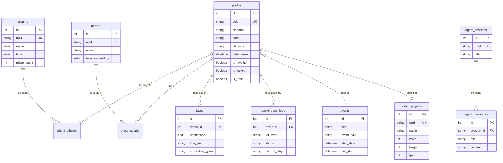

# Database Schema

Prism uses SQLite with WAL mode and FTS5 for full-text search. This document describes the database schema, tables, and relationships.

## Overview

- **Engine**: SQLite 3.x
- **Mode**: Write-Ahead Logging (WAL) for concurrent read/write
- **Search**: FTS5 for full-text search
- **Location**: `backend_rust/prism.db`

## Tables

### photos
Main table storing photo and video metadata.

```sql
CREATE TABLE photos (
    id INTEGER PRIMARY KEY AUTOINCREMENT,
    uuid TEXT UNIQUE NOT NULL,
    filename TEXT NOT NULL,
    path TEXT NOT NULL,
    url TEXT,
    width INTEGER,
    height INTEGER,
    aspect_ratio REAL,
    hash TEXT,
    phash TEXT,
    caption TEXT,
    city TEXT,
    state TEXT,
    country TEXT,
    latitude REAL,
    longitude REAL,
    date TEXT,
    date_taken TEXT,
    is_favorite BOOLEAN DEFAULT FALSE,
    is_locked BOOLEAN DEFAULT FALSE,
    is_trash BOOLEAN DEFAULT FALSE,
    mime_type TEXT,
    file_type TEXT,  -- 'image' or 'video'
    duration REAL,   -- video duration in seconds
    fps REAL,        -- video fps
    codec TEXT,      -- video codec
    audio_codec TEXT,-- audio codec
    ai_summary TEXT,
    auto_tags TEXT,  -- JSON array
    embedding TEXT,  -- JSON float array (SigLIP2)
    ocr_text TEXT,
    adjustments_json TEXT,  -- non-destructive edit adjustments
    blur_score REAL,
    content_type TEXT,  -- 'photo', 'screenshot', 'document'
    exif_make TEXT,
    exif_model TEXT,
    exif_focal_length REAL,
    exif_iso INTEGER,
    rotation INTEGER,
    device_id TEXT,
    is_external BOOLEAN DEFAULT FALSE,
    video_faces_scanned BOOLEAN DEFAULT FALSE,
    animated_url TEXT,
    event_id INTEGER,
    created_at DATETIME DEFAULT CURRENT_TIMESTAMP,
    updated_at DATETIME DEFAULT CURRENT_TIMESTAMP,
    FOREIGN KEY (event_id) REFERENCES events(id)
);
```

### albums
Album definitions.

```sql
CREATE TABLE albums (
    id INTEGER PRIMARY KEY AUTOINCREMENT,
    uuid TEXT UNIQUE NOT NULL,
    name TEXT NOT NULL,
    type TEXT NOT NULL,  -- 'places', 'memories', 'people', 'custom', 'smart'
    is_smart BOOLEAN DEFAULT FALSE,
    smart_type TEXT,  -- 'screenshots', 'documents', 'places'
    cover_url TEXT,
    photo_count INTEGER DEFAULT 0,
    metadata_json TEXT,
    created_at DATETIME DEFAULT CURRENT_TIMESTAMP,
    updated_at DATETIME DEFAULT CURRENT_TIMESTAMP
);
```

### photo_albums
Many-to-many relationship between photos and albums.

```sql
CREATE TABLE photo_albums (
    photo_id INTEGER NOT NULL,
    album_id INTEGER NOT NULL,
    PRIMARY KEY (photo_id, album_id),
    FOREIGN KEY (photo_id) REFERENCES photos(id) ON DELETE CASCADE,
    FOREIGN KEY (album_id) REFERENCES albums(id) ON DELETE CASCADE
);
```

### people
Identified people in photos.

```sql
CREATE TABLE people (
    id INTEGER PRIMARY KEY AUTOINCREMENT,
    uuid TEXT UNIQUE NOT NULL,
    name TEXT NOT NULL,
    cover_face_thumbnail TEXT,
    face_embedding TEXT,  -- JSON float array
    created_at DATETIME DEFAULT CURRENT_TIMESTAMP,
    updated_at DATETIME DEFAULT CURRENT_TIMESTAMP
);
```

### photo_people
Many-to-many relationship between photos and people.

```sql
CREATE TABLE photo_people (
    photo_id INTEGER NOT NULL,
    person_id INTEGER NOT NULL,
    confidence REAL,
    face_box_json TEXT,  -- JSON bounding box
    PRIMARY KEY (photo_id, person_id),
    FOREIGN KEY (photo_id) REFERENCES photos(id) ON DELETE CASCADE,
    FOREIGN KEY (person_id) REFERENCES people(id) ON DELETE CASCADE
);
```

### faces
Detected face data.

```sql
CREATE TABLE faces (
    id INTEGER PRIMARY KEY AUTOINCREMENT,
    photo_id INTEGER NOT NULL,
    confidence REAL,
    box_json TEXT,  -- JSON bounding box [x, y, w, h]
    embedding_json TEXT,  -- JSON embedding array (512-d)
    created_at DATETIME DEFAULT CURRENT_TIMESTAMP,
    FOREIGN KEY (photo_id) REFERENCES photos(id) ON DELETE CASCADE
);
```

### background_jobs
Background processing jobs.

```sql
CREATE TABLE background_jobs (
    id INTEGER PRIMARY KEY AUTOINCREMENT,
    photo_id INTEGER NOT NULL,
    job_type TEXT NOT NULL,  -- 'sequential_analysis'
    status TEXT NOT NULL,    -- 'pending', 'processing', 'completed', 'failed'
    current_stage TEXT,
    stage_progress TEXT,     -- JSON progress data
    attempt_count INTEGER DEFAULT 0,
    last_error TEXT,
    created_at DATETIME DEFAULT CURRENT_TIMESTAMP,
    updated_at DATETIME DEFAULT CURRENT_TIMESTAMP,
    FOREIGN KEY (photo_id) REFERENCES photos(id) ON DELETE CASCADE
);
```

### events
Event groupings (trips, etc.).

```sql
CREATE TABLE events (
    id INTEGER PRIMARY KEY AUTOINCREMENT,
    title TEXT,
    event_type TEXT,  -- 'trip', etc.
    start_date DATETIME,
    end_date DATETIME,
    location TEXT,
    cover_photo_id INTEGER,
    summary TEXT,
    created_at DATETIME DEFAULT CURRENT_TIMESTAMP,
    FOREIGN KEY (cover_photo_id) REFERENCES photos(id)
);
```

### video_projects
Video editor project state.

```sql
CREATE TABLE video_projects (
    id INTEGER PRIMARY KEY AUTOINCREMENT,
    uuid TEXT UNIQUE NOT NULL,
    name TEXT NOT NULL,
    cover_photo_id INTEGER,
    width INTEGER DEFAULT 1920,
    height INTEGER DEFAULT 1080,
    fps INTEGER DEFAULT 30,
    project_json TEXT,  -- JSON blob containing full timeline state
    created_at DATETIME DEFAULT CURRENT_TIMESTAMP,
    updated_at DATETIME DEFAULT CURRENT_TIMESTAMP,
    FOREIGN KEY (cover_photo_id) REFERENCES photos(id)
);
```

### agent_sessions
AI agent chat sessions.

```sql
CREATE TABLE agent_sessions (
    id INTEGER PRIMARY KEY AUTOINCREMENT,
    uuid TEXT UNIQUE NOT NULL,
    title TEXT,
    created_at DATETIME DEFAULT CURRENT_TIMESTAMP,
    updated_at DATETIME DEFAULT CURRENT_TIMESTAMP
);
```

### agent_messages
AI agent chat messages.

```sql
CREATE TABLE agent_messages (
    id INTEGER PRIMARY KEY AUTOINCREMENT,
    session_id TEXT NOT NULL,
    role TEXT NOT NULL,  -- 'user' or 'assistant'
    content TEXT,
    photos_json TEXT,   -- JSON array of photos in result
    plan_json TEXT,     -- Execution plan JSON
    tools_json TEXT,    -- Tool calls JSON
    attached_image_json TEXT,
    created_at DATETIME DEFAULT CURRENT_TIMESTAMP,
    FOREIGN KEY (session_id) REFERENCES agent_sessions(uuid) ON DELETE CASCADE
);
```

### settings
Key-value settings store.

```sql
CREATE TABLE settings (
    key TEXT PRIMARY KEY,
    value TEXT
);
```

### telemetry_events
Usage analytics events (opt-in).

```sql
CREATE TABLE telemetry_events (
    id INTEGER PRIMARY KEY AUTOINCREMENT,
    source TEXT,
    session_id TEXT,
    event_type TEXT,
    component TEXT,
    action TEXT,
    metadata_json TEXT,
    status TEXT,
    duration_ms REAL,
    created_at DATETIME DEFAULT CURRENT_TIMESTAMP
);
```

## Full-Text Search (FTS5)

### photos_fts
Full-text search index for photos.

```sql
CREATE VIRTUAL TABLE photos_fts USING fts5(
    filename,
    caption,
    city,
    state,
    country,
    ocr_text,
    ai_summary,
    auto_tags,
    content='photos',
    content_rowid='id'
);
```

### Triggers

```sql
-- Keep FTS index in sync
CREATE TRIGGER photos_ai AFTER INSERT ON photos BEGIN
    INSERT INTO photos_fts(rowid, filename, caption, city, state, country, ocr_text, ai_summary, auto_tags)
    VALUES (new.id, new.filename, new.caption, new.city, new.state, new.country, new.ocr_text, new.ai_summary, new.auto_tags);
END;

CREATE TRIGGER photos_ad AFTER DELETE ON photos BEGIN
    INSERT INTO photos_fts(photos_fts, rowid, filename, caption, city, state, country, ocr_text, ai_summary, auto_tags)
    VALUES ('delete', old.id, old.filename, old.caption, old.city, old.state, old.country, old.ocr_text, old.ai_summary, old.auto_tags);
END;

CREATE TRIGGER photos_au AFTER UPDATE ON photos BEGIN
    INSERT INTO photos_fts(photos_fts, rowid, filename, caption, city, state, country, ocr_text, ai_summary, auto_tags)
    VALUES ('delete', old.id, old.filename, old.caption, old.city, old.state, old.country, old.ocr_text, old.ai_summary, old.auto_tags);
    INSERT INTO photos_fts(rowid, filename, caption, city, state, country, ocr_text, ai_summary, auto_tags)
    VALUES (new.id, new.filename, new.caption, new.city, new.state, new.country, new.ocr_text, new.ai_summary, new.auto_tags);
END;
```

## Entity Relationships



## Indexes

```sql
-- Photo indexes
CREATE INDEX idx_photos_uuid ON photos(uuid);
CREATE INDEX idx_photos_date_taken ON photos(date_taken);
CREATE INDEX idx_photos_is_favorite ON photos(is_favorite);
CREATE INDEX idx_photos_is_locked ON photos(is_locked);
CREATE INDEX idx_photos_is_trash ON photos(is_trash);
CREATE INDEX idx_photos_file_type ON photos(file_type);
CREATE INDEX idx_photos_event_id ON photos(event_id);

-- Album indexes
CREATE INDEX idx_albums_uuid ON albums(uuid);
CREATE INDEX idx_albums_type ON albums(type);
CREATE INDEX idx_albums_is_smart ON albums(is_smart);

-- People indexes
CREATE INDEX idx_people_uuid ON people(uuid);

-- Face indexes
CREATE INDEX idx_faces_photo_id ON faces(photo_id);

-- Background job indexes
CREATE INDEX idx_background_jobs_photo_id ON background_jobs(photo_id);
CREATE INDEX idx_background_jobs_status ON background_jobs(status);

-- Video project indexes
CREATE INDEX idx_video_projects_uuid ON video_projects(uuid);

-- Agent indexes
CREATE INDEX idx_agent_sessions_uuid ON agent_sessions(uuid);
CREATE INDEX idx_agent_messages_session_id ON agent_messages(session_id);

-- Telemetry indexes
CREATE INDEX idx_telemetry_events_created_at ON telemetry_events(created_at);
CREATE INDEX idx_telemetry_events_event_type ON telemetry_events(event_type);
```

## Common Queries

### Search Photos
```sql
SELECT p.* FROM photos p
JOIN photos_fts fts ON p.id = fts.rowid
WHERE photos_fts MATCH 'sunset beach'
ORDER BY rank;
```

### Get Album Photos
```sql
SELECT p.* FROM photos p
JOIN photo_albums pa ON p.id = pa.photo_id
WHERE pa.album_id = ?
ORDER BY p.date_taken DESC;
```

### Get Person Photos
```sql
SELECT p.* FROM photos p
JOIN photo_people pp ON p.id = pp.photo_id
WHERE pp.person_id = ?
ORDER BY p.date_taken DESC;
```

### Get Photo Faces
```sql
SELECT f.*, p.name as person_name
FROM faces f
LEFT JOIN photo_people pp ON f.photo_id = pp.photo_id
LEFT JOIN people p ON pp.person_id = p.id
WHERE f.photo_id = ?;
```

### Get Similar Photos (by embedding)
```sql
-- Using cosine similarity (simplified)
SELECT id, uuid, filename,
       (1.0 - (embedding <=> ?)) as similarity
FROM photos
WHERE embedding IS NOT NULL
ORDER BY similarity DESC
LIMIT 10;
```

## Migrations

Migrations are handled in `backend_rust/src/db.rs` using SQLx's migration system. Each migration is a numbered SQL file in `backend_rust/migrations/`.

### Creating a Migration

```bash
# Create new migration
sqlx migrate add add_new_column
```

### Running Migrations

Migrations run automatically on server startup.

## Backup & Restore

### Backup
```bash
# Using CLI
prism utilities/backup/export

# Manual
cp backend_rust/prism.db backup/prism_$(date +%Y%m%d).db
```

### Restore
```bash
# Using CLI
prism utilities/backup/restore

# Manual
cp backup/prism_20240115.db backend_rust/prism.db
```

## Performance Tips

1. **WAL Mode** — Enabled by default for better concurrency
2. **FTS5** — Use for text searches, not LIKE queries
3. **Indexes** — Add indexes for frequently queried columns
4. **Vacuum** — Periodically vacuum to reclaim space
5. **Analyze** — Run ANALYZE for query optimizer statistics
