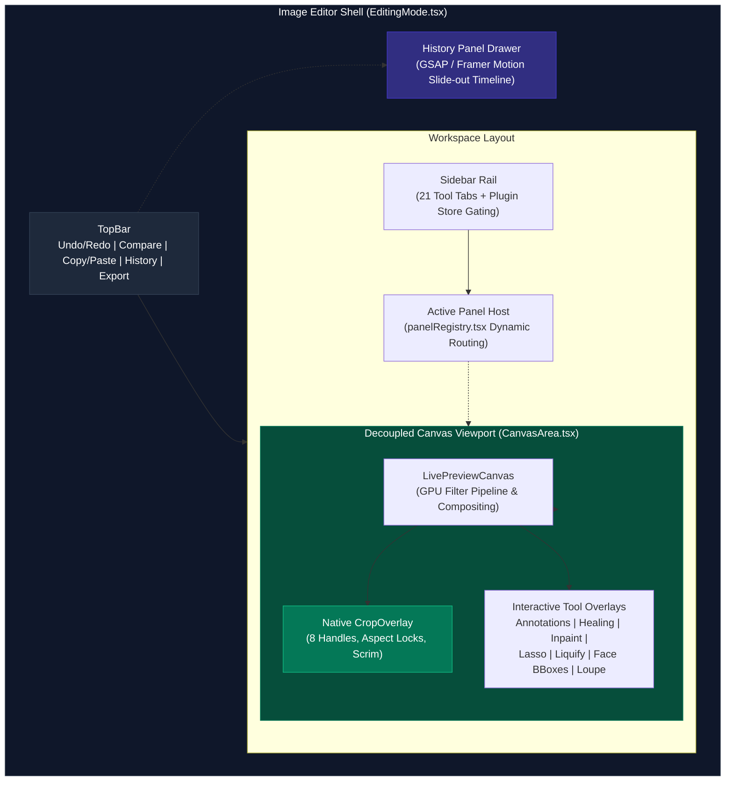
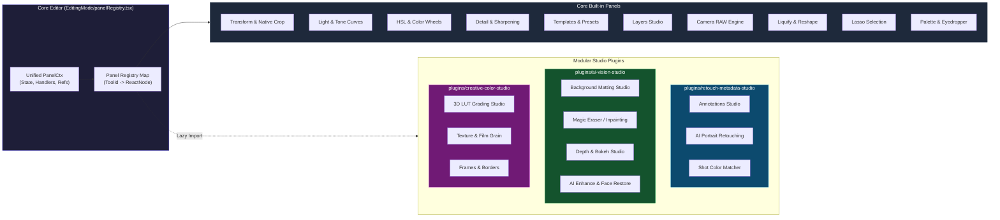
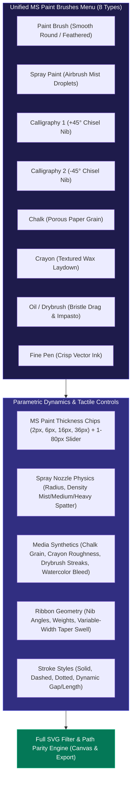
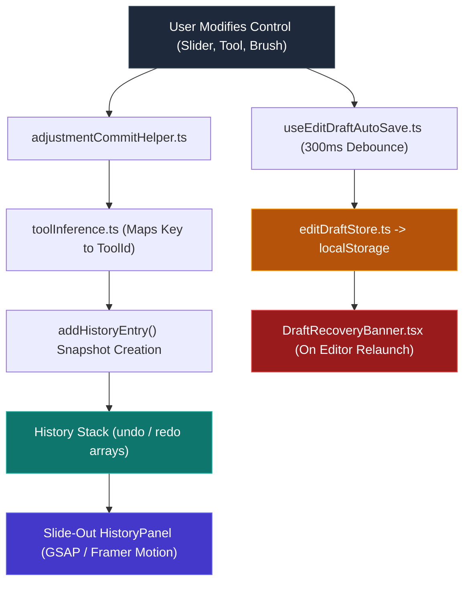
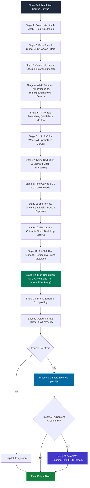
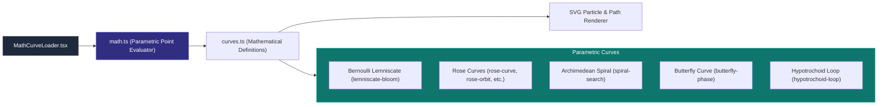

# Image Editor

Prism includes a professional-grade, non-destructive image editor featuring a 21-tool sidebar suite, embedded Tone Curves and Color Wheels studios, an extensible modular plugin architecture, tactile annotations with SVG filter parity, and standard-compliant C2PA Content Credentials provenance. All image modifications are maintained as parametric metadata and applied non-destructively — the original photograph is never mutated.

---

## Architecture Overview

The image editor is accessible from the photo lightbox by clicking the **Edit** action. It features a decoupled, reactive canvas viewport, a modular tool rail powered by dynamic plugin registration, an in-canvas overlay system, and a multi-stage export pipeline.

### Modular Plugin Architecture

Tool panels and processing engines are modularized into core built-ins and decoupled studio packs located in `plugins/`. Panels register dynamically through `EditingMode/panelRegistry.tsx`, and visibility is gated by installed plugin status via `usePluginStore`.

### Subsystem Directory Map

| Subsystem | Directory / Key Files | Responsibilities & Implementations |
|---|---|---|
| **Editor Shell** | `EditingMode/` | Editor lifecycle, keyboard shortcuts (`useKeyBindings`), layout orchestration, history integration |
| **Panel Registry** | `EditingMode/panelRegistry.tsx` | Type-safe dictionary mapping `ToolId` to panel renders with lazy-loaded plugin components |
| **Tool Navigation** | `Sidebar.tsx` | 21-tool vertical rail with spring indicator, plugin-gated tool visibility via `TOOL_PLUGIN_REQUIREMENTS` |
| **Canvas Viewport** | `CanvasArea/`, `CanvasArea.types.ts` | Decoupled canvas container, pixel coordination (`useImageRectSync`), live preview renderer host |
| **Native Crop** | `CanvasArea/overlays/CropOverlay.tsx` | Pure React/SVG crop box with 8 handles, rule-of-thirds grid, and aspect locks (**replaces Cropper.js**) |
| **Canvas Hooks** | `useCanvasZoom.ts`, `useCtrlPan.ts`, `useCompareSlider.ts`, `useImageLoader.ts` | Zoom (10–500%), pan gestures, before/after split slider, multi-layer asset loader |
| **Top Bar** | `TopBar.tsx` | Undo/redo stack navigation, compare split toggle, copy/paste edit metadata, export modal launcher |
| **Tone Curves** | `CurveEditor/` | Per-channel RGB & 5 "Color vs Color" curves, monotone cubic splines (`spline.ts`), luminance histogram |
| **Templates & Presets** | `TemplatesPanel/` | Curated presets, user preset management, live sample card renders (`sampleUrls.ts`) |
| **Camera RAW** | `RawEnginePanel/`, `rawEngine.ts` | Planckian-locus Kelvin WB, logarithmic EV exposure, Bayer demosaicing (AMaZE/AHD/RCD), wavelet denoise |
| **Layers Studio** | `LayersPanel/`, `layersEngine.ts` | Base pixel, fill (solid/gradient), and adjustment layers, 16 blend modes, hierarchy reordering |
| **Lasso Studio** | `LassoPanel/`, `LassoCanvas/`, `lassoEngine/` | Freehand, polygonal, and live-wire magnetic lasso, edge refine, high-res mask generation |
| **Liquify Studio** | `LiquifyPanel.tsx`, `LiquifyCanvas.tsx`, `liquifyEngine/` | 64×64 mesh displacement, WebGL shader renderer, warp/pucker/bloat/smooth/reconstruct |
| **Healing & Clone** | `HealingPanel.tsx`, `HealingCanvas/`, `healingEngine.ts` | Persistent stroke layer, sample anchor targeting, spot heal, clone stamp, frequency separation |
| **Palette Studio** | `PalettePanel/`, `colorQuantization.ts` | Median-cut dominant color extraction, `colord` harmonies, WCAG perceptual luminance, loupe eyedropper |
| **Retouch Studio Plugin** | `plugins/retouch-metadata-studio/` | MS Paint Brushes & Annotations, AI Portrait Retouching with Real Tone calibration, Reinhard Shot Color Matcher |
| **Vision Studio Plugin** | `plugins/ai-vision-studio/` | RMBG-1.4/ISNet background cutout & matting, LaMa ONNX magic eraser, AI depth & portrait bokeh, AI upscaler |
| **Creative Color Plugin** | `plugins/creative-color-studio/` | 3D LUT grading (.cube parser, Vivid Studio Dusk tables), film grain, light leaks, double exposure, frames |
| **History & Auto-Save** | `EditingMode/history/`, `HistoryPanel.tsx`, `useEditDraftAutoSave.ts` | Granular adjustment commit helper, tool inference, slide-out timeline drawer, debounced localStorage drafts |
| **Export Pipeline** | `exportPipeline.ts`, `exportPipeline/stages/` | 18-stage render pipeline, SVG filter export parity, `piexifjs` EXIF preservation, C2PA manifest injection |
| **Math Curve Loaders** | `MathCurveLoader/` | Animated SVG parametric loading indicators (Bernoulli Lemniscate, Rose, Spiral, Butterfly, Hypotrochoid) |

---

## Canvas Viewport & Native Interaction

Prism completely decouples viewport panning, zooming, and tool interaction from third-party DOM-manipulating libraries.

### Native `CropOverlay`

The legacy Cropper.js dependency has been replaced by `CropOverlay.tsx`, a high-performance, native React/SVG component integrated directly into the canvas layering hierarchy:

- **Coordinate Normalization**: Operates in normalized coordinates `[0..1]` relative to the underlying image rectangle (`ImageRect`), maintaining sub-pixel precision across zoom levels and window resizes.
- **8 Interactive Resize Handles**: Northwest, north, northeast, east, southeast, south, southwest, and west drag handles with tactile hit regions.
- **Aspect-Ratio Locking**: Supports arbitrary fixed aspect ratios (1:1, 3:2, 4:3, 4:5, 16:9, 9:16) as well as unconstrained freeform framing (`NaN`).
- **Framing Composition Aids**: Renders an SVG rule-of-thirds composition grid with semi-transparent rule lines.
- **Dimmed Scrim**: Non-destructive SVG mask darkened backdrop scrim (`rgba(0, 0, 0, 0.6)`) that isolates the selected composition.

### Decoupled Zoom, Pan & Compare

- **Floating Zoom Engine (`useCanvasZoom`)**: Provides stepped zoom increments (10% to 500%), screen fitting (`Ctrl+0`), and pixel-perfect 1:1 view (`Ctrl+1`).
- **Space/Ctrl Panning (`useCtrlPan`)**: Smooth canvas dragging with friction damping when holding `Space` or `Ctrl`, without interfering with active drawing tools.
- **Split-View Before/After Comparison (`useCompareSlider`)**: Real-time comparison split bar (`\` hotkey or interactive handle) that composites the unmodified source against the active adjustment stack.

---

## Comprehensive Tool & Modular Panel Guide

### 1. Templates & Presets (`TemplatesPanel/`)

The Templates & Presets panel provides instant access to curated photographic profiles and custom user presets.

- **Modular Architecture**: Split into `TemplatesPanel.tsx`, `CuratedTemplateCard.tsx`, `UserTemplateCard.tsx`, `SaveTemplateSection.tsx`, and `sampleUrls.ts`.
- **Curated Categorization**:
  - **Film & Analog**: Kodachrome, Fuji Chrome, Golden Hour, Cinematic Teal, Noir, B&W Classic.
  - **Portrait & Skin**: Studio Clean, Dramatic Dark, Pastel Dream.
  - **Landscape & Nature**: Velvia Pop, Cool Breeze, Warm Summer.
  - **Vintage & Retro**: Soft Matte, Faded Film, Faded Polaroid.
- **Sample Thumbnail Generation**: Dynamic thumbnail rendering mapped to appropriate sample subjects (`nature.png`, `woman.png`, `pet.png`) resolved via `sampleUrls.ts`.
- **Preset Intensity Blend**: Continuous slider (0–100%) that linearly interpolates adjustment parameters between base defaults and the target preset.
- **Custom User Presets**: Capture active adjustments, save under a custom name to `localStorage`, apply to any image, or delete.

### 2. Light Adjustments & Tone Curves (`AdjustPanel.tsx`, `CurveEditor/`)

Exposure, dynamic range shaping, and precision spline tone grading.

- **Primary Light Controls**: Exposure, Contrast, Highlights, Shadows, Whites, and Blacks (-100 to +100).
- **Secondary Tone Controls**: Brightness, Ambiance (local midtone contrast), and Dehaze (atmospheric scattering compensation).
- **Auto-Enhance**: One-click intelligent adjustment calculated via backend histogram analysis (`POST /api/v1/photos/auto-enhance/{id}`).
- **Modular `CurveEditor/`**:
  - `CurveHeader.tsx`: Switches between standard RGB and specialized "Color vs Color" modes.
  - `CurveGraph.tsx`: Interactive SVG canvas with a 256-bin luminance histogram backdrop computed directly from the filtered image preview.
  - **Monotone Cubic Splines (`spline.ts`)**: Spline interpolation guaranteed to be monotonic, preventing overshoot and ringing artifacts common in standard cubic Hermite splines.
  - **Channels**: Master, Red (`#ef4444`), Green (`#22c55e`), Blue (`#3b82f6`).
  - **Color vs Color Curves**:
    - **Hue vs Hue**: Shift specific color bands without affecting other hues.
    - **Hue vs Sat**: Selectively boost or desaturate chosen hues.
    - **Hue vs Lum**: Modulate lightness of individual hues.
    - **Lum vs Sat**: Control color saturation across shadow, midtone, and highlight zones.
    - **Sat vs Sat**: Tame oversaturated colors or boost muted tones.

### 3. Color (HSL) & Color Wheels (`HslPanel/`, `colorWheelsEngine.ts`)

A dedicated four-tab color suite for photographic and cinematic grading:

- **Mixer Tab (`HslMixerTab.tsx`)**: 8 isolated color bands (Reds, Oranges, Yellows, Greens, Aquas, Blues, Purples, Pinks) with Hue Shift (±180°), Saturation (-100 to +100), and Luminance (-100 to +100), alongside per-band reset and dynamic swatch previews.
- **Basic Tab (`HslBasicTab.tsx`)**: White balance presets (As Shot, Daylight, Cloudy, Shade, Tungsten, Fluorescent, Custom), Kelvin temperature, tint, vibrance, global saturation, and hue angle rotation.
- **Color Wheels Tab (`HslWheelsTab.tsx`, `colorWheelsEngine.ts`)**:
  - **Primary 3-Way Mode**: Lift (Shadows), Gamma (Midtones), Gain (Highlights), and Offset (Global). Each wheel couples a polar 2D vector (hue angle and chroma magnitude) with a vertical Luma slider.
  - **Log Grading Mode**: Shadows, Midtones, and Highlights wheels with parametric Low Pivot and High Pivot threshold sliders for strict zone isolation.
  - **Smoothstep Zone Isolation**: Uses Hermite smoothstep polynomial curves for natural photographic transitions between luminance zones.
- **Toning Tab (`HslToningTab.tsx`)**: Highlights and Shadows split-toning with presets (Teal & Orange, Warm & Cool, Sepia, Cyberpunk) and a bipolar tonal balance slider.

### 4. Camera RAW Engine (`RawEnginePanel/`, `rawEngine.ts`)

Professional digital negative development pipeline:

- **Camera & Sensor Metadata**: Reads EXIF sensor profiles, camera body, lens model, shutter speed, aperture, and ISO.
- **White Balance (`RawWhiteBalanceSection.tsx`)**: Planckian-locus Kelvin slider (2000K to 20,000K) and green/magenta tint adjustment (-100 to +100) with calibrated daylight/cloudy/tungsten presets.
- **Dynamic Range (`RawExposureSection.tsx`)**: Logarithmic EV exposure compensation (-5.0 EV to +5.0 EV), unclipped highlight channel reconstruction, shadow lift, and black/white clipping thresholds.
- **Demosaicing & Noise Reduction (`RawDetailSection.tsx`)**:
  - Directional Bayer CFA demosaicing algorithms: **AMaZE** (Adaptive Mosaicing toward Zero Error), **AHD** (Adaptive Homogeneity-Directed), and **RCD** (Ratio-based Corrected Demosaicing).
  - Wavelet-domain luminance noise reduction (0–100%).
  - Chrominance high-frequency color speckle removal (0–100%).
  - RAW micro-contrast clarity boost.

### 5. 3D LUT Color Grading (`plugins/creative-color-studio/`, `lutEngine.ts`)

3D look-up table grading executing directly via Canvas2D `ImageData` pixel transforms:

- **Vivid Studio Dusk Collection (`vividDuskLuts.ts`)**: 5 pre-compiled high-fidelity 3D LUT tables decoded from base64 float buffers (`vivid_dusk_1` through `5`).
- **Built-in Looks (15+)**: Cinematic Teal & Orange, Golden Hour, Matte Fade, Bleach Bypass, Film Print, Fuji Provia, Noir, Emerald City, Rose Gold, Arctic Blue.
- **`.cube` File Parser (`lutEngine.ts`)**: Standard parser for 17³, 33³, and 65³ `.cube` tables supporting `DOMAIN_MIN` and `DOMAIN_MAX` remapping.
- **Interpolation Engine**: High-speed trilinear interpolation mapping RGB coordinates into tetrahedral sub-cells.
- **Grade Export**: Export active grading stacks directly as standard `.cube` files.

### 6. Detail & Sharpening / Noise Reduction (`DetailPanel.tsx`)

Edge definition and optical depth effects:

- **Clarity**: High-radius unsharp contrast mask targeting image midtones.
- **Sharpness**: Dual-mode unsharp masking (positive values for radius/amount sharpening, negative values for Gaussian soft focus).
- **Noise Reduction**: Edge-preserving luminance smoothing.
- **Defringe & Chromatic Aberration**: Axial and lateral green/magenta color fringing cancellation.
- **Tilt-Shift Depth of Field**: Miniature-world tilt-shift simulation with Linear and Radial aperture modes, adjustable focal band width, blur gradient falloff, and focus repositioning.

### 7. Selective Color & Color Matcher (`plugins/retouch-metadata-studio/`, `colorMatchEngine.ts`)

Cinema-grade color grading transfer:

- **Shot Matcher**: Upload any reference photograph or cinema still to extract its color profile.
- **Reinhard $l\alpha\beta$ Color Transfer**: Converts source and target images from non-linear sRGB into LMS cone space, transforms to logarithmic space, and projects into the decorrelated perceptual $l\alpha\beta$ space (where $l$ is luminance, $\alpha$ is yellow-blue chromaticity, and $\beta$ is red-green chromaticity).
- **Statistical Matching**: Aligns color distributions by scaling pixel standard deviations and shifting means:
  $$\mu_{target} = \frac{\sigma_{ref}}{\sigma_{src}} (p_{src} - \mu_{src}) + \mu_{ref}$$
- **Strength Slider**: 10% to 100% blend between original and transferred color profiles.

### 8. Transform & Crop (`TransformPanel.tsx`, `CropOverlay.tsx`)

Spatial orientation and compositional geometry:

- **Native Interactive Crop**: 8-handle crop box with Rule of Thirds grid, freeform resizing, and aspect locks (1:1, 3:2, 4:3, 4:5, 16:9, 9:16).
- **Straighten & Leveling**: Fine rotational alignment from -45.0° to +45.0° in 0.1° increments.
- **Orientation**: Incremental 90° clockwise/counter-clockwise rotation and horizontal/vertical mirroring.
- **Perspective Corrections**: Horizontal and vertical perspective keystoning (-45° to +45°).
- **Lens Distortion**: Barrel and pincushion optical distortion correction (-100 to +100).

### 9. Markup & Annotations Studio (`plugins/retouch-metadata-studio/AnnotationsPanel/`)

A vector drawing and annotation studio with an MS Paint-inspired interface, realistic media physics, and parametric brush customization:

- **MS Paint Brushes Palette (`BrushesPalette.tsx`)**:
  1. **Paint Brush**: Smooth round brush with adjustable soft feathering (0–20px blur radius).
  2. **Spray Paint**: Particle airbrush spraying stochastic droplet mists with customizable spray radius (10–80px) and droplet density presets (Mist, Medium, Heavy Spatter).
  3. **Calligraphy 1 & 2**: Chisel-nib calligraphic ribbon pens with default angles (+45° and -45°), real-time nib rotation (-90° to +90°), and nib width weighting (10–100).
  4. **Chalk**: Porous chalk dust with parametric pressure, grain texture, and edge roughness (`CHALK_PRESETS`: Dusty, Crisp, Heavy, Smudged).
  5. **Crayon**: Granular wax laydown with density, waxy grain, and tooth roughness (`CRAYON_PRESETS`: Waxy, Gritty, Bold, Soft).
  6. **Oil / Drybrush**: Directional bristle drag, streaking lines, and tactile impasto (`DRYBRUSH_PRESETS`: Light Bristle, Coarse Oil, Scratchy, Impasto).
  7. **Watercolor**: Bleeding pigment wash with spread radius and paper wetness (`WATERCOLOR_PRESETS`: Wet Wash, Glaze, Granulating, Dry Blot).
  8. **Fine Pen**: Precision technical vector inking with sharp antialiasing.
- **Stroke Thickness Selector (`StrokeSizeSelector.tsx`)**: Quick-select chips matching MS Paint thickness profiles (Fine 2px, Medium 6px, Bold 16px, Broad 36px) plus a continuous 1px to 80px slider.
- **Taper & Stroke Profiles**: Solid, dashed, and dotted stroke styles with custom dash length/gap, end arrowheads, closed-path fill with opacity, and stroke taper profiles (None, Start, End, Both, Swell) with variable taper intensity.
- **Vector Shapes & Typography**: Rectangles, ellipses, polygons, arrows, stars; multi-font typography engine with Google Fonts, weight, italic, underline, alignment, letter spacing, and line height.
- **Categorized Emoji**: Smileys, Hearts, Gestures, Nature, Food, Objects.

### 10. Magic Eraser & Inpainting (`plugins/ai-vision-studio/`, `magicEraserEngine.ts`)

AI-driven distraction removal and neural replacement:

- **Model Hierarchy**:
  - **LaMa ONNX**: Large Mask Inpainting model for removing complex objects and reconstructing background textures.
  - **Client-Side Telea Engine**: Offline, zero-latency Fast-Marching Telea boundary interpolation with multi-scale patch synthesis for immediate client-side erasing.
  - **Stable Diffusion (Neural Replace)**: Prompt-guided generative inpainting with guidance scale and inference steps.
- **Interactive Segmentation (SAM Integration)**: Place positive/negative click prompts on canvas to generate object masks automatically.
- **Masking Tools**: Brush and eraser masks with adjustable size, edge hardness, mask opacity, and full mask history (undo/redo/clear).

### 11. Healing Brush & Clone Stamp (`HealingCanvas/`, `healingEngine.ts`)

Precision manual retouching on a dedicated overlay canvas:

- **Modular Architecture**: Split into `HealingCanvas.tsx`, `useHealingPainting.ts`, `indicators.tsx`, and `types.ts`.
- **Sample Anchor Management**: Alt+Click (or first tap) designates the reference source point. Dynamic crosshair indicators track brush movement relative to the sample anchor.
- **Retouching Modes**:
  - **Clone Stamp**: Direct pixel sampling with adjustable hardness, opacity, and live source tracking.
  - **Spot Heal**: Poisson-blended gradient cloning that harmonizes sampled textures with target boundary lighting.
  - **Frequency Separation**: Smoothes color tones while preserving pore and fabric textures.
  - **Patch Blend**: Area-to-area boundary texture harmonization.
  - **Dodge & Burn**: Local exposure sculpting (brightening or darkening).
- **Persistent Overlay**: Brush strokes render to an isolated work canvas and composite non-destructively onto the preview.

### 12. Lasso Selection Studio (`LassoPanel/`, `LassoCanvas/`, `lassoEngine/`)

High-precision pixel selection engine:

- **Modular Toolset**:
  - **Freehand Lasso**: Fluid manual cursor tracing.
  - **Polygonal Lasso**: Click-to-place straight-line polygonal anchors.
  - **Magnetic Intelligent Scissors (`liveWire.ts`, `magnetic.ts`)**: Real-time pathfinding Dijkstra traversal over an image cost map computed via 2D Sobel gradient magnitudes, snapping automatically to high-contrast edges.
- **Boolean Combine Modes**: New Selection, Add (`Shift`), Subtract (`Alt`), Intersect (`Shift+Alt`).
- **Edge Refinement (`refineEdge.ts`)**: Feather radius (0–50px), edge smoothing, edge shift/expansion (-100% to +100%), and mask contrast thresholding.
- **Preview Modes**: Classic animated Marching Ants (via SVG dashoffset animation), Rubylith mask overlay, and high-contrast Black & White.
- **Mask Conversion**: "Convert to AI Mask" generates a high-resolution, scaled binary mask Data URL and automatically hands off into the Magic Eraser.

### 13. Liquify & Reshape (`LiquifyPanel.tsx`, `liquifyEngine/`)

High-performance WebGL displacement mesh engine:

- **Deformation Modes**:
  - **Forward Warp**: Pushes pixels in the drag direction.
  - **Pucker (Pinch)**: Draws pixels toward the brush center.
  - **Bloat (Expand)**: Expands pixels radially outward.
  - **Smooth (Push)**: Relaxes mesh distortion gradients.
  - **Reconstruct (Restore)**: Reverts distorted vertices back to their rest coordinates.
- **Mesh Grid Architecture (`MeshGrid.ts`)**: 64×64 triangulated displacement grid maintaining sub-pixel vertex offsets.
- **WebGL Pipeline (`WebGLLiquifyRenderer.ts`)**: Custom vertex and fragment shaders render live mesh displacement at 60 FPS without CPU pixel processing overhead.
- **Parametric Facial Reshaping**: Sliders for eye size, eye distance, nose width, lip height, and chin/jaw contour driven by detected face anchors.

### 14. AI Portrait Retouching (`plugins/retouch-metadata-studio/`, `portraitEngine/`)

Deep-learning facial analysis and frequency-separation retouching:

- **Multi-Face Targeting**: Automatic detection of multiple faces via backend ONNX models. Retouch All Faces globally or isolate individual faces via sidebar pills or canvas click.
- **Real Tone Calibration (`facialRetouch.ts`)**: Tonal mapping algorithm that prevents ashy cast and preserves rich melanin gradations across diverse skin complexions.
- **Frequency Separation Skin Smoothing (`frequencySeparation.ts`)**: Deconstructs facial skin into high-frequency details (pores, fine hairs, texture) and low-frequency tones (blotches, redness, lighting variations). Smoothes tones while preserving authentic pore structure.
- **Facial Features Retouching**:
  - **Eyes**: Sclera whitening (vein/yellow reduction), iris contrast and clarity, specular catchlight sparkle.
  - **Mouth**: Tooth whitening (yellow-cast neutralization) and lip vibrance/hue enhancement.
  - **Brows**: Eyebrow density and hair definition sharpening.
- **Quick Looks**: Natural, Fresh, Studio, Smooth, Glamour presets.

### 15. Background Removal & Matting Studio (`plugins/ai-vision-studio/BackgroundPanel.tsx`)

AI alpha matting and virtual studio backdrop compositing:

- **State-of-the-Art Matting Models**:
  - **RMBG-1.4**: Bria AI studio-grade foreground extraction.
  - **ISNet General Use**: 1024px high-resolution universal subject segmentation.
  - **U²-Net-p**: Ultra-fast on-device matting.
  - **BiRefNet**: Bilateral reference network for hair and fiber boundary matting.
- **Backdrop Replacement**:
  - Transparent cutout.
  - Solid studio colors with curated swatches (Pure White, Studio Dark, Neutral Gray, Sky Cyan, Sunset Amber, Rose Pink) and hex picker.
  - Multi-stop linear and radial gradients.
  - Custom image upload (`customBackdropUrl`) supporting scenic backdrops and textures.
- **Matting Refinements**: Edge feathering (0–20px), edge contraction/expansion (-10px to +10px), synthetic background blur (bokeh simulation), and subject drop shadow (opacity, blur radius, color).

### 16. Layers Studio (`LayersPanel/`, `layersEngine.ts`)

Non-destructive Photoshop-style layer stack:

- **Modular UI**: Split into `LayersPanel.tsx`, `LayerHierarchySection.tsx`, `LayerControls.tsx`, and `LayerItem.tsx`.
- **Layer Types**:
  - **Base Pixel Layer**: The foundational photograph.
  - **Solid Fill Layer**: Color fill with opacity.
  - **Gradient Fill Layer**: Linear/radial gradient fills.
  - **Adjustment Layer**: Dedicated layer applying brightness, contrast, hue, and saturation.
- **16 Blend Modes**: Normal (`source-over`), Multiply, Screen, Overlay, Darken, Lighten, Color Dodge, Color Burn, Hard Light, Soft Light, Difference, Exclusion, Hue, Saturation, Color, Luminosity.
- **Stack Hierarchy**: Drag-and-drop layer reordering, visibility toggling, opacity adjustment, and flattening/export compositing.

### 17. Color Palette & Eyedropper (`PalettePanel/`, `colorQuantization.ts`, `colorUtils.ts`)

Color palette extraction, harmony analysis, and in-canvas sampling:

- **Median-Cut Quantization (`colorQuantization.ts`)**: Analyzes the photograph's color distribution, recursively partitioning RGB bounding boxes along the largest range axis to extract 6 dominant colors.
- **Color Harmonies (`colorUtils.ts` via `colord`)**: Computes complementary, analogous, and triadic color harmonies for any selected swatch using `colord/plugins/harmonies`.
- **Perceptual Luminance (`getPerceptualLuminance`)**: Evaluates WCAG/Rec.709 perceived lightness to guarantee accessible UI text contrast.
- **In-Canvas Loupe Eyedropper (`PaletteEyedropperOverlayHost.tsx`)**: Magnified 7×7 pixel loupe following the pointer for sub-pixel sampling, with fallback to the native browser EyeDropper API.
- **Swatch Locking**: Lock specific palette slots to preserve favorites while re-extracting others; one-click hex copying.

### 18. Frames & Borders (`plugins/creative-color-studio/FramesPanel.tsx`)

Borders, mats, and framing effects:

- **Styles**: Polaroid (classic bottom-heavy white border), Film Strip (sprocket hole perforations), Matte (gallery border), Rounded (curved corners), Thin Line (minimalist stroke), Shadow Box (floating mat with soft shadow).
- **Customization**: Frame thickness slider, curated palette swatches (White, Black, Cream, Slate, Burgundy, Forest), custom color picker.
- **Canvas Orientation Controls**: Rotate 90° clockwise/counter-clockwise and flip horizontal/vertical directly from the panel.

### 19. Texture, Grain & Atmosphere (`plugins/creative-color-studio/TexturePanel.tsx`)

Analog aesthetic emulation and composite overlays:

- **Analog Film Grain**: Realistic noise synthesis with grain amount (0–100%), particle size (Fine, Medium, Coarse), and monochrome vs. colored grain toggles.
- **Retro Light Leaks**: 6 vintage optical leak presets (Warm Sunburst, Sunset Flare, Edge Burn, Neon Haze, Soft Leak, Golden Streak) with intensity, position selection, and custom tint color.
- **Vignette**: Natural optical barrel falloff with bipolar controls (darkening or lightening).
- **Double Exposure Blending**: Overlay a second photographic exposure with 8 blend modes (Screen, Multiply, Overlay, Soft/Hard Light, Color Dodge/Burn, Difference), opacity, fit mode (Cover, Contain, Center), and Tauri native file dialog integration.

### 20. AI Depth Map & Bokeh (`plugins/ai-vision-studio/DepthPanel.tsx`)

Monocular depth estimation and optical lens simulation:

- **Depth Inference**: Generates 16-bit grayscale depth maps predicting scene geometry.
- **Depth of Field Blur**: Simulates wide-aperture lenses with selectable focal planes, depth range falloff, and realistic aperture bokeh blur.

### 21. AI Enhance, Upscale & Face Restore (`plugins/ai-vision-studio/EnhancePanel.tsx`)

Neural super-resolution and image restoration:

- **Neural Upscaling**: 2× and 4× super-resolution preserving sharp edges and text without bicubic interpolation fuzziness.
- **Face Restoration**: Neural enhancement reconstructing facial features, eye details, and skin fidelity from low-resolution or degraded images.
- **AI Denoising**: Deep-learning noise extraction removing high-ISO sensor grain while preserving structural textures.

---

## State Management, History & Auto-Save

Prism guarantees zero data loss through an integrated history stack, granular action inference, and an auto-saving draft recovery system.

### Modular History Engine

- **`adjustmentCommitHelper.ts`**: Formats adjustment modifications into human-readable descriptions (`"Adjusted Exposure: +25"`, `"Applied Kodachrome Preset"`, `"Added Calligraphy Ribbon"`) and pushes structured timeline snapshots.
- **`toolInference.ts`**: Automatically maps adjustment property keys (`curves`, `splitToning`, `raw`, `grain`, `layers`, `portrait`) to the corresponding `ToolId`, enabling one-click navigation from any history entry back to the active tool panel that created it.
- **`useInitialAdjustmentsLoader.ts`**: Bootstraps the editor session, parsing backend photo adjustment metadata, caching initial states, and establishing baseline history entries.

### Slide-Out GSAP `HistoryPanel`

The edit timeline is housed in an animated slide-out drawer (`HistoryOverlay.tsx`, `HistoryPanel.tsx`):

- **Connected Timeline Track**: Visual vertical timeline showing every discrete edit chronologically.
- **Active Step Restore**: Clicking any historical entry rolls the entire adjustment state back to that point in time while preserving redo branches.
- **State Folding & Suppression**: Toggle visibility (`Eye` icon) on individual adjustment entries to temporarily disable specific edits without clearing subsequent steps.
- **One-Click Re-edit**: Clicking an edit card opens the tool that produced it and focuses the associated slider or control.
- **Reset All**: Clears active edits and restores the baseline state.

### Non-Destructive Auto-Save & Draft Recovery (`useEditDraftAutoSave`)

- **300ms Debounced Persistence**: Edits, annotations, rotations, flips, RAW settings, and liquify meshes are continuously synchronized to `localStorage` via `useEditDraftAutoSave.ts`.
- **Dirty State Detection**: Compares current state against default baselines to prevent redundant writes.
- **`DraftRecoveryBanner.tsx`**: When relaunching the editor on a photo with uncommitted draft changes, a banner alerts the user with the draft's timestamp, offering **Restore Edits** or **Discard**.

---

## Export Pipeline & Metadata Preservation

Exporting produces high-resolution photographic files matching the live preview down to the exact sub-pixel.

### 18-Stage Export Pipeline (`exportPipeline.ts`, `exportPipeline/stages/`)

The export engine executes an 18-step sequential render across isolated canvas buffers:

1. **Canvas Clone**: Initializes a high-resolution offscreen canvas matching the unscaled source photograph.
2. **Mesh & Stroke Compositing**: Bakes WebGL liquify displacement and healing/clone stamp stroke buffers directly into the base image.
3. **Tone Adjustments**: Applies brightness, contrast, saturation, and exposure.
4. **Layer Compositing (`layersEngine.ts`)**: Blends solid, gradient, and adjustment layers using their configured global composite operations.
5. **Camera RAW & Chromatic Balance**: Computes Planckian Kelvin white balance, green/magenta tint, logarithmic EV scaling, and unclipped highlight recovery.
6. **Highlights, Shadows & Dehaze**: Non-linear highlight suppression, shadow recovery, and atmospheric dehaze.
7. **AI Portrait Retouching (`portraitEngine/`)**: Samples multi-face segmentation masks (skin, eyes, lips, teeth, brows) and applies frequency separation skin smoothing and facial enhancements.
8. **HSL Color Bands**: Shifts isolated color channels across the 8 HSL bands.
9. **Specialized & RGB Curves**: Interpolates monotone cubic splines and specialized "Color vs Color" transfer tables.
10. **Color Wheels Grading**: Applies 3-way Lift/Gamma/Gain/Offset and Log wheels.
11. **Sharpening & Noise Filtering**: Dual-pass blur and unsharp masking.
12. **3D LUT Grading (`lutEngine.ts`)**: Applies custom `.cube` or built-in tables via tetrahedral/trilinear interpolation.
13. **Atmosphere Compositing**: Synthesizes analog film grain, light leak gradients, and double exposure overlays.
14. **Background Cutout & Backdrop (`backgroundStage.ts`)**: Masks out the subject and composites solid, gradient, or custom photographic scenic backdrops.
15. **Optical Effects**: Applies tilt-shift miniature depth blur, optical vignetting, perspective warping, and lens distortion correction.
16. **Annotation Stage (`annotationsStages.ts`)**: Renders full-resolution vector annotations, ribbon paths, and custom SVG filters.
17. **Frame & Border Stage**: Computes Polaroid, Film Strip, Matte, or Shadow Box borders.
18. **Final Encoding**: Compresses the image into JPEG, PNG, or WebP at user-selected quality (50–100%).

### Full Export Parity for SVG Brush Filters & Ribbons

Live canvas previews in Prism render vector brush textures through inline SVG `<filter>` nodes. To ensure 100% visual parity in exported raster files, `annotationsStages.ts` generates isolated per-stroke SVG definitions with unique IDs (`chalk-filter-${id}`, `crayon-filter-${id}`, `drybrush-filter-${id}`, `watercolor-filter-${id}`) matching active parametric settings:

- **Chalk**: Procedural `feTurbulence` (fractal noise, 4 octaves) coupled with `feDisplacementMap` and alpha mask clipping.
- **Crayon**: Multi-octave turbulence noise and directional displacement matrix.
- **Drybrush / Oil**: Directional fractal grain noise, streak displacement, and impasto bristle masking.
- **Watercolor**: Gaussian blur bleed (`stdDeviation`) combined with fluid pigment spread displacement.
- **Calligraphy Ribbons**: Polygonal ribbons generated via `constructCalligraphyRibbon` with variable nib angles and widths.
- **Variable-Width Taper Swell**: `constructVariableWidthRibbon` dynamically modulates path width along the stroke trajectory.
- **Spray Mist**: Multi-particle dot generation via `generateSprayDots` preserving nozzle physics and droplet dispersion.

### Photographic EXIF Preservation (`utils/exifPreserver.ts`)

Standard HTML5 canvas export strips original camera metadata. Prism uses `piexifjs` to preserve complete photographic provenance:

- Extracts the original `0th` and `Exif` IFDs from the source image before export.
- Updates width and height tags (`ImageWidth`, `ImageLength`) to match the final exported dimensions.
- Sets the `Software` metadata tag to `"Prism Desktop Photo Editor"`.
- Strips legacy low-res embedded thumbnails to keep file sizes lean.
- Injects the compiled binary EXIF segment directly into the exported JPEG blob.

### Standard-Compliant C2PA Content Credentials (`c2paEngine.ts`)

Prism implements standard-compliant Content Credentials (C2PA) provenance assertion injection:

- **Manifest Generator (`buildC2paManifest`)**: Assembles a standard claim dictionary recording author, title, editing software, and actions (`c2pa.edited`, non-destructive parameter adjustments).
- **APP11 Marker Injection (`injectC2paHeader`)**:
  - Validates the JPEG SOI marker (`0xFF, 0xD8`) at byte offset 0.
  - Constructs a standard JPEG `APP11` (`0xFF, 0xEB`) marker segment containing the `"c2pa\0"` identifier and UTF-8 JSON claim dictionary.
  - Injects the marker immediately following the SOI marker without corrupting binary JPEG headers.

---

## Mathematical Curve Loaders (`MathCurveLoader/`)

When executing background AI tasks (depth estimation, portrait segmentation, background matting, or neural inpainting), Prism displays animated SVG mathematical curve loaders:

| Curve Type | Identifier | Mathematical Formula / Parametric Definition | Visual Behavior |
|---|---|---|---|
| **Lemniscate** | `lemniscate-bloom` | $r^2 = a^2 \cos(2\theta)$ (Bernoulli $\infty$) | Figure-eight orbiting particles with pulsing nodal trail |
| **Rose Curves** | `rose-curve`, `rose-three`, `rose-four`, `rose-two`, `rose-orbit` | $r = a \cos(k\theta)$ where $k \in \{2, 3, 4, 5\}$ | Rotating multi-petal mathematical flower curves |
| **Spiral** | `spiral-search` | $r = a + b\theta$ | Expanding and contracting radial Archimedean spiral |
| **Butterfly** | `butterfly-phase` | $r = e^{\sin\theta} - 2\cos(4\theta) + \sin^5\left(\frac{2\theta - \pi}{24}\right)$ | Temple H. Fay transcendental butterfly curve |
| **Hypotrochoid** | `hypotrochoid-loop` | $x = (R-r)\cos\theta + d\cos\left(\frac{R-r}{r}\theta\right)$ $y = (R-r)\sin\theta - d\sin\left(\frac{R-r}{r}\theta\right)$ | Rolling roulette loops with harmonograph symmetry |
| **Thinking** | `original-thinking`, `thinking-five`, `thinking-nine` | Multi-frequency harmonic sinusoids | Fluid undulating AI thinking waves |

---

## Keyboard Shortcuts & Gestures

| Shortcut / Gesture | Context | Action |
|---|---|---|
| `Ctrl+Z` | Global Editor | Undo last edit action |
| `Ctrl+Y` / `Ctrl+Shift+Z` | Global Editor | Redo last edit action |
| `\` (hold / press) | Canvas Viewport | Toggle / hold split-view Before/After comparison slider |
| `Space` + Drag / `Ctrl` + Drag | Canvas Viewport | Pan canvas viewport without activating drawing tools |
| `Ctrl+0` | Canvas Viewport | Zoom to fit image within viewport |
| `Ctrl+1` | Canvas Viewport | Zoom to 100% 1:1 pixel scale |
| `Ctrl++` / `Ctrl+=` | Canvas Viewport | Zoom in (+10%) |
| `Ctrl+-` | Canvas Viewport | Zoom out (-10%) |
| `[` / `]` | Brush / Healing / Inpaint | Decrease / increase brush stroke diameter |
| `Alt` + Click / Tap | Healing Brush / Clone Stamp | Set reference sample anchor coordinate |
| `Enter` | Lasso Selection | Close open path and finalize selection |
| `Esc` | Lasso / Overlays | Cancel active path / dismiss active overlay / close history drawer |
| `Backspace` / `Delete` | Lasso Selection | Remove most recent anchor point |
| `Right-Click` | Lasso Selection | Remove last anchor point |
| `Ctrl+A` | Lasso Selection | Select entire image bounds |
| `Ctrl+D` | Lasso Selection | Deselect active lasso selection |
| `Ctrl+Shift+I` | Lasso Selection | Invert active selection mask |
| `H` | Global Editor | Toggle slide-out History & Timeline drawer |

---

## Non-Destructive Editing Model

All modifications are stored strictly as an `Adjustments` JSON object associated with the photo:

> [!NOTE]
> The source image is treated as immutable media. Prism never overwrites the original binary file during editing operations. When users select "Save Changes", the changes are applied to a high-resolution duplicate or committed to the non-destructive adjustment sidecar database.

- **Metadata Architecture**: A single canonical `Adjustments` schema stores every tool state: basic tone, tone curves, specialized curves, HSL bands, 3D LUT profiles, RAW development values, portrait masks, liquify vertex vectors, layers, and vector annotations.
- **Multi-Layer Rendering Pipeline**: Previews are composited through hardware-accelerated CSS filters, Canvas2D pixel buffers, and WebGL shaders. In Tauri desktop environments lacking native `ctx.filter`, Prism automatically engages high-performance fallback CPU pixel algorithms (`filterFallback.ts`).
- **Full Quality Preservation**: Because adjustments are purely mathematical operations evaluated at render time, images can be resized, re-cropped, or graded repeatedly without cumulative compression or quantization artifacts.