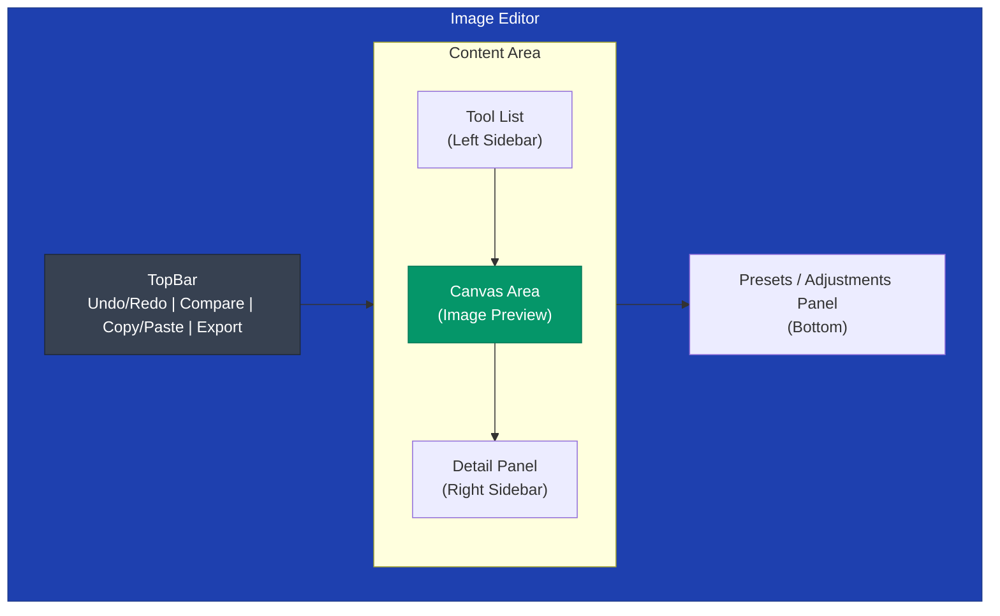
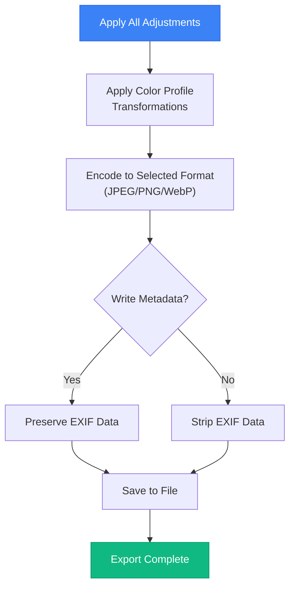

# Image Editor

Prism includes a professional-grade, non-destructive image editor with 19 tools. All adjustments are stored as metadata and applied non-destructively — the original image is never modified.

## Overview

The image editor is accessible from the photo lightbox by clicking the "Edit" button. It features a sidebar-based interface with tool panels, a central canvas area, and a top bar with actions.

### Interface Layout

## Tools

### 1. Presets
Curated cinematic, vintage, and creative look presets organized by category:
- **Film Looks** — Kodachrome, Portra, Ektar, Fujifilm simulations
- **Vintage** — Retro color grading, faded blacks, warm tones
- **Creative** — Dramatic, moody, high-contrast looks
- **My Presets** — User-saved custom presets

**Features:**
- Preview thumbnails for each preset
- Adjustable intensity slider (0-100%)
- Save custom presets from current adjustments

### 2. Light Adjustments
Exposure and tone controls:
- **Exposure** — Overall brightness (-100 to +100)
- **Brightness** — Midtone brightness (-100 to +100)
- **Contrast** — Tone separation (-100 to +100)
- **Highlights** — Recover blown highlights (-100 to +100)
- **Shadows** — Lift shadow detail (-100 to +100)
- **Whites** — White point clipping (-100 to +100)
- **Blacks** — Black point clipping (-100 to +100)

### 3. Color (HSL)
Per-band hue, saturation, and luminance control:
- **8 Color Bands** — Red, Orange, Yellow, Green, Aqua, Blue, Purple, Magenta
- **Per-band Controls** — Hue shift, saturation, luminance
- **Global Controls** — Temperature, tint, vibrance, saturation

**Color Grading Presets:**
- Warm highlights / Cool shadows
- Cool highlights / Warm shadows
- Cross-process look
- Teal and orange

### 4. Tone Curves
Per-channel RGB curves with bezier spline interpolation:
- **Channels** — RGB (combined), Red, Green, Blue
- **Interactive Editor** — Click to add points, drag to adjust
- **Histogram Overlay** — Real-time histogram behind the curve
- **Black/White Point** — Set from histogram

### 5. Color Wheels
Three-way color grading:
- **Shadows** — Color tint for dark areas
- **Midtones** — Color tint for mid-range
- **Highlights** — Color tint for bright areas
- **Global** — Overall color shift

### 6. Portrait
Face-aware enhancements:
- **Face Detection** — Automatic face region detection
- **Skin Smoothing** — Reduce skin texture
- **Face Brightening** — Illuminate faces
- **Eye Enhancement** — Sharpen and brighten eyes

### 7. Selective Adjustments (Regions)
Local adjustment layers using custom drawn masks:
- **Lasso Tool** — Freehand selection
- **AI Segmentation** — Automatic subject/background separation
- **Per-region Adjustments** — Brightness, contrast, saturation, blur

### 8. Healing
AI-powered object removal:
- **Brush Tool** — Paint over unwanted objects
- **LaMa Inpainting** — AI-powered content-aware fill
- **Adjustable Brush Size** — Fine to broad strokes

### 9. Inpainting
Advanced object removal with SAM integration:
- **Point-based Selection** — Click to select objects
- **AI Segmentation** — Automatic object boundary detection
- **Batch Processing** — Remove multiple objects

### 10. Annotations
Overlay text, shapes, and drawings:
- **Text** — Custom text with font, size, color options
- **Shapes** — Rectangles, circles, arrows, lines
- **Doodle** — Freehand drawing with adjustable brush
- **Emoji** — Emoji picker for fun overlays
- **Layers** — Manage annotation layers

### 11. Frames
Add borders and frames:
- **Frame Styles** — Solid, gradient, double, shadow
- **Frame Color** — Custom color picker
- **Frame Thickness** — Adjustable width
- **Aspect Ratio** — Maintain or crop to fit

### 12. Texture
Film-like effects:
- **Grain** — Adjustable film grain (amount, size, colored)
- **Light Leaks** — Simulated light leak overlays
- **Vignette** — Corner darkening effect
- **Blend Modes** — Multiple blend options

### 13. Detail
Sharpening and noise reduction:
- **Clarity** — Midtone contrast enhancement
- **Sharpness** — Edge sharpening
- **Noise Reduction** — Luminance noise reduction
- **Tilt-Shift** — Simulated depth of field

### 14. LUT (Color Grading)
Apply Look-Up Tables:
- **Built-in LUTs** — Curated color grading presets
- **Custom LUTs** — Import .cube LUT files
- **Opacity Control** — Blend LUT intensity

### 15. Transform
Crop, rotate, and flip:
- **Crop** — Free or aspect-ratio constrained
- **Rotate** — 90° increments or free rotation
- **Flip** — Horizontal and vertical
- **Straighten** — Level horizon

### 16. Auto-Enhance
One-click AI-powered adjustment:
- **Analysis** — Analyze image histogram and content
- **Adjustment** — Automatically apply optimal exposure, contrast, and color
- **Intensity** — Adjustable strength

### 17. History
Visual undo/redo panel:
- **Timeline** — Visual history of all edits
- **Snapshots** — Save named states
- **Undo/Redo** — Step through changes

### 18. Palette
Extract dominant colors:
- **Median-cut Quantization** — Extract 6 prominent colors
- **Copy Colors** — Copy hex values for use elsewhere
- **Save Palette** — Export color palette

### 19. Color Match
Match colors between images:
- **Reference Image** — Select source for color matching
- **Strength Control** — Blend color characteristics
- **Channel Selection** — Match specific channels

## Export Pipeline

### Export Options
- **Format** — JPEG, PNG, WebP
- **Quality** — Adjustable quality slider (1-100)
- **Resize** — Scale or custom dimensions
- **Metadata** — Preserve or strip EXIF data

### Export Process

## Keyboard Shortcuts

| Shortcut | Action |
|----------|--------|
| `Ctrl+Z` | Undo |
| `Ctrl+Shift+Z` | Redo |
| `Ctrl+C` | Copy adjustments |
| `Ctrl+V` | Paste adjustments |
| `Space` | Compare (hold) |
| `Ctrl+S` | Save/Export |
| `Ctrl+Shift+S` | Save as new preset |

## Non-destructive Editing

All adjustments are stored as JSON metadata alongside the original image:
- **Original** — Never modified
- **Adjustments JSON** — All edit parameters stored in database
- **Preview** — Real-time preview using CSS filters and canvas operations
- **Export** — Full-resolution rendering on demand

This approach ensures:
- Original quality is always preserved
- Edits can be modified or removed at any time
- Multiple edit versions can be maintained
- Storage overhead is minimal (only metadata)
