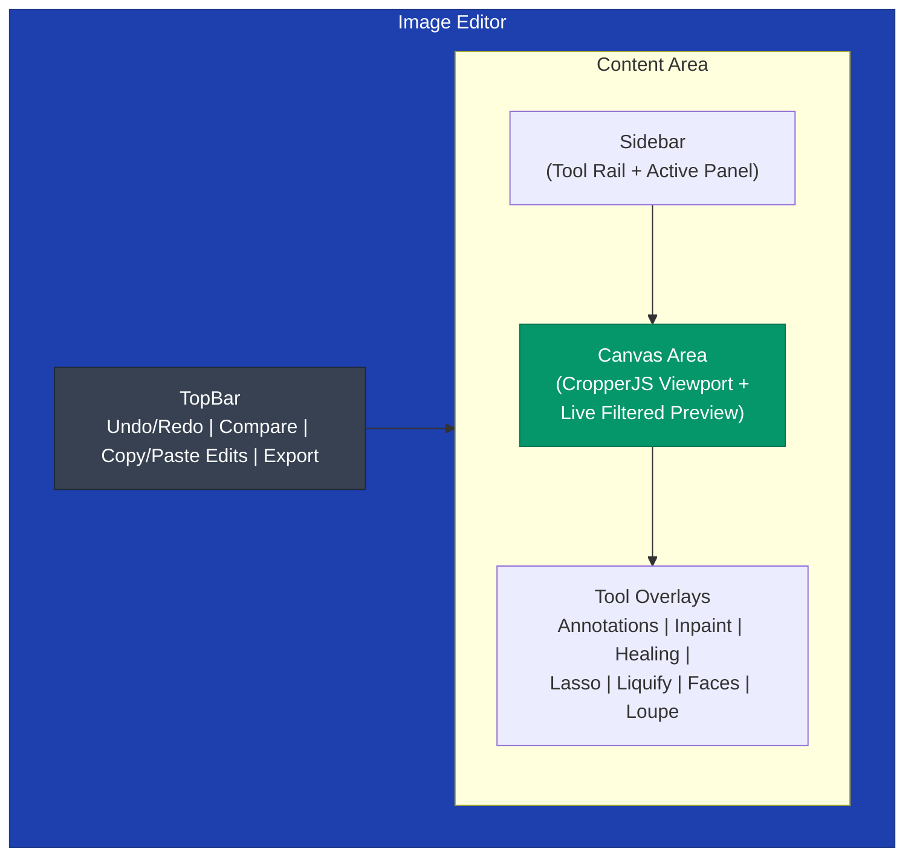
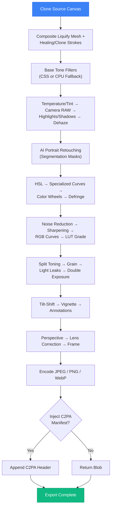

or tto# Image Editor

Prism includes a professional-grade, non-destructive image editor with 18 sidebar tools plus embedded Tone Curves and Color Wheels studios. All adjustments are stored as metadata and applied non-destructively — the original image is never modified.

## Overview

The image editor is accessible from the photo lightbox by clicking the "Edit" button. It features a sidebar-based interface with tool panels, a central canvas area, and a top bar with actions.

### Interface Layout

### Key Components

| Area | Key Files | Purpose |
|------|-----------|---------|
| Shell | `EditingMode/` | Editor state orchestration, panel routing, gesture/keyboard handling |
| Navigation | `Sidebar.tsx` | 18-tool icon rail with spring-animated active indicator and floating tooltips |
| Canvas | `CanvasArea.tsx`, `CanvasArea.types.ts` | CropperJS viewport, live filtered preview canvas, overlay coordination |
| Canvas hooks | `useCanvasZoom`, `useCtrlPan`, `useCompareSlider`, `useCropperSetup`, `useImageLoader`, `useRafThrottledValue` | Zoom, Ctrl+drag panning, compare slider, cropper lifecycle, image/mask loading, RAF throttling |
| Top Bar | `TopBar.tsx` | Undo/redo, compare toggle, copy/paste edits, export menu with progress |
| State model | `filterEngine.ts`, `adjustmentTypes.ts` | Canonical `Adjustments` object, defaults, CSS filter-string builder |
| Preview renderer | `canvasDrawing.ts` | Ordered live-preview pixel pipeline |
| Export | `exportPipeline.ts`, `exportPipeline/` | Multi-stage full-resolution render and encoding |
| Compatibility | `filterFallback.ts` | CPU filter/blur implementations for engines without `ctx.filter` (WebKit/Tauri) |
| Math engines | `curves.ts`, `spline.ts`, `hslEngine.ts`, `colorWheelsEngine.ts`, `lutEngine.ts`, `rawEngine.ts`, `portraitEngine.ts`, `liquifyEngine.ts`, `lassoEngine.ts`, `healingEngine.ts`, `inpaintEngine.ts`, `colorMatchEngine.ts`, `layersEngine.ts` | Per-tool pixel and color math |
| Data | `presets.ts`, `vividDuskLuts.ts`, `history.ts`, `c2paEngine.ts` | Preset library, baked LUT tables, history model, C2PA provenance |
| Shared UI | `ui/`, `uiTheme.ts`, `Histogram.tsx`, `ZoomControls.tsx`, `EmojiPicker.tsx`, `FaceBoundingBoxOverlay.tsx`, `PaletteEyedropperOverlay.tsx` | Sliders, theme tokens, histogram, zoom HUD, pickers, canvas overlays |

## Tools

### 1. Presets
Curated looks organized into collapsible category accordions:
- **Film & Analog** — Kodachrome, Fuji Chrome, Golden Hour, Cinematic Teal, Noir, B&W Classic
- **Portrait & Skin** — Studio Clean, Dramatic Dark, Pastel Dream
- **Landscape & Nature** — Velvia Pop, Cool Breeze, Warm Summer
- **Vintage & Retro** — Soft Matte, Faded Film, Faded Polaroid

**Features:**
- Live sample-image previews rendered with each preset's filter stack
- Adjustable intensity slider (0–100%) that blends numeric values toward defaults
- Save current adjustments as a named user preset (persisted in localStorage)
- Delete user presets; active-preset checkmark indicators

### 2. Light Adjustments
Exposure and tone controls with collapsible accordions:
- **Exposure, Contrast, Highlights, Shadows, Whites, Blacks** — bipolar sliders (-100 to +100)
- **Advanced tone settings** (collapsible) — Brightness, Ambiance (local contrast), Dehaze
- **Auto Enhance** — one-click server-side analysis (`POST /api/v1/photos/auto-enhance/{id}`) returning optimal parameters
- **Reset** — restores all light sliders and curves to defaults

### 3. Tone Curves
Embedded in the Light panel; per-channel curves using monotone cubic spline interpolation (guaranteed no overshoot):
- **Channels** — Master, Red, Green, Blue
- **Specialized curves ("Color vs Color")** — Hue vs Hue, Hue vs Saturation, Hue vs Luminance, Luminance vs Saturation, Saturation vs Saturation
- **Interactive editor** — click to add points, drag to adjust with sub-pixel precision, double-click to remove; endpoints locked at 0/255
- **Histogram overlay** — luminance histogram computed from the filtered image behind the curve (debounced)

### 4. Color (HSL)
A four-tab color suite:
- **Mixer** — 8 color bands (Reds, Oranges, Yellows, Greens, Aquas, Blues, Purples, Pinks) with Hue Shift (±180°), Saturation, and Luminance sliders; dynamic swatch colors, per-band and global reset
- **Basic** — white-balance presets (As Shot, Daylight, Cloudy, Shade, Tungsten, Fluorescent, Custom), Temperature, Tint, Vibrance, Saturation, Hue Rotation
- **Wheels** — hosts the Color Wheels studio (see below)
- **Split** — split toning with presets (Teal & Orange, Warm & Cool, Sepia Tone, Cyberpunk), Highlights/Shadows hue + saturation, and Balance

### 5. Color Wheels
Embedded in the Color panel; trackball-style grading:
- **Primary (3-Way)** — Lift (Shadows), Gamma (Midtones), Gain (Highlights), Offset (Global); each wheel combines an X/Y chroma vector with a Y (Luma) slider
- **Log mode** — Shadows/Midtones/Highlights wheels with adjustable Low and High pivots defining zone boundaries
- Pixel-level engine weights RGB deltas by luminance zone with smoothstep falloff

### 6. Camera RAW
Professional RAW development controls:
- **Camera & sensor profile** — reads EXIF metadata (camera, lens, exposure, ISO) from the backend
- **White balance** — Planckian-locus Kelvin slider (2000K–20000K) plus green/magenta tint; presets for Daylight, Cloudy, Shade, Tungsten, Fluorescent, Flash
- **Dynamic range** — logarithmic EV exposure (-5.0 to +5.0), highlight recovery with unclipped channel reconstruction, shadow lift, whites/blacks
- **Demosaic & denoise** — AMaZE/AHD/RCD directional demosaicing refinement, wavelet luminance + chrominance noise reduction, RAW micro-contrast clarity

### 7. LUT (Color Grading)
3D look-up-table grading:
- **Built-in LUTs (15)** — Vivid Studio Dusk collection (5 pre-compiled tables) plus Golden Hour, Teal & Orange, Matte Fade, Bleach Bypass, Film Print, Fuji Provia, Noir, Emerald City, Rose Gold, Arctic Blue
- **Categories** — All, Portrait, Cinema, Vintage, Creative, B&W with staggered entrance animations
- **Custom LUTs** — import standard `.cube` files (17³/33³/65³); export any active grade back to `.cube`
- **Blend strength** — opacity slider; trilinear-interpolated per-pixel lookup
- **Live thumbnails** — each LUT rendered onto category-matched sample photos

### 8. Color Match (Shot Matcher)
Cinema-grade color transfer between images:
- **Reference photo** — upload any image or cinema still as the grading reference
- **Reinhard lαβ transfer** — statistical mean/std matching in perceptual lαβ space (3D histogram matching)
- **Match strength** — 10–100% blend between original and matched color statistics

### 9. Portrait
AI face-aware retouching driven by backend segmentation masks:
- **Multi-face targeting** — edit All Faces or select individual detected faces (also clickable on-canvas)
- **Quick Looks** — Natural, Fresh, Studio, Smooth, Glamour one-click presets
- **Skin tab** — smoothing (true frequency separation preserving pore texture), pore-texture detail, Real Tone balance, brightness, warmth, tint
- **Eyes tab** — sclera whitening, iris clarity/contrast, catchlight sparkle, eyebrow definition
- **Mouth tab** — teeth whitening (yellow-cast removal), lip vibrance and hue steering

### 10. Detail
Sharpening and depth effects:
- **Clarity** — midtone local contrast (-100 to +100)
- **Sharpness** — unsharp-mask sharpening or soften blur (-150 to +150)
- **Noise Reduction** — luminance smoothing (0–100)
- **Tilt-Shift** — miniature-effect depth blur with linear/radial modes, blur strength, focus position, and focus range

### 11. Transform (Crop)
Geometry and framing via CropperJS:
- **Crop** — draggable crop box with Apply/Reset actions
- **Aspect ratios** — Free, 1:1, 3:2, 4:3, 4:5, 16:9, 9:16
- **Rotate/Flip** — ±90° rotation, horizontal/vertical mirroring
- **Straighten** — fine angle adjustment (-45° to +45°, 0.1° steps)
- **Geometry corrections** — horizontal/vertical perspective and lens distortion

### 12. Frames & Atmosphere
Borders and environmental effects:
- **Frame styles** — Polaroid, Film Strip, Matte, Rounded, Thin Line, Shadow Box
- **Border controls** — thickness slider; preset color swatches + custom picker (matte/thinline)
- **Atmosphere** — warmth (color temperature), edge vignette (bipolar), analog film grain (amount, fine/medium/coarse, colored)
- **Retro light leaks** — six presets with intensity, custom overlay color, and position selector
- **Canvas transform** — quick rotate/flip buttons

### 13. Texture (Grain & Leak)
Film-like effects and compositing:
- **Film grain** — amount, size (fine/medium/coarse), colored/mono toggle
- **Light leaks** — six gradient presets with intensity control
- **Vignette** — bipolar darkening/lightening
- **Double exposure** — blend a second image with 8 blend modes (Screen, Multiply, Overlay, Soft/Hard Light, Color Dodge/Burn, Difference), opacity, and cover/contain/center fit; supports the Tauri native file browser

### 14. Healing (Clone & Heal)
Retouching brushes painting onto a persistent stroke layer:
- **Clone Stamp** — Alt+Click (or first click) sets the sample source; paints copied texture with a live source indicator
- **Spot Heal** — seamless blending of sampled surrounding texture
- **Frequency Separation** — skin-tone smoothing while preserving texture
- **Patch Blend / Dodge & Burn** — patch blending and local exposure brushes
- **Brush dynamics** — size (5–200 px), edge hardness, stroke opacity; `[`/`]` resize; clear-all-strokes reset

### 15. Inpainting (AI Tools)
Object removal, replacement, and expansion:
- **Operations** — Remove, Replace (prompt-driven), Expand (outpaint)
- **Selection tools** — Brush, Eraser, Interactive (positive/negative click points), Auto-detect
- **AI models** — LaMa/LDM/MAT for erasing; Stable Diffusion 1.5/XL and PowerPaint for diffusion (prompt, guidance scale, inference steps)
- **Mask workflow** — blue-tinted mask preview with opacity control, undo/redo, clear
- **Local fallback** — client-side fast-marching (Telea-style) inpainting with bilateral edge smoothing

### 16. Lasso Studio (Selection)
Professional selection suite with persistent marching ants:
- **Tools** — Freehand, Polygonal, Magnetic (intelligent-scissors live-wire pathfinding over a Sobel-gradient cost map with edge snapping and auto-anchoring)
- **Boolean combine modes** — New, Add, Subtract, Intersect
- **Refine edge** — feather radius, contour smoothing, shift edge (expand/contract), mask contrast
- **Preview modes** — marching ants, rubylith overlay, black & white
- **Actions** — select all, invert mask, convert selection to an AI inpaint mask
- Full keyboard-driven workflow (Enter/Esc/Backspace/Ctrl+A/Ctrl+D/Ctrl+Shift+I)

### 17. Liquify & Reshape
WebGL-accelerated mesh warping:
- **Mesh tools** — Forward Warp, Pucker, Bloat, Smooth, Restore (reconstruct) on a 64×64 triangulated grid
- **Brush dynamics** — size and pressure with aspect-corrected circular falloff
- **Face-aware reshape** — parametric eye size, eye distance, nose width, lip height, and chin/jaw shaping driven by detected face boxes
- Renders through a custom WebGL displacement shader

### 18. Layers
Non-destructive layer stack:
- **Layer types** — pixel (base), adjustment, and fill layers
- **Blend modes** — Normal, Multiply, Screen, Overlay, Darken, Lighten, Color Dodge/Burn, Hard/Soft Light, Difference, Exclusion, Hue, Saturation, Color, Luminosity
- **Per-layer controls** — opacity, fill color/gradient
- **Stack management** — reorder, visibility toggles, delete; composited at export

### 19. Annotations (Markup & Vector)
Overlay drawing and text:
- **Text** — font family/size/weight/style, underline/strikethrough, alignment, line height, letter spacing
- **Shapes & arrows** — rectangles, ellipses, arrows, and vector outlines
- **Doodle** — freehand brush with adjustable size/color and eraser
- **Emoji** — categorized emoji picker (Smileys, Hearts, Gestures, Objects, Food, Nature)
- **Selection styling** — move, resize, restyle, and delete placed annotations

### 20. Palette
Dominant-color extraction and sampling:
- **Median-cut quantization** — extracts 6 prominent colors from the photo
- **In-canvas loupe eyedropper** — magnified 7×7 pixel grid with hex/RGB readout for precise sampling (native EyeDropper API fallback)
- **Swatch management** — lock/unlock swatches from re-extraction, copy hex codes, re-sample

### 21. Cutout & Background Studio
AI deep-learning alpha matting and backdrop compositing:
- **AI Matting Models** — ISNet Universal, BiRefNet High-Resolution, and RMBG-1.4 Studio
- **Backdrop replacement** — transparent cutout, solid colors, multi-stop radial/linear gradients, or custom scenic image upload
- **Refinement controls** — feathering (0–20px), edge shift/expansion (-10 to +10px), subject shadow opacity and blur radius, background blur (bokeh simulation)
- **Compositing pipeline** — non-destructive live canvas rendering and high-resolution multi-stage export compositing

## Editor Features

- **Auto-Enhance** — one-click AI optimization from the Light panel (histogram/content analysis on the backend)
- **History (Undo/Redo)** — every committed edit pushes a snapshot entry (adjustments, geometry, annotations) onto an undo/redo stack surfaced via TopBar buttons and `Ctrl+Z`/`Ctrl+Y`
- **Before/After Compare** — draggable split-view slider with Before/After labels; toggle from the TopBar or hold `\`
- **Copy/Paste Edits** — copy the full adjustment set from one photo and paste it onto another for batch syncing
- **Zoom & Pan** — floating zoom HUD (10–500%) with fit/preset/scrub controls; `Ctrl+drag` to pan

## Export Pipeline

### Export Options
- **Format** — JPEG, PNG, WebP
- **Quality** — adjustable quality slider (50–100)
- **Destination** — Export Copy (new file), Save Changes (overwrite original), or Copy to Clipboard
- **Progress** — live step/percentage indicator during multi-stage rendering
- **Provenance** — optional C2PA manifest header injected into exported assets

### Export Process

## Keyboard Shortcuts

| Shortcut | Action |
|----------|--------|
| `Ctrl+Z` | Undo |
| `Ctrl+Y` | Redo |
| `\` | Toggle/hold before-after split compare |
| `[` / `]` | Decrease / increase brush size |
| `Alt+Click` | Set clone/heal sample source point |
| `Ctrl+Drag` | Pan the canvas |
| `Ctrl+0` | Fit image to screen |
| `Ctrl+-` / `Ctrl+=` | Zoom out / zoom in |
| `Space` (hold) | Temporarily pan while using selection tools |
| `Enter` | Close lasso selection |
| `Esc` | Cancel lasso path / dismiss overlays |
| `Backspace` / `Delete` | Remove last lasso anchor point |
| `Right-Click` | Remove last lasso point |
| `Ctrl+A` | Select all (lasso) |
| `Ctrl+D` | Deselect (lasso) |
| `Ctrl+Shift+I` | Invert selection (lasso) |

## Non-destructive Editing

All adjustments are stored as JSON metadata alongside the original image:
- **Original** — Never modified
- **Adjustments JSON** — A single `Adjustments` object holds every parameter: tone, color, curves, HSL, wheels, LUT, RAW, portrait masks, effects, and geometry
- **Preview** — Real-time rendering via CSS filters on the base image plus an ordered canvas pixel pipeline (with CPU fallback when `ctx.filter` is unavailable)
- **Stroke layers** — Healing/clone strokes and liquify meshes persist as overlays and are composited only at export
- **Portrait masks** — AI segmentation masks (skin/eyes/lips/teeth/brows) are fetched from the backend and cached client-side
- **Export** — Full-resolution multi-stage rendering on demand

This approach ensures:
- Original quality is always preserved
- Edits can be modified or removed at any time
- Multiple edit versions can be maintained
- Storage overhead is minimal (only metadata)