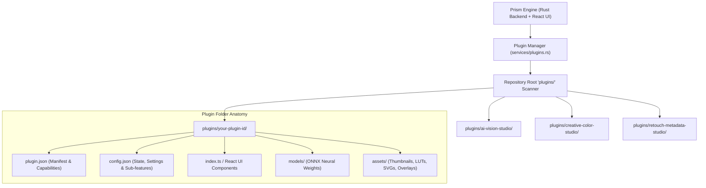

# Plugin Development & Architecture Guide

Prism provides a modular, privacy-first plugin architecture (similar to Jellyfin and VS Code) that allows developers to extend the image editor, add AI vision models, contribute creative filter packs, and build automated metadata tools without modifying core code.

---

## 1. Overview & Architecture

Every Prism plugin lives inside its own dedicated directory under the root `plugins/<plugin-id>/` directory. The Prism backend and frontend automatically discover, validate, and manage plugins and their sub-features at runtime.



### Key Principles
- **Self-Contained Full-Stack Packages**: Each plugin folder contains both frontend React components and backend manifests, assets, and ONNX weights.
- **Privacy-First & Offline**: Plugins run locally without phoning home or requiring external cloud infrastructure.
- **Granular Sub-Feature Control**: Users can toggle individual sub-features within each studio (e.g. enabling Cutout & Matting while disabling Inpainting) to optimize workflow and memory.
- **Custom Branding & Thumbnails**: Plugins support custom user-uploaded thumbnails and assets served directly via static asset endpoints.
- **Non-Destructive Metadata Pipeline**: All plugin edits integrate seamlessly with Prism's non-destructive pipeline and history stacks.

---

## 2. Directory Structure

A complete Prism plugin has the following file layout:

```
plugins/<plugin-id>/
├── plugin.json         # REQUIRED: Plugin metadata, version, and capabilities
├── config.json         # REQUIRED: Runtime state, settings, sub-features, and thumbnail URL
├── index.ts / index.js # OPTIONAL: Frontend entrypoint, panels, or tools
├── assets/             # OPTIONAL: Static assets (thumbnail.png, .cube LUTs, SVGs, textures)
└── models/             # OPTIONAL: ONNX deep learning inference models
```

### TypeScript Path Resolution
- `@plugins/*` resolves to `plugins/*` across the entire workspace.
- `@/*` resolves to `frontend/*` for seamless imports of shared UI types and engine helpers.
- Root `tsconfig.json` and `plugins/tsconfig.json` configure `typeRoots: ["./frontend/node_modules/@types"]` to support IDE IntelliSense and compile checks without duplication.

---

## 3. The Plugin Manifest (`plugin.json`)

The `plugin.json` file describes your plugin to Prism, the CLI, and the UI catalog.

```json
{
  "id": "ai-vision-studio",
  "name": "AI & Deep Learning Vision Studio",
  "version": "1.0.0",
  "author": "Prism Vision Team",
  "description": "Comprehensive neural vision suite: Subject Cutout & Matting, Object Inpainting, Neural Super-Resolution, and Optical Depth Bokeh simulation.",
  "category": "AI & Machine Learning",
  "icon": "Sparkles",
  "homepage": "https://github.com/prism-photo/prism",
  "capabilities": [
    "background",
    "inpaint",
    "super-resolution",
    "depth-bokeh"
  ],
  "entrypoint": "index.ts",
  "min_app_version": "0.1.0"
}
```

### Manifest Fields Specification

| Field | Type | Required | Description |
|---|---|---|---|
| `id` | `string` | **Yes** | Unique identifier (lowercase alphanumeric and hyphens, e.g. `ai-vision-studio`). |
| `name` | `string` | **Yes** | Human-readable display name shown in UI and CLI. |
| `version` | `string` | **Yes** | Semantic version string (e.g. `1.0.0`). |
| `author` | `string` | **Yes** | Author or organization name. |
| `description` | `string` | **Yes** | Summary of the plugin's functionality. |
| `category` | `string` | **Yes** | Plugin category (see standard categories below). |
| `icon` | `string` | No | Lucide icon name (e.g. `Sparkles`, `Scissors`, `Film`, `Palette`, `ShieldCheck`). |
| `homepage` | `string` | No | URL to documentation or source repository. |
| `capabilities` | `string[]` | **Yes** | Array of capability keys registered by the plugin. |
| `entrypoint` | `string` | No | Main code script or component file (e.g. `index.ts` or `index.js`). |
| `min_app_version`| `string` | No | Minimum compatible Prism version (e.g. `0.1.0`). |

### Standard Categories
- `AI & Machine Learning` — Deep learning vision models, background matting, neural upscaling, inpainting.
- `Creative & Filters` — 3D LUTs, film grain synthesis, vintage frames, light leaks.
- `Image Editor & Retouch` — Portrait retouching, skin enhancement, color matching, vector annotations.
- `Metadata & Security` — EXIF enrichment, reverse geocoding, C2PA content credentials, privacy scrubbers.

---

## 4. Configuration & Sub-Features (`config.json`)

The `config.json` file stores runtime settings, sub-feature flags, and custom thumbnail metadata:

```json
{
  "enabled": true,
  "installed_at": "2026-08-25T10:00:00Z",
  "updated_at": "2026-08-25T11:45:00Z",
  "settings": {
    "thumbnail_url": "/api/v1/plugins/ai-vision-studio/assets/thumbnail.png",
    "features": {
      "background": true,
      "inpaint": true,
      "super-resolution": false,
      "depth-bokeh": true
    }
  }
}
```

### Granular Sub-Features System
Each plugin can expose modular sub-features. When a sub-feature is toggled in the **Plugin Configuration Modal** (`PluginManager.tsx`):
1. Its boolean state is saved to `settings.features[key]`.
2. The Image Editor sidebar (`Sidebar.tsx`) inspects `isFeatureActive(pluginId, featureKey)`.
3. If disabled (`false`), only that specific tool is hidden from the sidebar, while the rest of the plugin remains functional.

---

## 5. Plugin Thumbnails & Assets

### Custom Thumbnail Upload
Users can upload custom images (`.png`, `.jpg`, `.webp`, `.svg`) for any plugin:
- Uploading an image sends a base64 payload to `POST /api/v1/plugins/thumbnail/:id`.
- The image is saved to `plugins/<id>/assets/thumbnail.png`.
- The plugin config is updated with `"thumbnail_url": "/api/v1/plugins/<id>/assets/thumbnail.png"`.
- Deleting the thumbnail sends `DELETE /api/v1/plugins/thumbnail/:id`, removing the asset and reverting to the default SVG icon.

### Static Asset Serving API
Any file located in `plugins/<id>/assets/*` is served via:
```
GET /api/v1/plugins/:id/assets/*path
```
Supports MIME-type guessing, path-traversal protection (`..` prevention), and client-side HTTP caching.

---

## 6. Official Built-in Studios

Prism ships with 3 unified built-in studios:

### 1. AI & Deep Learning Vision Studio (`ai-vision-studio`)
* `background`: **Subject Cutout & Neural Matting** (ISNet Universal, BiRefNet High-Res, RMBG-1.4 Studio, U²-Net).
* `inpaint`: **Object Inpainting & Smart Brush** (LaMa fast Fourier neural inpainting).
* `super-resolution`: **Neural Super-Resolution & Face Restore** (Real-ESRGAN, CodeFormer).
* `depth-bokeh`: **Optical Depth & Bokeh Simulation** (Depth-Anything aperture blur).

### 2. Creative, Color & Film Emulation Studio (`creative-color-studio`)
* `lut`: **3D LUT Color Grading** (Kodak 2383, Fuji Eterna, Teal & Orange, custom `.cube` file loader).
* `texture`: **Analog Film Grain & Light Leaks** (Photochemical 35mm/120mm grain synthesis, halation glow).
* `frame`: **Vintage Frames & Polaroid Borders** (Instant photo borders, film rebate margins).

### 3. Retouching, Metadata & Security Studio (`retouch-metadata-studio`)
* `portrait`: **Portrait & Skin Retouching** (Frequency separation, eye whitening, dental brightening).
* `colormatch`: **Reinhard Shot Color Matcher** (Perceptual histogram color transfer).
* `annotations`: **Vector Markup & Technical Annotations** (Callouts, arrows, dimension lines, measurement scales).
* `metadata-c2pa`: **EXIF Geocoding & C2PA Provenance** (Reverse geocoding & cryptographic provenance credentials).

---

## 7. Adding Neural Network Models (`models/`)

If your plugin uses ONNX deep learning weights:

1. Place weights in the `models/` subfolder:
   ```
   plugins/my-ai-plugin/
   ├── plugin.json
   ├── config.json
   └── models/
       └── model_fp32.onnx
   ```
2. Prism automatically resolves model weights from `plugins/<plugin-id>/models/<model-file>.onnx`.
3. Support live progress reporting during downloads using the backend model manager (`/api/v1/models/download/:id` and `/api/v1/models/progress`).

---

## 8. REST API Reference

| Endpoint | Method | Description |
|---|---|---|
| `/api/v1/plugins` | `GET` | Lists all installed plugins with configs and active statuses. |
| `/api/v1/plugins/catalog` | `GET` | Returns available plugins from the catalog. |
| `/api/v1/plugins/install` | `POST` | Installs a plugin from a source path, URL, or JSON payload. |
| `/api/v1/plugins/uninstall/:id` | `POST` | Uninstalls and removes a plugin directory. |
| `/api/v1/plugins/toggle/:id` | `POST` | Enables or disables an entire plugin (`{"enabled": true/false}`). |
| `/api/v1/plugins/config/:id` | `POST` | Updates plugin settings and sub-feature flags (`{"settings": {...}}`). |
| `/api/v1/plugins/thumbnail/:id` | `POST` | Uploads a custom thumbnail image (`{"image_base64": "data:..."}`). |
| `/api/v1/plugins/thumbnail/:id` | `DELETE` | Deletes custom thumbnail and restores default icon. |
| `/api/v1/plugins/:id/assets/*path`| `GET` | Serves static assets (images, LUTs, textures). |
| `/api/v1/plugins/:id/entrypoint` | `GET` | Fetches the JavaScript entrypoint code. |

---

## 9. CLI Reference

```bash
# List all installed plugins
prism plugins list

# Inspect plugin details
prism plugins info ai-vision-studio

# Toggle plugin state
prism plugins toggle ai-vision-studio --enabled false
prism plugins toggle ai-vision-studio --enabled true

# Install a plugin
prism install ./plugins/my-custom-plugin/plugin.json
```

---

## 10. Developer Best Practices

- [ ] Place plugins in the root `plugins/<plugin-id>/` directory.
- [ ] Ensure `id` is lowercase and matches the directory name.
- [ ] Define modular sub-feature capabilities in `capabilities` and handle them via `settings.features`.
- [ ] Store static assets in `assets/` and reference them via `/api/v1/plugins/<id>/assets/<file>`.
- [ ] Use `isFeatureActive(pluginId, featureKey)` when wiring tools into the Image Editor UI.
- [ ] Run `cargo test` and `pnpm tsc --noEmit` to verify type safety and API integration.
