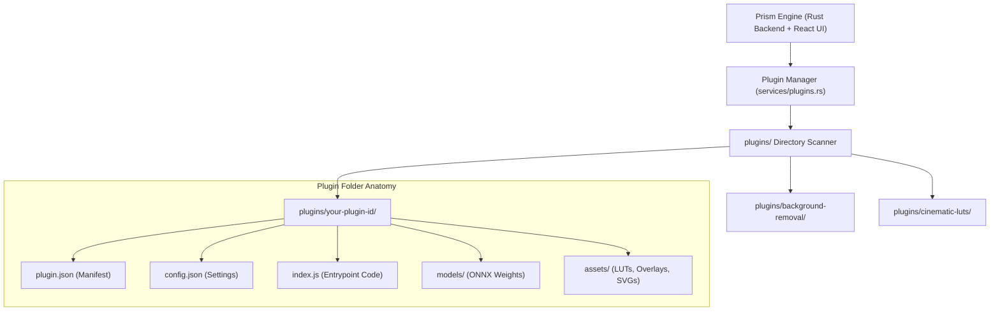

# Plugin Development Guide

Prism provides a modular, privacy-first plugin architecture (similar to Jellyfin and VS Code) that allows developers to extend the image editor, add AI vision models, contribute creative filter packs, and build automated metadata tools without modifying core code.

---

## 1. Overview & Architecture

Every Prism plugin lives inside its own dedicated directory under `plugins/<plugin-id>/`. The Prism backend automatically discovers, validates, and manages plugins at runtime.



### Key Principles
- **Privacy-First & Offline**: Plugins run locally without phoning home.
- **Non-Destructive**: All modifications integrate with Prism's non-destructive metadata pipeline.
- **Zero-Build Installation**: Plugins can be installed directly from a single manifest JSON file, local directory, or URL.

---

## 2. Directory Structure

A complete Prism plugin has the following file layout:

```
plugins/<plugin-id>/
├── plugin.json         # REQUIRED: Plugin metadata & capabilities
├── config.json         # REQUIRED: Runtime settings & active state
├── index.js            # OPTIONAL: JavaScript lifecycle & UI hooks
├── models/             # OPTIONAL: Subdirectory for ONNX neural network weights
└── assets/             # OPTIONAL: Subdirectory for LUTs (.cube), SVGs, presets
```

---

## 3. The Plugin Manifest (`plugin.json`)

The `plugin.json` file describes your plugin to Prism, the CLI, and the UI catalog.

```json
{
  "id": "vintage-film-studio",
  "name": "Vintage Film & Halation Studio",
  "version": "1.0.0",
  "author": "Your Name / Organization",
  "description": "Authentic 35mm film grain synthesis, red-edge halation glow, and Kodak/Fujifilm color curves.",
  "category": "Creative & Filters",
  "icon": "Film",
  "homepage": "https://github.com/your-username/prism-plugin-vintage-film",
  "capabilities": ["film-grain", "halation", "color-grading", "presets"],
  "entrypoint": "index.js",
  "min_app_version": "0.1.0"
}
```

### Manifest Fields Specification

| Field | Type | Required | Description |
|---|---|---|---|
| `id` | `string` | **Yes** | Unique identifier (lowercase alphanumeric and hyphens, e.g. `vintage-film-studio`). |
| `name` | `string` | **Yes** | Human-readable display name shown in UI and CLI. |
| `version` | `string` | **Yes** | Semantic version string (e.g. `1.0.0`). |
| `author` | `string` | **Yes** | Author or organization name. |
| `description` | `string` | **Yes** | Summary of the plugin's functionality. |
| `category` | `string` | **Yes** | Plugin category (see below for standard categories). |
| `icon` | `string` | No | Lucide icon name (e.g. `Film`, `Sparkles`, `Scissors`, `Aperture`, `Moon`, `Palette`). |
| `homepage` | `string` | No | URL to documentation or source repository. |
| `capabilities` | `string[]` | **Yes** | Array of capabilities exposed by the plugin. |
| `entrypoint` | `string` | No | Main code script file (defaults to `index.js`). |
| `min_app_version`| `string` | No | Minimum compatible Prism version (e.g. `0.1.0`). |

### Standard Categories
- `AI & Machine Learning` — Deep learning vision models, background matting, neural upscaling, inpainting.
- `Image Editor` — Retouching tools, portrait adjustments, selection aids, technical vector tools.
- `Creative & Filters` — 3D LUTs, film grain, vintage frames, camera badges, light leaks.
- `Metadata & Geotagging` — EXIF enrichment, reverse geocoding, C2PA content credentials, privacy scrubbers.

---

## 4. Configuration (`config.json`)

The `config.json` file stores runtime settings and user preferences. It is automatically created on install if not present.

```json
{
  "enabled": true,
  "installed_at": "2026-08-23T12:00:00Z",
  "updated_at": "2026-08-23T12:00:00Z",
  "settings": {
    "default_film_stock": "portra_400",
    "grain_intensity": 35,
    "enable_halation": true
  }
}
```

- When `enabled: false`, the plugin's tools and weights are deactivated in the UI.
- `settings` can hold arbitrary JSON parameters editable through the UI config modal or the API (`POST /api/v1/plugins/config/:id`).

---

## 5. Entrypoint Code (`index.js`)

The `index.js` file handles lifecycle events and UI tool registrations:

```javascript
/**
 * Vintage Film & Halation Studio Plugin for Prism
 */
export default {
  id: "vintage-film-studio",
  name: "Vintage Film & Halation Studio",
  version: "1.0.0",

  /**
   * Called when Prism starts or when the plugin is installed.
   * @param {Object} context - Prism Plugin Context API
   */
  initialize(context) {
    console.log("[Vintage Film Plugin] Initialized with config:", context.config);
    
    // Register custom presets
    if (context.registerPreset) {
      context.registerPreset({
        id: "portra_warm",
        name: "Portra Warm 400",
        category: "Film & Analog",
        adjustments: {
          temperature: 12,
          contrast: 8,
          highlights: -15,
          shadows: 10,
          grainAmount: 35
        }
      });
    }
  },

  /**
   * Called when the user toggles the plugin to Active.
   */
  onActivate() {
    console.log("[Vintage Film Plugin] Activated");
  },

  /**
   * Called when the user disables or uninstalls the plugin.
   */
  onDeactivate() {
    console.log("[Vintage Film Plugin] Deactivated");
  }
};
```

---

## 6. Adding Neural Network Models (`models/`)

If your plugin uses ONNX deep learning weights (e.g. for matting, upscaling, or depth estimation):

1. Create a `models/` subfolder in your plugin directory:
   ```
   plugins/my-ai-plugin/
   ├── plugin.json
   ├── config.json
   ├── index.js
   └── models/
       └── my_model_fp32.onnx
   ```
2. Prism automatically resolves model weights from:
   - `plugins/<plugin-id>/models/<model-file>.onnx`
   - `plugins/<plugin-id>/<model-file>.onnx`
   - `models/packs/<plugin-id>/<model-file>.onnx`

---

## 7. Step-by-Step Tutorial: Creating a Watermark Plugin

Let's build a complete camera stamp plugin from scratch.

### Step 1: Create the Plugin Folder
```bash
mkdir -p plugins/custom-watermark/assets
```

### Step 2: Create `plugin.json`
`plugins/custom-watermark/plugin.json`:
```json
{
  "id": "custom-watermark",
  "name": "Custom Watermark & Camera Badge",
  "version": "1.0.0",
  "author": "Jane Developer",
  "description": "Appends Leica and Hasselblad camera badges with lens metadata and custom copyright signatures.",
  "category": "Creative & Filters",
  "icon": "Stamp",
  "capabilities": ["watermark", "camera-badge", "typography"],
  "entrypoint": "index.js",
  "min_app_version": "0.1.0"
}
```

### Step 3: Create `config.json`
`plugins/custom-watermark/config.json`:
```json
{
  "enabled": true,
  "installed_at": "2026-08-23T12:00:00Z",
  "updated_at": "2026-08-23T12:00:00Z",
  "settings": {
    "badge_style": "leica_classic",
    "signature_text": "© 2026 Jane Developer Photography",
    "position": "bottom-right",
    "opacity": 0.85
  }
}
```

### Step 4: Create `index.js`
`plugins/custom-watermark/index.js`:
```javascript
export default {
  id: "custom-watermark",
  name: "Custom Watermark & Camera Badge",
  version: "1.0.0",
  initialize(context) {
    console.log("[Plugin: custom-watermark] Registered camera badge generator.");
  }
};
```

---

## 8. Installing and Testing Your Plugin

### Method 1: Using the Prism CLI
```bash
# Install from a local manifest file
prism install ./plugins/custom-watermark/plugin.json

# Install from a local folder
prism install ./plugins/custom-watermark/

# Verify the plugin is installed and active
prism plugins list
prism plugins info custom-watermark

# Test toggling the plugin
prism plugins toggle custom-watermark --enabled false
prism plugins toggle custom-watermark --enabled true
```

### Method 2: Using the REST API
```bash
# Install plugin via API
curl -X POST http://127.0.0.1:8269/api/v1/plugins/install \
  -H "Content-Type: application/json" \
  -d '{"source": "./plugins/custom-watermark/plugin.json"}'

# List all plugins
curl http://127.0.0.1:8269/api/v1/plugins

# Update settings
curl -X POST http://127.0.0.1:8269/api/v1/plugins/config/custom-watermark \
  -H "Content-Type: application/json" \
  -d '{"settings": {"signature_text": "© 2026 New Studio Name"}}'
```

### Method 3: Using the Prism Desktop UI
1. Navigate to **Utilities** → **Plugins**.
2. Switch between **My Plugins** (installed) and **Plugin Catalog**.
3. Use the **Settings** gear icon to customize runtime parameters or toggle on/off.

---

## 9. Distributing Your Plugin

### Option A: Distribute as a Standalone Manifest JSON
Users can install your plugin with a single command:
```bash
prism install https://raw.githubusercontent.com/your-username/my-plugin/main/plugin.json
```

### Option B: Submit to the Official Catalog
To include your plugin in Prism's official catalog:
1. Open a pull request to `backend_rust/src/services/plugins.rs` adding your definition to `builtin_catalog_definitions()`.
2. Add your plugin's icon mapping to `frontend/components/utilities/PluginManager.tsx`.
3. Provide automated unit tests in `backend_rust/src/tests.rs`.

---

## 10. Developer Checklist

- [ ] `id` is lowercase, hyphen-separated, and matches folder name.
- [ ] `plugin.json` is valid JSON and includes all required fields.
- [ ] `config.json` provides sensible defaults in `settings`.
- [ ] `index.js` safely handles optional context APIs.
- [ ] Heavy model weights (`models/`) are gated or optional where appropriate.
- [ ] Tested installation and removal via `prism install` and `prism uninstall`.
