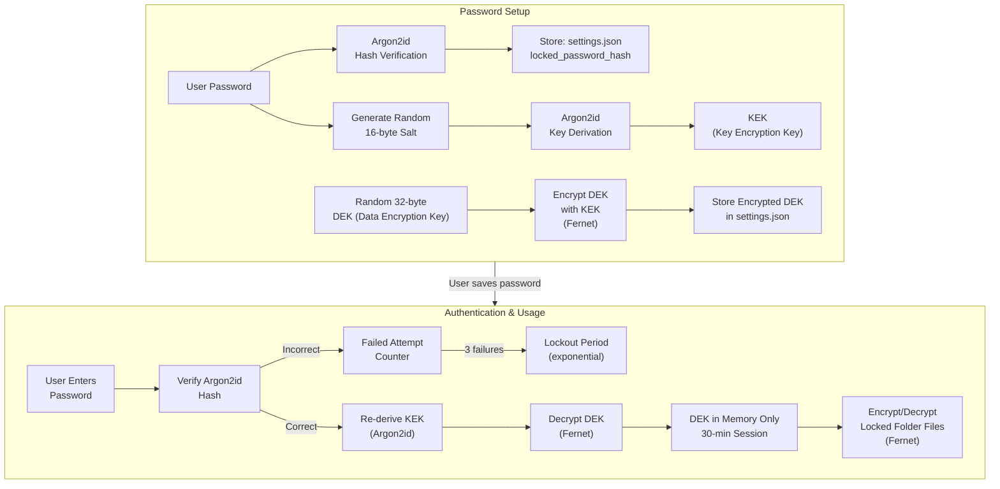
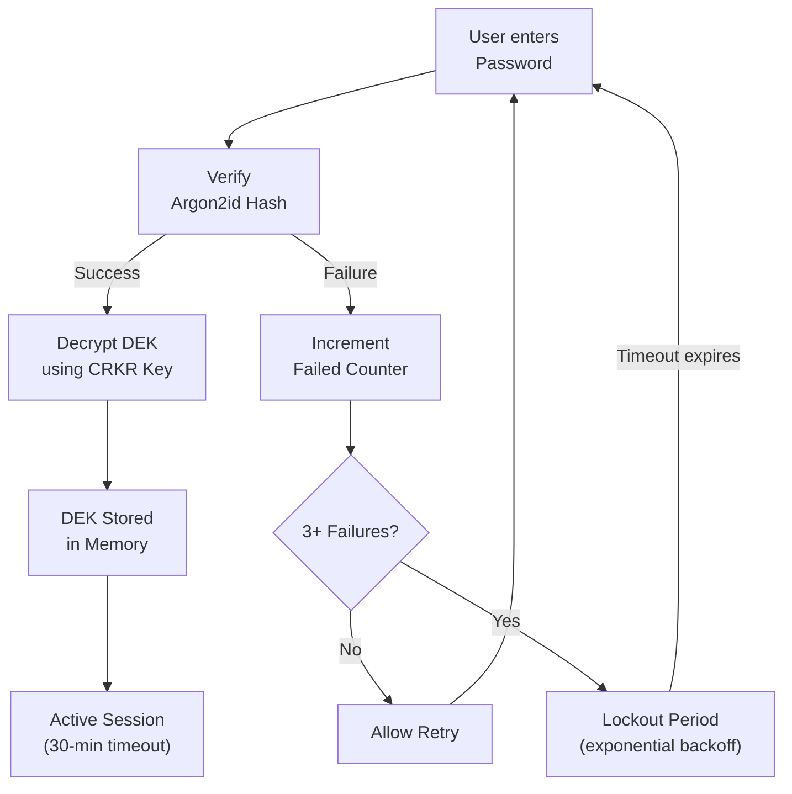

# Prism Security Boundaries

Comprehensive overview of security mechanisms in Prism, covering encryption, authentication, path isolation, and data protection.

---

## Table of Contents

- [Envelope Encryption](#envelope-encryption)
- [Path Isolation](#path-isolation)
- [API Authentication](#api-authentication)
- [CORS Policy](#cors-policy)
- [Rate Limiting](#rate-limiting)
- [Data Storage Locations](#data-storage-locations)
- [Locked Folder Session Management](#locked-folder-session-management)
- [Startup Recovery](#startup-recovery)
- [Tauri Content Security Policy](#tauri-content-security-policy)

---

## Envelope Encryption

The Locked Folder uses a layered encryption approach called **envelope encryption**:



### Key Components

| Component | Description | Storage |
|-----------|-------------|---------|
| **Password** | User-chosen password (min 12 characters) | Never stored |
| **Salt** | 16 random bytes | settings.json (hex) |
| **Argon2id Hash** | Password verification hash | settings.json |
| **KEK** | Key Encryption Key derived from password + salt via Argon2id | In-memory only during authentication |
| **DEK** | 32-byte Data Encryption Key (Fernet-compatible) | Encrypted with KEK in settings.json |
| **Fernet** | Symmetric encryption of individual files | On-disk encrypted files |

### Encryption Process

1. User sets a password (min 12 characters)
2. Argon2id hashes the password for verification storage
3. Separate Argon2id derivation creates a KEK from password + random salt
4. A random 32-byte DEK is generated
5. The DEK is encrypted with the KEK using Fernet
6. The encrypted DEK and Argon2id verification data are stored in `settings.json`

### File Encryption

Each file in the Locked Folder is encrypted with Fernet using the DEK:

```
Original File → Fernet.encrypt() → "Prism_ENC:" header + encrypted data
```

Files are written atomically:
1. Encrypted data is written to a temporary file
2. `os.replace()` atomically replaces the original file
3. A backup copy (`.prism_backup`) is kept during the operation
4. The backup is removed on successful completion

### Encrypted File Header

Encrypted files start with the header `Prism_ENC:` (13 bytes), followed by the Fernet-encrypted payload.

Encrypted thumbnails use a separate header: `Prism_ENC_THUMB:` (17 bytes).

### Decryption Process

1. User provides password
2. Argon2id verifies the password hash
3. KEK is derived from password + stored salt
4. DEK is decrypted using KEK
5. DEK is held in memory for the session
6. Individual files are decrypted on access using Fernet

---

## Path Isolation

File access is centralized in `backend/app/utils/security.py` to prevent directory traversal attacks.

### Allowed Read Roots

Read operations are restricted to:

| Path | Description |
|------|-------------|
| `{UPLOAD_DIR}` | Prism upload directory |
| `{THUMBNAILS_DIR}` | Prism thumbnail directory |
| `{DATA_DIR}` | Prism data directory |
| `~/Pictures` | User's Pictures folder |
| `~/Downloads` | User's Downloads folder |
| `~/Documents` | User's Documents folder |
| `~/Desktop` | User's Desktop folder |
| `~` (home) | User's home directory |
| `/media`, `/run/media`, `/Volumes`, `/mnt` | External media mounts (POSIX only) |
| User-configured paths | From `settings.json` mount configuration |

### Security Checks

The `safe_resolve_read()` and `safe_resolve_write()` functions enforce:

1. **Path traversal detection**: Rejects paths containing `..`
2. **Symlink resolution**: Resolves symlinks before checking boundaries
3. **Root validation**: Checks that the resolved path is within an allowed root
4. **Error handling**: Returns appropriate HTTP 403/400 responses

```python
# Example: safe_resolve_read
def safe_resolve_read(path):
    p = Path(path)
    if ".." in p.parts:
        raise HTTPException(403, "Path traversal attempt")
    resolved = p.resolve()
    if not resolved.is_relative_to(any_allowed_root):
        raise HTTPException(403, "Access denied")
    return resolved
```

Out-of-boundary requests return `403 Access Denied`.

---

## API Authentication

### API Key Configuration

Set `API_KEY` in `backend/.env` to enable token-based authentication:

```env
API_KEY=your-secret-api-key
```

When enabled, all API endpoints require an `X-API-Key` header with the matching key value.

When `API_KEY` is empty (default), the API is open for local development.

### Verification Middleware

The `verify_api_key` dependency is applied to all feature routers in `main.py`:

```python
app.include_router(photos.listing_router, ..., dependencies=[Depends(verify_api_key)])
```

The middleware checks:
1. If `API_KEY` is empty → allow all requests (development mode)
2. If `API_KEY` is set → require `X-API-Key` header match
3. Failed verification → `403 Forbidden`

---

## CORS Policy

The API allows only local Tauri/Vite origins:

```python
allow_origins=[
    "tauri://localhost",
    "http://tauri.localhost",
    "http://localhost:3005",
    "http://127.0.0.1:3005",
    "http://172.17.0.1:3005",  # Docker bridge network
]
```

- **Methods**: All methods allowed (`*`)
- **Headers**: All headers allowed (`*`)
- **Credentials**: Cookies/credentials allowed
- **Expose headers**: All headers exposed to the client

---

## Rate Limiting

Photo upload endpoints enforce per-client rate limiting:

| Setting | Value |
|---------|-------|
| Rate limit | 100 uploads per minute |
| Scope | Per client IP |
| Implementation | In-memory token bucket |

Rate limiting is implemented in `backend/app/utils/rate_limit.py`.

---

## Data Storage Locations

### Platform Data Directory Resolution

| OS | Default Data Directory |
|----|----------------------|
| Linux | `~/.local/share/prism` |
| macOS | `~/Library/Application Support/prism` |
| Windows | `%APPDATA%/prism` |

### Stored Files

| File | Description | Contains Sensitive Data |
|------|-------------|------------------------|
| `Prism.db` | SQLite database | Photo metadata, file paths, AI summaries |
| `settings.json` | Dynamic settings | **Argon2id hash, salt, encrypted DEK** |
| `uploads/` | Imported media files | User photos/videos (may be encrypted) |
| `thumbnails/` | Generated thumbnails | Scaled-down versions of photos |

### Test Mode

When running tests (`pytest` or `PRISM_TEST=1`), data is stored in a temporary directory:

```
/tmp/prism_tests/
```

---

## Locked Folder Session Management

### Authentication Flow



### Session Properties

| Property | Value |
|----------|-------|
| Session timeout | 30 minutes (1800 seconds) |
| Failed attempts limit | 3 |
| Lockout initial duration | 30 seconds |
| Lockout escalation | 30 × 2^(attempts - 3) seconds |
| Session key location | In-memory only (never written to disk) |

### Session Lifecycle

1. **Setup**: First-time password creation stores verification data and encrypted DEK
2. **Authentication**: Password verification decrypts DEK into memory
3. **Activity**: `last_activity` timestamp updated on each operation
4. **Expiry**: After 30 minutes of inactivity, session auto-locks
5. **Lock**: `lock_session()` clears in-memory DEK and blocks access
6. **Lockout**: After 3 failed attempts, exponential backoff applies
7. **Restart**: Lockout counter resets on application restart

### Security Properties

- Decrypted DEK exists **only in memory** after authentication
- Locking the session or restarting clears the in-memory key
- Encrypted file/thumbnail access is blocked without authentication
- Failed verification attempts trigger exponential lockout
- The Argon2id hash prevents offline password cracking
- The KEK derivation adds a computational barrier against brute force

---

## Startup Recovery

On application startup (`lifespan.py`), the system:

1. **Scans for interrupted operations**: Checks `uploads/` and `thumbnails/` directories for `.prism_backup` files
2. **Restores originals**: If a backup file is found, it restores the original file and removes the backup
3. **Logs recovery**: All recovery actions are logged for auditing

This ensures that interrupted encryption/decryption operations (e.g., from a system crash) do not result in data loss.

---

## Tauri Content Security Policy

The Tauri webview enforces a strict CSP that restricts:

- **Script sources**: Local backend and self origins only
- **Style sources**: Local backend and self origins only
- **Connection sources**: Local backend (`127.0.0.1:8269`, `localhost:8269`)

This prevents XSS attacks and unauthorized network requests from the webview.

---

## Threat Model

### In Scope

| Threat | Mitigation |
|--------|------------|
| Unauthorized file access | Path isolation, symlink resolution, traversal detection |
| Offline data access | Envelope encryption, Argon2id password protection |
| Session hijacking | In-memory only DEK, 30-minute timeout |
| XSS attacks | Strict CSP in Tauri webview |
| Network attacks | CORS restriction to local origins |
| API abuse | Rate limiting on upload endpoints |
| Brute force password attacks | Exponential lockout, Argon2id computational cost |

### Out of Scope (by design)

- **Cloud storage**: No cloud sync or remote access
- **Multi-user**: Single-user desktop application
- **Network exposure**: Not designed for public network deployment
- **Side-channel attacks**: Timing attacks not mitigated (local application)
