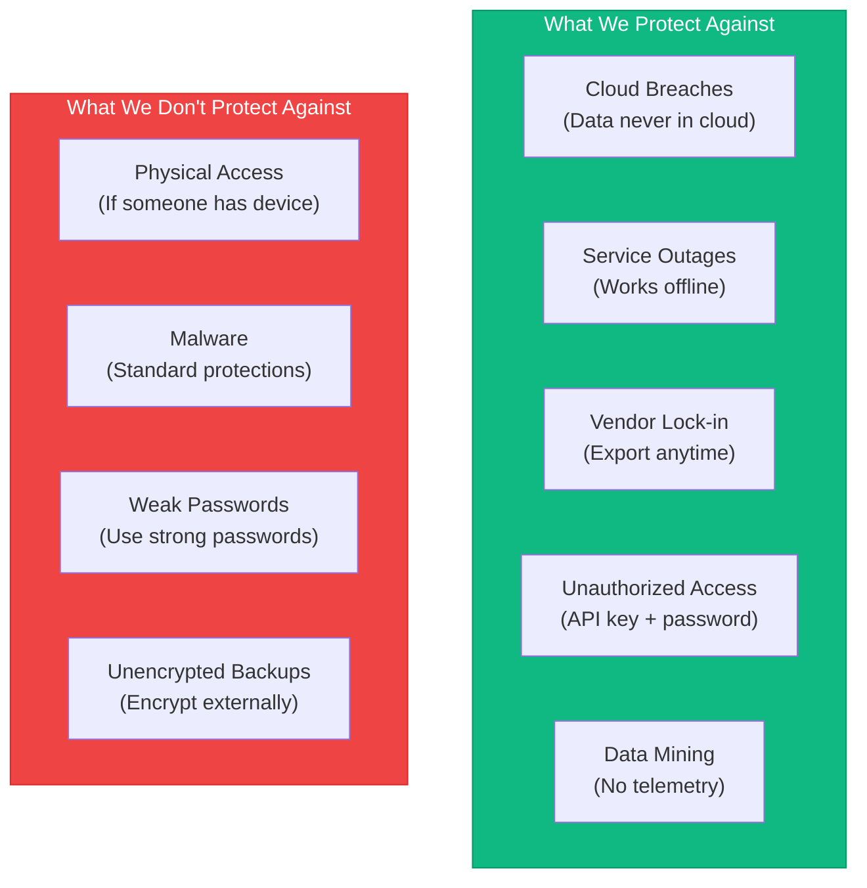

# Security & Privacy

Prism is built with privacy as a core principle. All data stays on your machine, and no information is sent to external services without explicit consent.

## Core Security Principles


```mermaid
graph TD
    subgraph Principles["Security Principles"]
        LocalFirst["1. Local-first Architecture"]
        DataOwnership["2. Data Ownership"]
        Encryption["3. Encryption"]
    end

    LocalFirst --> NoCloud["No Cloud Dependencies"]
    LocalFirst --> NoAPI["No External API Calls"]
    LocalFirst --> NoTelemetry["No Telemetry by Default"]
    LocalFirst --> NoRemote["No Remote Storage"]

    DataOwnership --> Control["You Control Your Data"]
    DataOwnership --> NoLockin["No Vendor Lock-in"]
    DataOwnership --> NoAccount["No Account Required"]
    DataOwnership --> NoTracking["No Tracking"]

    Encryption --> LockedFolder["Locked Folder<br/>(Argon2id)"]
    Encryption --> SecureDeletion["Secure Deletion"]
    Encryption --> LocalDB["Local Database<br/>(SQLite)"]

    style Principles fill:#1e40af,stroke:#1e3a8a,color:#fff
    style LocalFirst fill:#3b82f6,stroke:#2563eb,color:#fff
    style DataOwnership fill:#8b5cf6,stroke:#7c3aed,color:#fff
    style Encryption fill:#10b981,stroke:#059669,color:#fff
```

## Locked Folder

### What is Locked Folder?
Locked Folder is a secure, encrypted storage area for your most private photos and videos. Files in the Locked Folder are:

- **Encrypted** — Using Argon2id key derivation
- **Hidden** — Not visible in the main library
- **Protected** — Requires authentication to access
- **Isolated** — Separate from regular photos

### How It Works

1. **Setup** — Create a password for the Locked Folder
2. **Lock** — Move photos/videos to the Locked Folder
3. **Access** — Enter password to view contents
4. **Session** — Automatic lock after inactivity

### Security Features

- **Argon2id** — Memory-hard key derivation function
- **Password Protected** — Required for access
- **Session Timeout** — Auto-lock after inactivity
- **No Recovery** — Password cannot be recovered (by design)
- **Secure Deletion** — Files are securely wiped when removed

## API Security

### API Key Authentication

Optional API key protection for the backend:

```bash
# Set API key
export API_KEY=your-secret-key

# Client must include header
X-API-Key: your-secret-key
```

### Rate Limiting

Built-in rate limiting for expensive endpoints:

- **Video endpoints** — 20 requests per minute
- **Inpainting** — 20 requests per minute
- **Per-IP tracking** — Separate limits per client

### CORS Policy

Strict CORS configuration:

```rust
// Allowed origins
- tauri://localhost
- http://tauri.localhost
- http://localhost:3005
- http://127.0.0.1:3005
```

### Content Security Policy (CSP)

Tauri enforces strict CSP:

```
default-src 'self';
img-src 'self' http://127.0.0.1:8269 data: blob:;
media-src 'self' http://127.0.0.1:8269 data: blob:;
style-src 'self' 'unsafe-inline';
script-src 'self';
connect-src 'self' http://127.0.0.1:8269;
```

## Data Storage

### Local Database
- **SQLite** — Stored in `backend_rust/prism.db`
- **WAL Mode** — Write-ahead logging for performance
- **No Remote Sync** — Database never leaves your machine

### Media Files
- **Original Files** — Stored in `uploads/` directory
- **Thumbnails** — Generated and stored in `thumbnails/`
- **No Cloud Upload** — Files are never uploaded

### Configuration
- **Settings** — Stored in SQLite database
- **Environment Variables** — For sensitive configuration
- **No Cloud Config** — Configuration is local only

## Privacy Features

### No Telemetry by Default
- **Opt-in Only** — Telemetry is disabled by default
- **No Tracking** — No user identification
- **No Analytics** — No usage statistics collected
- **Transparent** — All telemetry code is open source

### Data Export
- **Full Export** — Export all your data at any time
- **No Lock-in** — Your data is always accessible
- **Standard Formats** — Export in common formats (JPEG, MP4, JSON)

### Secure Deletion
- **Trash Purge** — Permanent deletion of trashed files
- **Locked Folder** — Secure wipe of encrypted files
- **Database Cleanup** — Remove metadata permanently

## Threat Model


```mermaid
graph TD
    subgraph Protected["What We Protect Against"]
        CloudBreaches["Cloud Breaches<br/>(Data never in cloud)"]
        ServiceOutages["Service Outages<br/>(Works offline)"]
        VendorLockin["Vendor Lock-in<br/>(Export anytime)"]
        UnauthorizedAccess["Unauthorized Access<br/>(API key + password)"]
        DataMining["Data Mining<br/>(No telemetry)"]
    end

    subgraph NotProtected["What We Don't Protect Against"]
        PhysicalAccess["Physical Access<br/>(If someone has device)"]
        Malware["Malware<br/>(Standard protections)"]
        WeakPasswords["Weak Passwords<br/>(Use strong passwords)"]
        UnencryptedBackups["Unencrypted Backups<br/>(Encrypt externally)"]
    end

    style Protected fill:#10b981,stroke:#059669,color:#fff
    style NotProtected fill:#ef4444,stroke:#dc2626,color:#fff
```

## Best Practices

### For Users
1. **Use Strong Passwords** — For Locked Folder and API keys
2. **Encrypt Backups** — When backing up your library
3. **Keep Software Updated** — For security patches
4. **Review Permissions** — Check what Prism can access
5. **Enable Telemetry Only If Needed** — It's off by default

### For Developers
1. **Never Commit Secrets** — Use environment variables
2. **Validate Input** — Sanitize all user input
3. **Use Parameterized Queries** — Prevent SQL injection
4. **Rate Limit Endpoints** — Prevent abuse
5. **Log Security Events** — Track authentication attempts

## Compliance

### GDPR
- **No Personal Data Collection** — We don't collect any data
- **Right to Export** — Full data export capability
- **Right to Delete** — Permanent deletion of all data
- **No Third-party Sharing** — No data is shared

### CCPA
- **No Data Selling** — We never sell your data
- **No Tracking** — No user tracking or profiling
- **Full Control** — Export or delete anytime

## Security Auditing

### Open Source
- **Full Transparency** — All code is public
- **Community Review** — Anyone can audit the code
- **No Backdoors** — No hidden functionality

### Dependencies
- **Minimal Dependencies** — Fewer dependencies = smaller attack surface
- **Regular Updates** — Keep dependencies current
- **Known Vulnerabilities** — Monitor for CVEs

## Reporting Security Issues

If you discover a security vulnerability:

1. **Do Not** open a public issue
2. **Email** security@prism.app (or maintainer email)
3. **Include** detailed reproduction steps
4. **Allow** reasonable time for response

We will:
- Acknowledge receipt within 48 hours
- Provide an initial assessment within 1 week
- Release a fix within 30 days (for critical issues)
- Credit researchers (with permission)

## Security Checklist

- [x] Local-first architecture
- [x] No cloud dependencies
- [x] Encrypted Locked Folder
- [x] API key authentication
- [x] Rate limiting
- [x] Strict CSP
- [x] No telemetry by default
- [x] Data export capability
- [x] Secure deletion
- [x] Open source
