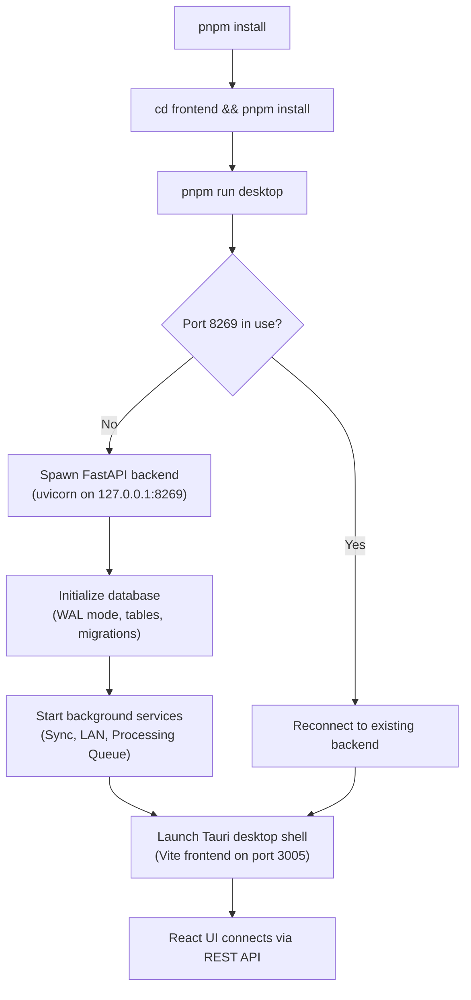

# Prism Setup Guide

Comprehensive setup instructions for the Prism photo and video library desktop application.

---

## Table of Contents

- [Prerequisites](#prerequisites)
- [One-Click Startup](#one-click-startup)
- [Manual Development Setup](#manual-development-setup)
- [Per-OS Tauri Dependencies](#per-os-tauri-dependencies)
- [Environment Variables](#environment-variables)
- [GPU / CUDA Setup](#gpu--cuda-setup)
- [Troubleshooting](#troubleshooting)

---

## Prerequisites

| Dependency | Version | Purpose |
|------------|---------|---------|
| [pnpm](https://pnpm.io/) | 9+ | Frontend package manager |
| [Python](https://www.python.org/) | 3.11+ | Backend runtime |
| [uv](https://github.com/astral-sh/uv) | latest | Python package manager and virtual environment tool |
| [ffmpeg](https://ffmpeg.org/) | latest | Video thumbnail generation, metadata extraction, transcoding |
| [Tauri system deps](#per-os-tauri-dependencies) | — | Native OS libraries for the Tauri v2 shell |

### Optional Dependencies

| Dependency | Purpose |
|------------|---------|
| NVIDIA CUDA Toolkit | GPU-accelerated AI features (face detection, embeddings, inpainting) |
| `llama-server` | Local LLM inference for agent search, vision, and OCR |
| `execstack` | Fix executable-stack issues for InspireFace shared library (Linux) |

---

## One-Click Startup

The fastest way to get Prism running:

```bash
# Install root dependencies
pnpm install

# Install frontend dependencies
cd frontend && pnpm install

# Start everything (backend + Tauri desktop shell)
pnpm run desktop
```

### Startup Workflow



`pnpm run desktop` does the following:
1. Starts the FastAPI backend on `127.0.0.1:8269`
2. Streams backend logs to the terminal
3. Opens the Tauri desktop shell using the Vite frontend on port `3005`
4. Detects if the backend is already running and reconnects to the existing log stream

---

## Manual Development Setup

For developers who want separate terminal windows for backend and frontend.

### Terminal 1: Python API Backend

```bash
cd backend

# Create and activate virtual environment
uv venv
source .venv/bin/activate

# Install dependencies
uv sync

# Start the FastAPI server
uv run uvicorn app.main:app --host 0.0.0.0 --port 8269 --reload --log-level info
```

On Windows PowerShell:

```powershell
cd backend
uv venv
.\.venv\Scripts\Activate.ps1
uv sync
uv run uvicorn app.main:app --host 0.0.0.0 --port 8269 --reload --log-level info
```

### Terminal 2: Frontend Client

```bash
cd frontend
pnpm install
pnpm run dev
```

The Vite dev server is pinned to port `3005` (configured in `frontend/vite.config.ts`).

### Useful Scripts

| Command | Description |
|---------|-------------|
| `pnpm run dev` | Run backend and frontend concurrently |
| `pnpm run frontend` | Start Vite frontend dev server |
| `pnpm run frontend:build` | Build frontend assets |
| `pnpm run frontend:typecheck` | Run frontend TypeScript checks |
| `pnpm run backend` | Start FastAPI backend with reload |
| `pnpm run backend:test` | Run backend pytest suite |
| `pnpm run backend:sync` | Install backend dependencies with frozen lockfile |
| `pnpm run test` | Run frontend typecheck and backend tests |
| `pnpm run desktop` | Start backend and Tauri desktop shell |
| `pnpm run tauri` | Run Tauri CLI from the frontend package |

---

## Per-OS Tauri Dependencies

### Linux (Debian/Ubuntu)

```bash
sudo apt update
sudo apt install -y \
  libwebkit2gtk-4.1-dev \
  build-essential \
  curl \
  wget \
  file \
  libxdo-dev \
  libssl-dev \
  libayatana-appindicator3-dev \
  librsvg2-dev \
  libgtk-3-dev \
  libsoup-3.0-dev \
  libjavascriptcoregtk-4.1-dev
```

### macOS

Xcode Command Line Tools are required:

```bash
xcode-select --install
```

### Windows

- Microsoft Visual Studio C++ Build Tools
- WebView2 (included with Windows 10+)

---

## Environment Variables

Configuration is managed through `backend/.env`. Below are all available settings:

### Core Settings

| Variable | Default | Description |
|----------|---------|-------------|
| `PROJECT_NAME` | `Prism Photos API` | Application name |
| `API_V1_STR` | `/api/v1` | API version prefix |
| `DATA_DIR` | Platform-specific | User data directory (see below) |
| `DATABASE_PATH` | `{DATA_DIR}/Prism.db` | SQLite database file path |
| `FFMPEG_PATH` | `""` (use system PATH) | Custom ffmpeg binary path |
| `API_KEY` | `""` (disabled) | API key for production authentication |

### AI Feature Flags

| Variable | Default | Description |
|----------|---------|-------------|
| `ENABLE_AI_AGENT` | `False` | Local AI assistant (llama-server agent model) |
| `ENABLE_AI_INPAINTING` | `False` | Stable Diffusion inpainting for object removal |
| `ENABLE_AI_FACE` | `False` | Face detection and clustering (InspireFace) |
| `ENABLE_AI_CLIP` | `False` | SigLIP2 embeddings for semantic search |
| `ENABLE_AI_REMBG` | `False` | Background removal |
| `ENABLE_AI_OCR` | `False` | PaddleOCR-VL text extraction |
| `ENABLE_AI_SUBTITLES` | `False` | Whisper-based subtitle generation |
| `ENABLE_AI_STORY` | `True` | AI-powered story generation |
| `ENABLE_AI_CONTENT_CLASSIFY` | `True` | Content classification (photo/screenshot/document) |
| `ENABLE_AI_CAPTION` | `True` | Gemma 4 image captioning |
| `ENABLE_RAW_PROCESSING` | `True` | RAW image processing support |
| `ENABLE_LAN_SYNC` | `False` | LAN sync between Prism instances |

### Background Processing

| Variable | Default | Description |
|----------|---------|-------------|
| `ENABLE_IMAGE_BG_PROCESS` | `True` | Master switch for image background analysis |
| `ENABLE_VIDEO_BG_PROCESS` | `True` | Master switch for video background analysis |
| `ENABLE_VIDEO_FACE` | `True` | Video face detection and tracking |
| `ENABLE_VIDEO_EDITOR_AI` | `True` | Video editor AI features |
| `GPU_MODE` | `cuda` | Hardware acceleration backend |
| `GPU_ENCODING_MODE` | `auto` | Video encoding mode (`auto`, `nvenc`, `vaapi`, `cpu`) |

### Face Detection Settings

| Variable | Default | Description |
|----------|---------|-------------|
| `FACE_CONF_THRESHOLD` | `0.65` | Face detection confidence threshold |
| `FACE_YAW_PITCH_LIMIT` | `28.0` | Maximum yaw/pitch angle for face detection |
| `FACE_MATCH_THRESHOLD` | `0.41` | Face matching threshold for clustering |
| `FACE_UNCERTAIN_MATCH_THRESHOLD` | `0.33` | Threshold for pending face assignments |
| `FACE_EARLY_EXIT_SCORE` | `0.75` | Early exit score for face matching |
| `FACE_DETECT_MAX_DIM` | `1280` | Maximum dimension for face detection |

### Job Queue Settings

| Variable | Default | Description |
|----------|---------|-------------|
| `JOB_QUEUE_MAX_RETRIES` | `5` | Maximum retry attempts for failed jobs |
| `JOB_QUEUE_THROTTLE_CPU_THRESHOLD` | `85.0` | CPU % threshold for throttling |
| `JOB_QUEUE_THROTTLE_BATTERY_THRESHOLD` | `20` | Battery % threshold for throttling |

### Server Ports

| Variable | Default | Description |
|----------|---------|-------------|
| Backend API | `127.0.0.1:8269` | FastAPI server |
| Agent server | `127.0.0.1:9090` | llama-server for agent search |
| Vision server | `127.0.0.1:9091` | llama-server for vision/captioning |
| OCR server | `127.0.0.1:9092` | llama-server for PaddleOCR-VL |
| Tauri dev URL | `http://localhost:3005` | Vite dev server |

### Platform Data Directories

| OS | Default Data Directory |
|----|----------------------|
| Linux | `~/.local/share/prism` |
| macOS | `~/Library/Application Support/prism` |
| Windows | `%APPDATA%/prism` |

Stored files include:
- `Prism.db` — SQLite database
- `settings.json` — Dynamic settings
- `uploads/` — Imported media files
- `thumbnails/` — Generated thumbnails

---

## GPU / CUDA Setup

### NVIDIA CUDA

1. Install NVIDIA CUDA Toolkit 12.x from [developer.nvidia.com](https://developer.nvidia.com/cuda-downloads)
2. Ensure `LD_LIBRARY_PATH` includes `/usr/local/cuda/lib64`
3. Set `GPU_MODE=cuda` in `backend/.env`

The `run-desktop.sh` script automatically sets common CUDA `LD_LIBRARY_PATH` entries.

### AMD ROCm

1. Install ROCm from [rocm.docs.amd.com](https://rocm.docs.amd.com)
2. Set `GPU_MODE=rocm` in `backend/.env`

### Intel Arc / SYCL

1. Install Intel oneAPI Base Toolkit
2. Set `GPU_MODE=sycl` in `backend/.env`

### Vulkan

1. Install Vulkan SDK
2. Set `GPU_MODE=vulkan` in `backend/.env`

### CPU Only

Set `GPU_MODE=cpu` in `backend/.env` to disable GPU acceleration entirely.

---

## Troubleshooting

### Backend is already running

`pnpm run desktop` detects an active listener on port `8269` and reconnects to the existing backend log stream instead of starting a duplicate backend process.

### CUDA or native library issues

- `run-desktop.sh` sets common CUDA `LD_LIBRARY_PATH` entries
- Handles the local `gcc-15` compiler override when available
- Fixes executable-stack issues for the bundled InspireFace shared library when `execstack` is installed

### AI features are disabled

Most AI components are behind feature flags and are not required for basic import, browsing, search, albums, maps, or Locked Folder usage. Enable only the features you need in `backend/.env`.

### Video thumbnails not generating

Video thumbnail generation requires `ffmpeg` and `ffprobe` to be installed and available on your PATH. Install via your system package manager:

```bash
# Debian/Ubuntu
sudo apt install ffmpeg

# macOS
brew install ffmpeg

# Windows
choco install ffmpeg
```

### Port conflicts

If port `8269` is already in use, kill the existing process or change the port in `backend/.env`.

### Database issues

- **Vacuum**: Use the Utilities view in the app or run `prism serve` with maintenance mode
- **Reset**: The Utilities view provides a "Reset Indexed Library" option that removes photo records and thumbnails without deleting original files
- **Backup**: Use the backup export/restore endpoints in the Utilities API

### Locked Folder lockout

After 3 failed password attempts, the Locked Folder enforces an exponentially increasing lockout period (starting at 30 seconds). Restarting the app resets the lockout counter.
