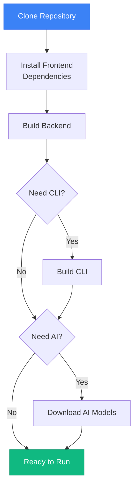
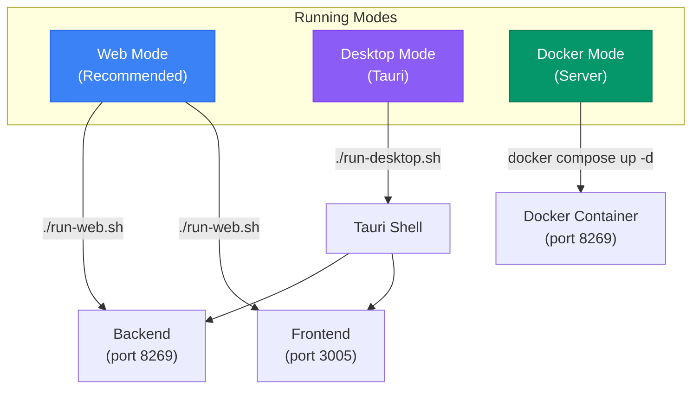

# Setup Guide

This guide covers installation, configuration, and troubleshooting for Prism.

## Prerequisites

### Required
- **Rust** (latest stable) — [Install Rust](https://rustup.rs/)
- **Node.js** (v18+) — [Install Node.js](https://nodejs.org/)
- **pnpm** — [Install pnpm](https://pnpm.io/)
- **SQLite** — Usually pre-installed on most systems

### Optional (for video features)
- **ffmpeg** — Video metadata and thumbnails
- **ffprobe** — Video analysis

### Optional (for desktop mode)
- **Tauri CLI** — Desktop application shell
- **System dependencies** — See [Tauri prerequisites](https://tauri.app/v1/guides/getting-started/prerequisites)

## Installation


```mermaid
flowchart TD
    A["Clone Repository"] --> B["Install Frontend
Dependencies"]
    B --> C["Build Backend"]
    C --> D{"Need CLI?"}
    D -->|Yes| E["Build CLI"]
    D -->|No| F{"Need AI?"}
    E --> F
    F -->|Yes| G["Download AI Models"]
    F -->|No| H["Ready to Run"]
    G --> H

    style A fill:#3b82f6,stroke:#2563eb,color:#fff
    style H fill:#10b981,stroke:#059669,color:#fff
```

### 1. Clone the Repository

```bash
git clone https://github.com/yourusername/prism.git
cd prism
```

### 2. Install Frontend Dependencies

```bash
cd frontend
pnpm install
cd ..
```

### 3. Build Backend

```bash
cd backend_rust
cargo build --release
cd ..
```

### 4. (Optional) Build CLI

```bash
cd cli
cargo build --release
cd ..
```

### 5. (Optional) Download AI Models

Download models to `backend_rust/models/`:

```bash
# Create model directories
mkdir -p backend_rust/models/{llm,face,segmentation,inpainting}

# Download models (example URLs - replace with actual links)
# SigLIP2
wget -O backend_rust/models/llm/siglip2_image.onnx <url>
wget -O backend_rust/models/llm/siglip2_text.onnx <url>
wget -O backend_rust/models/llm/tokenizer.json <url>

# Face-id
wget -O backend_rust/models/face/det_10g.onnx <url>
wget -O backend_rust/models/face/w600k_mbf.onnx <url>

# Segmentation
wget -O backend_rust/models/segmentation/segformer.onnx <url>
wget -O backend_rust/models/segmentation/face_parsing.onnx <url>

# Inpainting
wget -O backend_rust/models/inpainting/lama.onnx <url>
```

## Running Prism


```mermaid
graph TD
    subgraph Modes["Running Modes"]
        Web["Web Mode<br/>(Recommended)"]
        Desktop["Desktop Mode<br/>(Tauri)"]
        Docker["Docker Mode<br/>(Server)"]
    end

    Web --> |"./run-web.sh"| Backend["Backend
(port 8269)"]
    Web --> |"./run-web.sh"| Frontend["Frontend
(port 3005)"]
    
    Desktop --> |"./run-desktop.sh"| Tauri["Tauri Shell"]
    Tauri --> Backend
    Tauri --> Frontend
    
    Docker --> |"docker compose up -d"| Container["Docker Container
(port 8269)"]

    style Web fill:#3b82f6,stroke:#2563eb,color:#fff
    style Desktop fill:#8b5cf6,stroke:#7c3aed,color:#fff
    style Docker fill:#059669,stroke:#047857,color:#fff
```

### Web Mode (Recommended for Development)

Start both backend and frontend:

```bash
./run-web.sh
```

This will:
1. Start the Rust backend on port `8269`
2. Start the Vite dev server on port `3005`
3. Open the app in your browser at `http://localhost:3005`

### Desktop Mode

Start with Tauri desktop shell:

```bash
./run-desktop.sh
```

**Note:** Requires Tauri CLI and system dependencies. See [Tauri prerequisites](https://tauri.app/v1/guides/getting-started/prerequisites).

### Docker Mode

Run the backend as a Docker container:

```bash
docker compose up -d
```

This will:
1. Build the backend Docker image
2. Start the container on port `8269`
3. Create persistent volumes for data

## Configuration

### Environment Variables

Create a `.env` file in the project root:

```bash
# Backend Configuration
HOST=0.0.0.0
PORT=8269
DATABASE_URL=sqlite://backend_rust/prism.db
UPLOAD_DIR=uploads
THUMBNAILS_DIR=thumbnails

# Security
API_KEY=your-secret-api-key  # Optional

# AI Features
GPU_MODE=cpu  # cpu, cuda, metal
RUST_LOG=info  # debug, info, warn, error

# LLM Services (Optional)
LLM_AGENT_PORT=9090
LLM_VISION_PORT=9091
LLM_OCR_PORT=9092
```

### Configuration Files

| File | Purpose |
|------|---------|
| `frontend/vite.config.ts` | Vite dev server configuration |
| `frontend/tailwind.config.js` | Tailwind CSS configuration |
| `frontend/src-tauri/tauri.conf.json` | Tauri desktop configuration |
| `backend_rust/Cargo.toml` | Rust backend dependencies |

## Directory Structure

```
prism/
├── backend_rust/
│   ├── prism.db          # SQLite database
│   ├── uploads/          # Imported media files
│   ├── thumbnails/       # Generated thumbnails
│   └── models/           # ML model files
│       ├── llm/          # SigLIP2, LLM models
│       ├── face/         # Face detection models
│       ├── segmentation/ # Segmentation models
│       └── inpainting/   # Inpainting models
├── frontend/
│   ├── dist/             # Built frontend
│   └── public/           # Static assets
└── cli/
    └── target/           # Built CLI binary
```

## Troubleshooting

### Backend Won't Start

**Port already in use:**
```bash
# Check what's using port 8269
lsof -i :8269

# Kill existing process
pkill -f "prism-backend-rust"
```

**Database errors:**
```bash
# Check database file permissions
ls -la backend_rust/prism.db

# Reset database (WARNING: deletes all data)
rm backend_rust/prism.db
```

### Frontend Won't Start

**Node modules missing:**
```bash
cd frontend
rm -rf node_modules
pnpm install
```

**Port 3005 in use:**
```bash
# Check what's using port 3005
lsof -i :3005

# Kill existing process
pkill -f "vite"
```

### Thumbnail Generation Fails

**ffmpeg not found:**
```bash
# Install ffmpeg
# Ubuntu/Debian
sudo apt install ffmpeg

# macOS
brew install ffmpeg

# Windows
winget install ffmpeg
```

**Permission errors:**
```bash
# Check upload directory permissions
ls -la uploads/
chmod -R 755 uploads/
```

### AI Features Not Working

**Models not found:**
```bash
# Check model directory
ls -la backend_rust/models/

# Download models (see Installation section)
```

**GPU not available:**
```bash
# Check CUDA installation
nvidia-smi

# Use CPU mode instead
export GPU_MODE=cpu
```

**LLM services not running:**
```bash
# Check if llama-server is running
ps aux | grep llama-server

# Start LLM services (see AI Features documentation)
```

### Desktop Mode Issues

**Tauri build fails:**
```bash
# Install Tauri CLI
pnpm add -D @tauri-apps/cli

# Check system dependencies
# See https://tauri.app/v1/guides/getting-started/prerequisites
```

**WebKitGTK issues (Linux):**
```bash
# Install WebKitGTK
sudo apt install libwebkit2gtk-4.0-dev

# Set environment variables
export WEBKIT_DISABLE_DMABUF_RENDERER=1
export WEBKIT_DISABLE_COMPOSITING_MODE=0
export WEBKIT_USE_GLDOM=1
```

## Performance Optimization

### Database
```bash
# Vacuum database
prism config vacuum true

# Check database size
ls -lh backend_rust/prism.db
```

### Thumbnails
```bash
# Regenerate thumbnails
rm -rf thumbnails/*
# Restart backend to regenerate
```

### Memory
```bash
# Monitor memory usage
top -p $(pgrep -f "prism-backend-rust")

# Reduce concurrent workers
prism config max_workers 2
```

## Updating

### Update Code
```bash
git pull origin main
```

### Update Dependencies
```bash
# Frontend
cd frontend
pnpm update

# Backend
cd backend_rust
cargo update
```

### Rebuild
```bash
# Frontend
cd frontend
pnpm build

# Backend
cd backend_rust
cargo build --release
```

## Getting Help

- **Documentation**: See `docs/` directory
- **Issues**: Open a GitHub issue
- **Discussions**: Join GitHub Discussions
- **Logs**: Check `backend_rust/backend.log` for error details
