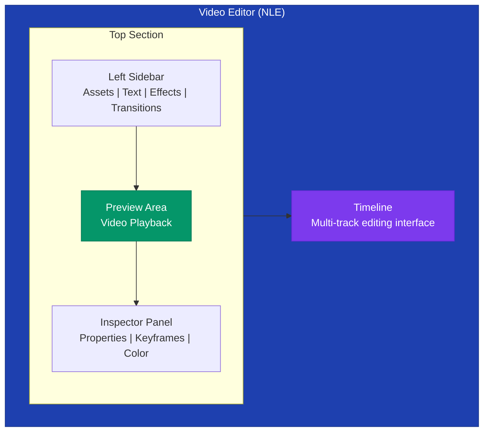
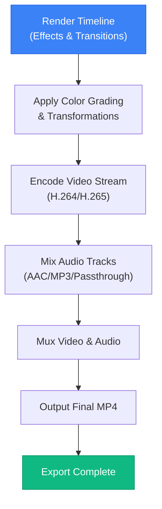

# Video Editor (NLE)

Prism includes a full non-linear editing (NLE) system for video editing. The editor supports multi-track timelines, keyframe animation, color grading, transitions, and export to MP4.

## Overview

The video editor is accessible from the photo lightbox when viewing a video file. It features an OpenCut-inspired layout with:
- **Left Sidebar** — Tool panels (Assets, Text, Effects, etc.)
- **Center Preview** — Video playback area
- **Right Inspector** — Clip properties and effects
- **Bottom Timeline** — Multi-track editing interface

### Interface Layout

## Timeline

### Tracks
- **Video Tracks** — Multiple video layers with opacity control
- **Audio Tracks** — Multi-track audio with volume and pan
- **Text Tracks** — Text overlay elements

### Clip Operations
- **Add Clip** — Drag from assets panel or split existing clip
- **Split Clip** — Cut at playhead position (`S` key)
- **Delete Clip** — Remove selected clip (`Del` key)
- **Copy/Paste** — Duplicate clips (`Ctrl+C`/`Ctrl+V`)
- **Trim** — Drag clip edges to adjust in/out points
- **Move** — Drag clips along timeline
- **Reorder Tracks** — Drag tracks to reorder layers

### Timeline Controls
- **Zoom** — Scroll wheel or slider to zoom in/out
- **Playhead** — Click to seek, drag to scrub
- **Bookmarks** — Add markers for reference points
- **Snap** — Toggle snapping to clip edges

## Clip Properties

### Transform
- **Position** — X/Y coordinates
- **Scale** — Uniform or per-axis scaling
- **Rotation** — Degree rotation
- **Anchor Point** — Transform origin

### Opacity
- **Global Opacity** — 0-100% clip opacity
- **Keyframeable** — Animate opacity over time

### Speed
- **Constant Speed** — Fixed playback rate (0.25x - 4x)
- **Speed Ramping** — Variable speed with keyframes
- **Reverse** — Play clip backwards

### Color Grading
Per-clip color adjustments:
- **Exposure** — Brightness control
- **Contrast** — Tone separation
- **Saturation** — Color intensity
- **Temperature** — Warm/cool shift
- **Highlights/Shadows** — Tone-specific adjustments

## Keyframe Animation

### Keyframe System
- **Per-property Keyframes** — Animate any clip property
- **Bezier Curves** — Smooth interpolation between keyframes
- **Visual Editor** — Graph editor for precise curve control

### Keyframeable Properties
- Position (X, Y)
- Scale
- Rotation
- Opacity
- Speed
- Color adjustments
- Effects parameters

### Keyframe Controls
- **Add Keyframe** — Click diamond icon or use `K` key
- **Delete Keyframe** — Select and press `Delete`
- **Edit Curves** — Open graph editor for bezier handle adjustment
- **Copy/Paste** — Duplicate keyframes between properties

## Effects & Transitions

### Video Effects
- **Color Grading** — Per-clip color adjustments
- **Blur** — Gaussian blur with adjustable radius
- **Sharpen** — Edge enhancement
- **Vignette** — Corner darkening
- **Grain** — Film grain simulation

### Transitions
Browse and apply transitions between clips:
- **Dissolve** — Cross-fade between clips
- **Wipe** — Directional wipe transitions
- **Push** — Slide transitions
- **Zoom** — Zoom in/out transitions
- **Custom** — Animated preview thumbnails

## Text Overlays

### Text Elements
- **Title Text** — Large text for titles
- **Subtitle Text** — Smaller text for captions
- **Custom Text** — Any text content

### Text Properties
- **Font** — Choose from system fonts
- **Size** — Adjustable text size
- **Color** — Text color picker
- **Position** — Drag to position on canvas
- **Duration** — Set text display duration
- **Animation** — Fade in/out options

## Multi-cam Editing

### Multi-cam Features
- **Angle Switching** — Switch between camera angles
- **Grid View** — See all angles simultaneously
- **Sync Points** — Synchronize multiple cameras
- **Cut on Angle** — Automatically cut to selected angle

## Audio

### Audio Controls
- **Volume** — Per-track volume control
- **Pan** — Left/right audio panning
- **Mute** — Silence individual tracks
- **Solo** — Listen to single track

### Audio Mixer
- **Multi-track Mixing** — Balance multiple audio sources
- **Fade In/Out** — Smooth audio transitions
- **Audio Levels** — Visual level meters

## Proxy System

### Automatic Proxy Generation
- **Low-res Proxies** — Automatic low-resolution copies
- **Smooth Playback** — Edit with proxies for performance
- **Original on Export** — Full-resolution used for export

### Proxy Benefits
- Smooth editing on lower-end hardware
- Reduced memory usage
- Faster timeline scrubbing

## Export

### Export Options
- **Format** — MP4 (H.264/H.265)
- **Resolution** — 720p, 1080p, 4K, or custom
- **Frame Rate** — 24, 30, 60 fps
- **Bitrate** — Quality-based or fixed bitrate
- **Audio** — AAC, MP3, or passthrough

### Export Process

### Export Status
- **Progress Bar** — Real-time export progress
- **Preview** — See frames being rendered
- **Cancel** — Stop export at any time
- **Download** — Download completed export

## Project Management

### Save/Load
- **Auto-save** — Automatic project state saving
- **Manual Save** — Explicit save to database
- **Project List** — Browse saved projects
- **Restore** — Resume editing from saved state

### Project Properties
- **Name** — Custom project name
- **Resolution** — Output resolution settings
- **Frame Rate** — Project frame rate
- **Duration** — Total timeline duration

## Keyboard Shortcuts

| Shortcut | Action |
|----------|--------|
| `Space` | Play/Pause |
| `S` | Split clip at playhead |
| `Del` | Delete selected clip |
| `Ctrl+C` | Copy clip |
| `Ctrl+V` | Paste clip |
| `Ctrl+Z` | Undo |
| `Ctrl+Shift+Z` | Redo |
| `K` | Add keyframe |
| `J` | Play backward |
| `L` | Play forward |
| `I` | Set in point |
| `O` | Set out point |

## Performance Tips

1. **Use Proxy Videos** — Enable for smooth playback on lower-end hardware
2. **Reduce Preview Quality** — Lower quality for faster editing
3. **Close Unused Panels** — Free up screen space and resources
4. **Save Frequently** — Auto-save is enabled, but manual save ensures state
5. **Export in Background** — Continue editing while exporting
