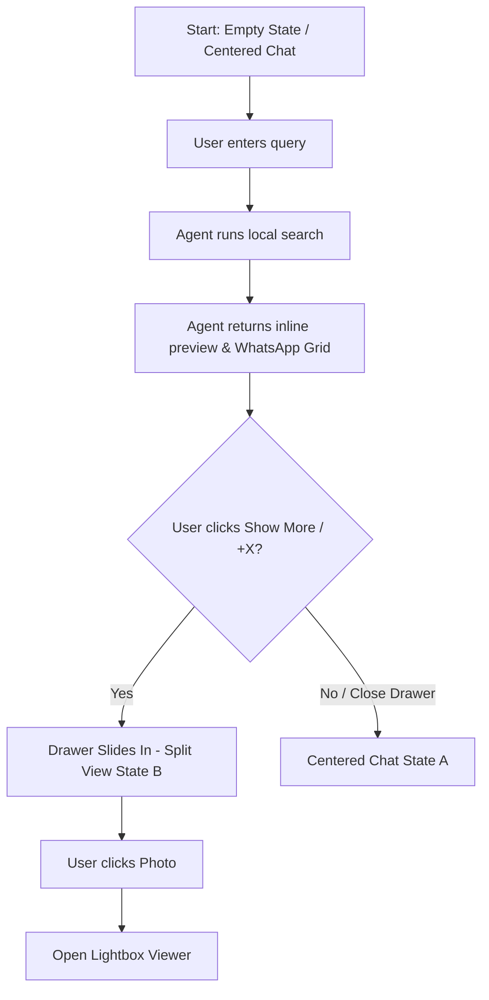

# Prism AI Chat & Gallery Layout Redesign

This specification details the UX/UI redesign of the Prism AI interface. It replaces the static, desktop-only split screen with a dynamic, chat-first centered view that expands into a multi-panel layout when displaying search results. It introduces WhatsApp-style inline previews and a slide-out gallery drawer.

## 1. Key Objectives
*   **Immersive Chat Experience:** Provide a clean, centered, and spacious chat assistant interface by default, eliminating visual clutter when starting a search.
*   **WhatsApp-Style Inline Grids:** Preview search results directly inside the chat feed using a grid format, supporting overlays for count indicators (e.g. `+12 photos`).
*   **Dynamic Responsive Layout:** Smoothly split the screen into a dual-pane layout when the user wants to browse the full set of photo results, allowing them to collapse or expand the details as needed.
*   **Premium Visual Touches:** Implement modern CSS masking for soft edge scroll fades, interactive glassmorphic panels, and smooth spring animations.

---

## 2. Layout States

The workspace will dynamically toggle between two primary layout states.

### State A: Centered Chat (Default / Closed Drawer)
*   **Structure:** A single vertical container centered on the screen.
*   **Sizing:** Max-width of `800px` to maintain comfortable text reading line-length.
*   **Appearance:** Background glows (radial gradient aura) behind the input bar to create depth.
*   **Scrolling:** The entire chat thread scrolls vertically. Top and bottom edges fade out using CSS masks.

### State B: Split View (Open Drawer)
*   **Trigger:** Click on the inline preview's `+X` overlay, a photo thumbnail, or the "Show more" button.
*   **Structure:** Two side-by-side panes.
    *   **Left Pane (Chat):** Squeezes smoothly to `42%` of the width.
    *   **Right Pane (Gallery Drawer):** Slides in from the right to occupy `58%` of the width.
*   **Behavior:** Both panels scroll independently. The chat panel maintains its state and messages.



---

## 3. Component Details

### A. WhatsApp-Style Inline Grid (`InlinePhotoGrid.tsx`)
This component renders inline in the assistant's chat bubble when photos are returned in the response payload. It displays up to 5 photos:
*   **1 Photo:** Span full container width, aspect-ratio `16/10` or square.
*   **2 Photos:** Grid columns `grid-cols-2`, gap `2`.
*   **3 Photos:** 1 large image on the left, 2 smaller stacked images on the right.
*   **4 Photos:** 2x2 grid `grid-cols-2`, gap `2`.
*   **5+ Photos:** 2x2 or custom grid showing 4 thumbnails. The 5th thumbnail has a dark translucent overlay (`bg-black/60 backdrop-blur-[2px]`) with centered white bold text displaying `+X` (where X is the number of remaining photos, e.g. `+12`).
*   **Click Action:** Clicking any photo or the overlay opens the **Gallery Drawer**.

### B. Slide-out Gallery Drawer (`GalleryDrawer.tsx`)
A right-side sliding panel containing the complete set of matched photos.
*   **Header:**
    *   Title: "Search Results ({totalMatches} matches)"
    *   Actions: Close button (`✕`) to close the drawer, "Clear" button to clear results.
*   **Body:**
    *   High density responsive grid: 2 columns on small screens, 3-4 columns on larger displays.
    *   Smooth entry animation for grid items using `framer-motion`.
    *   Hover effect on cards to show filename, date, and FTS5 search explanation match reasons (e.g. `✓ Date: 2024`).
*   **Click Action:** Clicking a photo opens the application's global fullscreen Lightbox viewer.

### C. Chat Input & Feed Improvements
*   **Scroll Fades:** Applied to the message feed wrapper using CSS masks:
    ```css
    mask-image: linear-gradient(to bottom, transparent 0%, black 5%, black 95%, transparent 100%);
    -webkit-mask-image: linear-gradient(to bottom, transparent 0%, black 5%, black 95%, transparent 100%);
    ```
*   **Input Glow:** Subtle glow around the chat input bar on focus.
*   **Suggestions Panel:** Redesigned as glassmorphic pills with hover translations.

---

## 4. Verification Plan

### Automated Tests
*   Verify that `AgentView` renders the `InlinePhotoGrid` correctly when messages contain photo payloads.
*   Verify that clicking "Show More" triggers the drawer-open state toggle.
*   Verify the math for calculating `+X` overlay works (e.g. `total - 4` or `total - 5`).

### Manual Verification
*   Open Prism AI dev server, enter queries (e.g. "Show my favorite photos"), verify that:
    1.  The chat starts centered.
    2.  Inline grid renders correctly for varying numbers of photos (1, 2, 3, 4, 5+).
    3.  Clicking the `+X` overlay opens the right-hand slide-out drawer.
    4.  The drawer renders all photos in a high-density grid.
    5.  Double scrollbars are avoided, and scrolling is smooth.
